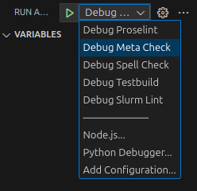

# Checks

This directory contains QA tests for the documentation.

All these checks are intended to run on the markdown files, not rendered files.

Tests should be made as Python scripts to allow flexibility of use. Currently these checks are run two ways:

- [GitHub Actions](https://docs.github.com/en/actions) as defined in [workflows](../.github/workflows/),
- [VSCode Problem Matchers](https://code.visualstudio.com/docs/editor/tasks#_processing-task-output-with-problem-matchers) as defined in [tasks.json](../.vscode/tasks.json).

## Check Types

### Spellcheck

*This linter is defined in [run_spell_check.py](run_spell_check.py) script.*

Spellcheck pipeline settings can be modified in [.spellcheck.yml](../.spellcheck.yml).

List of custom words can be found in [dictionary.txt](../docs/assets/glossary/dictionary.txt),
however you **should not edit this manually**, see [adding-words-to-dictionary](../docs/CONTRIBUTING.md#adding-words-to-dictionary).

#### Limitations

Spellchecker does not provide output lineumber / column.
In order to get this a regex match is done on the markdown.
This means that you might occassionally see a word highlighted inside a context where it should be ignored (e.g. code block),
the typo is probably occuring elsewhere in the text in a valid context, fix it here and the first error will resolve.

### Prose Lint

*This linter is defined in [run_proselint.py](run_proselint.py) script.*

Checks text follows best practice for English language.

Individual rules can be disabled/enabled in [.proselint.json](../.proselint.json).

### Markdown Lint

Checks markdown for compliance against general [best practice rules](https://github.com/markdownlint/markdownlint/blob/main/docs/RULES.md).

Individual rules can be disabled/enabled in [.markdownlint.json](../.markdownlint.json)

### Meta Checks

*This linter is defined in [run_meta_check.py](run_meta_check.py) script.*

Catch-all for custom checks.

See script for details.

### Test Build

Does a 'strict' build of the site, capturing any errors emmited by mkdocs.

### Debugging Checks

Each type of test has a debug job in VSCode.

Most will run on the [fail_checks](fail_checks.md) page

## Tags

Tags are used to help search indexing, but can also be used to search by topic.

We don't want a large number of similar/duplicate tag topics, as this is visually messy and reduces the utility of being able to sort by one.
There is a list of 'approved' tags [.approved_tags.yml](./.approved_tags.yml), feel free to add to it.

Tags are checked in [run_meta_check.py](run_meta_check.py).
