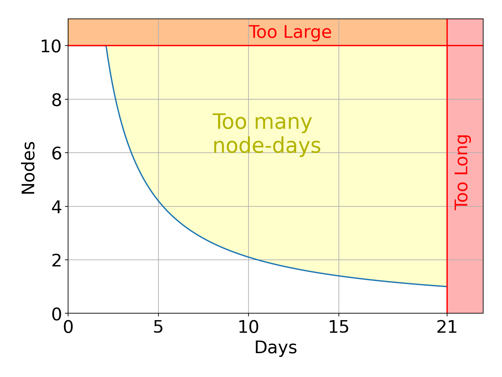

These are open for review if you find any of them unreasonable or inefficient.

!!! info
    This page is about *hard limits* applied to jobs and users. For more information about *per project* usage limitations, see our page on [Fair Share](Fair_Share.md).

## Per Job

{ align=right width=75% }

- {{ slurm_limits.per_job.nodes }} nodes
- {{ slurm_limits.per_job.days }} days walltime
- {{ slurm_limits.per_job.node_days }} node-days (walltime x nodes)

<!-- The walltime limit is there so that long work uses checkpointing.
Splitting it into jobs that use [checkpointing](Job_Checkpointing.md) and chaining them with `--dependency` is good practice;
only the [debug QoS](Job_Prioritisation.md#quality-of-service) may not be used this way.
If you need more, . -->

## Per User

- {{ slurm_limits.per_user.cores }} CPU cores occupied,
- {{ slurm_limits.per_user.core_days }} core-days booked by running jobs.
- {{ slurm_limits.per_user.memory_tb }} TB of memory occupied
- {{ slurm_limits.per_user.tb_days }} TB-days booked by running jobs.
- {{ slurm_limits.per_user.gpus }} GPUs occupied, {{ slurm_limits.per_user.gpu_days }} GPU-days booked by running jobs.
- No user can have more than 1,000 jobs in the queue at a time.
