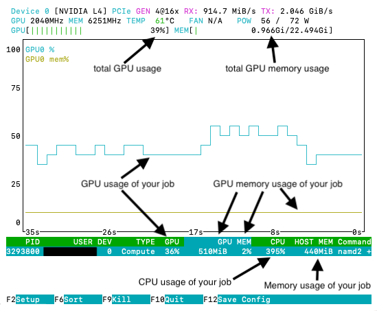
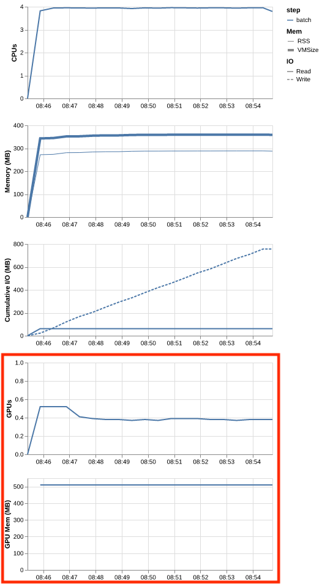
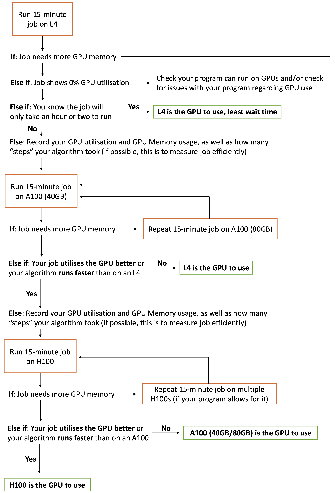

This page provides generic information about how to access GPUs through the Slurm scheduler.

## When to use a GPU

You should consider using a GPU for your work if:

* Your job has GPU support/functionality, and
* Your job is substantially large or will run for a long time without GPU support
* Or you are performing a task that needs a GPU (e.g. work with large language models, some machine learning methods such as neural networks)

!!! warning
    Your first stop when looking into using GPUs should be the documentation
    of the application you are using.  
    Not every process can use a GPU, and how to use them effectively varies greatly!  
    There is a list of commonly used GPU supporting software at the bottom of this page.

## Request GPU resources using Slurm

To request a GPU for your [Slurm job](Tutorial:_Submitting_your_first_job.md), add
the following option in the header of your submission script:

```sl
#SBATCH --gpus-per-node=<gpu_type>:<gpu_number>
```

where `<gpu_type>` is the type of gpu you want to use (either 'h100', 'a100', or 'l4'), and `<gpu_number>` is the number of gpus you would like to request for your job.

!!! note
     Recall, memory associated with the GPUs is the VRAM, and is a separate resource from the RAM requested by Slurm. The memory values listed below are VRAM values.

<table>
    <tr>
        <td>Architecture</td>
        <td>Note</td>
        <td>VRAM</td>
        <td>Max</td>
        <td>Slurm Header</td>
    </tr>
    <tr>
        <td rowspan="2">NVIDIA A100</td>
        <td rowspan="2"></td>
        <td>80GB</td>
        <td>4</td>
        <td><pre><code>#SBATCH --partition=milan<br>#SBATCH --gpus-per-node=a100:1</code></pre></td>
    </tr>
    <tr>
        <td>40GB</td>
        <td>2</td>
        <td><pre><code>#SBATCH --partition=genoa<br>#SBATCH --gpus-per-node=a100:1</code></pre></td>
    </tr>
    <tr>
        <td>NVIDIA H100</td>
        <td></td>
        <td>96GB</td>
        <td>2</td>
        <td><pre><code>#SBATCH --gpus-per-node=h100:1</code></pre></td>
    </tr>
    <tr>
        <td>NVIDIA L4</td>
        <td>No double precision floating point (fp64)</td>
        <td>24GB</td>
        <td>4</td>
        <td><pre><code>#SBATCH --gpus-per-node=l4:1</code></pre></td>
    </tr>
</table>

You can also use the `--gpus-per-node`option in
[Slurm interactive sessions](../Interactive_Computing/Slurm_Interactive_Sessions.md),
with the `srun` and `salloc` commands. For example:

``` sh
srun --job-name "InteractiveGPU" --gpus-per-node L4:1 --partition genoa --cpus-per-task 8 --mem 2GB --time 00:30:00 --pty bash
```

will request and then start a bash session with access to a L4 GPU, for a
duration of 30 minutes.

!!! warning
     When you use the `--gpus-per-node`option, Slurm automatically sets the
     `CUDA_VISIBLE_DEVICES` environment variable inside your job
     environment to list the index/es of the allocated GPU card/s on each
     node.

     ``` sh
     srun --job-name "GPUTest" --gpus-per-node=L4:2 --time 00:05:00 --pty bash
     ```
     
     ```out
     srun: job 20015016 queued and waiting for resources
     srun: job 20015016 has been allocated resources
     $ echo $CUDA_VISIBLE_DEVICES
     0,1
     ```

## Load CUDA and cuDNN modules

To use an Nvidia GPU card with your application, you need to load the
driver and the CUDA toolkit via the [environment modules](../Software/Available_Applications/index.md)
mechanism:

``` sh
module load CUDA/11.0.2
```

You can list the available versions using:

``` sh
module spider CUDA
```

Please  if you need a version not
available on the platform.


The CUDA module also provides access to additional command line tools:

- [nvidia-smi](https://developer.nvidia.com/nvidia-system-management-interface)
            to directly monitor GPU resource utilisation,
- [nvcc](https://docs.nvidia.com/cuda/cuda-compiler-driver-nvcc/index.html)
            to compile CUDA programs,
- [cuda-gdb](https://docs.nvidia.com/cuda/cuda-gdb/index.html)
            to debug CUDA applications.

In addition, the [cuDNN](https://developer.nvidia.com/cudnn) (NVIDIA
CUDA® Deep Neural Network library) library is accessible via its
dedicated module:

``` sh
module load cuDNN/8.0.2.39-CUDA-11.0.2
```

which will automatically load the related CUDA version. Available
versions can be listed using:

``` sh
module spider cuDNN
```

## Example Slurm script

The following Slurm script illustrates a minimal example to request a
GPU card, load the CUDA toolkit and query some information about the
GPU:

``` sl
#!/bin/bash -e

#SBATCH --job-name       GPUJob      # job name (shows up in the queue)
#SBATCH --account        nesi99991   # Your account
#SBATCH --time           00-00:10:00 # Walltime (DD-HH:MM:SS)
#SBATCH --partition      genoa       # This means the job will land on A100 with 40GB VRAM
#SBATCH --gpus-per-node  A100:1      # GPU resources required per node
#SBATCH --cpus-per-task  2           # number of CPUs per task (1 by default)
#SBATCH --mem            512MB       # amount of memory per node (1 by default)

# load CUDA module
module purge
module load CUDA/11.0.2

# display information about the available GPUs
nvidia-smi

# check the value of the CUDA_VISIBLE_DEVICES variable
echo "CUDA_VISIBLE_DEVICES=${CUDA_VISIBLE_DEVICES}"
```

Save this in a `test_gpu.sl` file and submit it using:

``` sh
sbatch test_gpu.sl
```

The content of job output file would look like:

``` sh
cat slurm-20016124.out
```

```sh
The following modules were not unloaded:
   (Use "module --force purge" to unload all):

  1) slurm   2) NeSI
Wed May 12 12:08:27 2021
+-----------------------------------------------------------------------------+
| NVIDIA-SMI 460.32.03    Driver Version: 460.32.03    CUDA Version: 11.2     |
|-------------------------------+----------------------+----------------------+
| GPU  Name        Persistence-M| Bus-Id        Disp.A | Volatile Uncorr. ECC |
| Fan  Temp  Perf  Pwr:Usage/Cap|         Memory-Usage | GPU-Util  Compute M. |
|                               |                      |               MIG M. |
|===============================+======================+======================|
|   0  Tesla P100-PCIE...  On   | 00000000:05:00.0 Off |                    0 |
| N/A   29C    P0    23W / 250W |      0MiB / 12198MiB |      0%      Default |
|                               |                      |                  N/A |
+-------------------------------+----------------------+----------------------+

+-----------------------------------------------------------------------------+
| Processes:                                                                  |
|  GPU   GI   CI        PID   Type   Process name                  GPU Memory |
|        ID   ID                                                   Usage      |
|=============================================================================|
|  No running processes found                                                 |
+-----------------------------------------------------------------------------+
CUDA_VISIBLE_DEVICES=0
```

!!! note
    `CUDA_VISIBLE_DEVICES=0` indicates that this job was allocated to CUDA
     GPU index 0 on this node. It is not a count of allocated GPUs.

## Live monitoring your job's GPU(s)

To dynamically inspect your running job's GPU usage:

1. Obtain the job id for your job of interest by typing `squeue --me` into the terminal.

    ```bash
    user.name@login03:$ squeue --me
    JOBID         USER     ACCOUNT   NAME        CPUS MIN_MEM PARTITI START_TIME     TIME_LEFT STATE    NODELIST(REASON)    
    1234567       user.nam nesi99999 Example_GPU_   8     24G genoa   Apr 30 17:36    23:58:08 RUNNING  g09               
    ```

2. Jump onto the node your job is running by typing `jump_into <JobId>`, where you replace `<JobId>` with your Job of interest.

    ```bash
    user.name@login03:$ jump_into 1234567
    Jumping to node: g09 (job 1234567)    
    ```

3. Type into the terminal `nvtop`. This will open an interface that will enable you to inspect your job's GPU resource usage.

    { width="800" }

## Measuring GPU efficiency after a job has finished

It is possible to measure your GPU's processing and memory efficiency in two ways:

### Using `seff`

Once your job has finished, it is possible to use `seff` to get a measure of the GPU utilisation and GPU memory efficiency. To use this feature, type into the terminal

```bash
seff <JobID>
```

Where `<JobID>` is the job ID for the job of interest. For example:

```bash
user.name@login03$ seff 1234567
Cluster: hpc
Job ID: 1234567
State: TIMEOUT
Cores: 4
Tasks: 1
Nodes: 1
Job Wall-time:   100.4%  00:15:04 of 00:15:00 time limit
CPU Utilisation:  98.5%  00:59:20 of 01:00:16 core-walltime
Mem Utilisation:   1.2%  284.46 MB of 24.00 GB
GPU Utilisation:  43  %
GPU Memory:        2.2%  510.00 MB of 23 GB
```

### Using Slurm Native Profiling

Before you begin your Slurm job, include the following line somewhere at the start of your Slurm submission file:

```bash
#SBATCH --profile task
```

Then allow your job to run. Once your job has finished, type in to the terminal

```bash
profile_plot <JobID>
```

Where `<JobID>` is the job ID for the job of interest. This will create a file called `<JobID>_profile.png`, which will look something like this:



See [Slurm Native Profiling](../Software/Profiling_and_Debugging/Slurm_Native_Profiling.md) for more information on this feature. 

## How to determine which GPU is best for your job

The following flow diagram explains the steps you should take to test which GPU is right for your job.



When running a 15-minute test job, add the following settings in your Slurm submission script:

```sl
#SBATCH --time=00:15:00
#SBATCH --gpu-per-node=<gpu-type>:1
#SBATCH --qos=debug
#SBATCH --profile=task # Only for testing
#SBATCH --acctg-freq=1 # Only for testing
```

To record the GPU utilisation and GPU memory, see [Measuring GPU efficiency after a job has finished](./Using_GPUs.md#measuring-gpu-efficiency-after-a-job-has-finished) for more information.

## Application and toolbox specific support pages

See the [Supported Applications](../Software/Available_Applications/index.md) for more information on what softwares have GPU support, as well as programming toolkits:

- [NVIDIA GPU Containers](../Software/Containers/NVIDIA_GPU_Containers.md)
