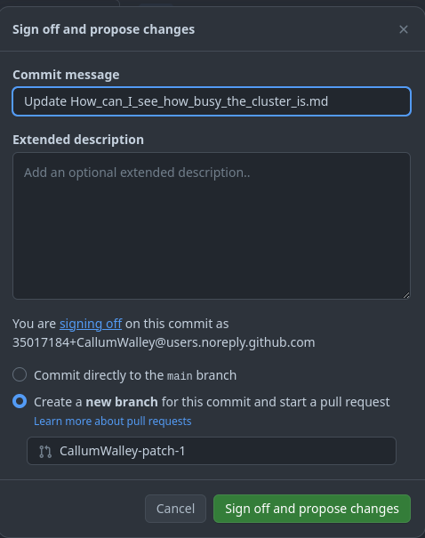

**[CLICK TO VIEW THIS PAGE RENDERED IN MKDOCS](https://nesi.github.io/support-docs/CONTRIBUTING)**{ .hidden }

!!! prerequisite "See also"
    - For examples of markdown use, [see FORMAT](FORMAT.md).
    - For information about page creation, [see NEWPAGE](NEWPAGE.md).

Any changes made should be merged via a pull request.

## Minor edits through GitHub

- Open the GitHub page of the repository, i.e. [https://github.com/nesi/support-docs](https://github.com/nesi/support-docs), and find the support page you want to edit.
- Then click on the edit icon or press <kbd>e</kbd> to open the integrated editor.
- In the integrated editor, use the `preview` tab to check the rendered version.  
  **Note:** Be aware that, unfortunately, the GitHub preview won't render properly some elements, in particular admonitions.
- Once you have finished, press the `Commit changes...` button to create a new commit.
  This will lead you to create a new pull request too.

  

## Major edits through GitHub

### Codespace Environment

This repository has been configured to be useable with [GitHub Codespaces](https://github.com/features/codespaces).
It allows acessing a full featured pre-configured development environment remotely, without installing anything on your local machine.

Clicking on the following link will open a VS Code instance ready to be used with the latest version of the documentation files.

[](https://codespaces.new/nesi/support-docs?quickstart=1)

### Sharing Codespace Deployment

Branch deployments can be shared

1. Open 'PORTS' Tab.

2. Right click on the port and select in the menu, 'Port Visiblity' -> 'Public'.

3. Copy forwarded address (<kbd>ctrl</kbd> + <kbd>c</kbd>)


Sharing this address will allow other people to view your deployment, so long as your codespace is running.

## Local Development Environment

A local development environment is not required to make doc edits, but if you are making lots of changes, the real time rendering can be quite helpful.

### First Time Setup

You will need to have Python **3.10** or later installed on your computer.

Clone this repository and create a Python virtual environment using:

```sh
git clone https://github.com/nesi/support-docs.git
cd support-docs
python -m venv .venv
source .venv/bin/activate
pip3 install -r requirements.txt
```

### Make Development Branch

```sh
git checkout -b my_development_branch
```

### Build and deploy

```sh
source .venv/bin/activate
mkdocs serve -c
```

Take note of any warnings or errors.

A link to the deployment will be printed once served.

### VS Code configuration

You can use any IDE you want, but various tools have been configured for use with VS Code.

#### Recommended Extensions

When opening the workspace for the first time, you should be prompted to install the <a href="https://github.com/nesi/support-docs/blob/main/.vscode/extensions.json">Recommended VS Code Plugins</a>.

#### Snippets

`ctrl` + `space` can be used to aid by auto-completing.

e.g. starting to type an image include `![my image](` then pressing `ctrl` + `space` will show all the valid paths.

Custom snippets can be added in <a href="https://github.com/nesi/support-docs/blob/main/.vscode/includes.code-snippets.json">`../.vscode/includes.code-snippets`</a>

#### Command Palette

Pressing <kbd>ctrl</kbd> + <kbd>shift</kbd> + <kbd>p</kbd>, will open up the VSCode _command pallet_.
This allows you access to all functionality within VS Code, with only a few key presses.


#### Tasks

Some of the same checks run during the GitHub CI, can also be run in VS Code.

This is shown with word underlining, and in the 'PROBLEMS' tab in the terminal.

Tasks allow continuous checks to be run in the background, these can be defined in <a href="https://github.com/nesi/support-docs/blob/main/.vscode/tasks.json">`../.vscode/tasks.json`</a>, also include in <a href="https://github.com/nesi/support-docs/blob/main/.vscode/settings.json">`../.vscode/settings.json`</a> in order to trigger on save.

## Checks

Whenever a change is commited, or a merge request opened, a series of automatic checks will be started.
From a pull request, the status of these checks can be seen in the 'Checks' tab, or inline under the 'Files Changed' Tab.

Will give three levels of ourput, **Errors** (serious issues that will prevent merging into main), **Warnings** (non-critical suggestions for improvement) and **Info** (pedantry).

## Making a Merge Request

The `main` branch is protected, changes can be made via a pull request.

Make a pull request for your development branch into `main`.

If you are using a local development environment,

```sh
git checkout -b <branchname>
```

When you are done with your changes

```sh
git push origin <branchname>
```

CI checks will run on your branch, you can check them under 'Actions'
Might be worth having a quick look at these before making a pull request.

Make a pull [request](https://github.com/nesi/support-docs/pulls)

Assign a reviewer if you wish.

Pull will merge automatically if all checks passed. (add timer too maybe?)

## Reviewing A Merge Request

Under the 'pull requests' tab, open one of the pending requests.

Clicking on the 'Files Changed' tab, will give a convenient diff of the changes, as well as inline errors identified by the CI checks.

If some of the CI checks failed (make sure they are not important ones), you will have to click the  `Merge without waiting for requirements to be met (bypass branch protections)` button before proceeding with the merge.

Feel free to raise an issue, make a proposal or [add words to the dictionary](#adding-words-to-dictionary) if you feel you are being unfairly targeted by the CI checks.

## Update Remote Assets

Certain files need to be fetched from other repos for up to date info. This will be automated, but for not the proccess is manual.

1. Run the [](https://github.com/nesi/support-docs/actions/workflows/fetch_includes.yml) workflow in this repo.
2. A branch `new-assets` will be created, which can be merged into main.

## Adding Words to Dictionary

If the CI is failing the spellcheck phase, and you believe the identified words are not typos, (double check your capitalisation and apostrophes first) you can update the dictionary being used.

1. Visit the [NeSI Word List](https://github.com/nesi/nesi-wordlist), follow the instructions there on adding words.
2. Once changes to the word list have been merged, return to this repo and run [update remote assets](#update-remote-assets).
3. You should see your new words in the [Dictionary](assets/glossary/dictionary.txt) if your words included a definition, they will also be in the <a href="https://github.com/nesi/support-docs/blob/main/overrides/Glossary.md">Glossary</a>.

## Raise an issue

*Not documented at the moment (TODO)*

## The 'Supported Apps' Page

Quite a lot of data-sources come together to make this page:

- mkdocs article titles
- lmod info scraped from all clusters
- licence counts from promethius instance
- licence details from config file
- Manual overwrites in the [modules list repo](https://github.com/nesi/modules-list/blob/main/tags/licence_type.yml).

Most of these are collected together in the [modules list repo](https://github.com/nesi/modules-list/blob/main/tags/licence_type.yml)

### Adding/Fixing Information

#### Description, Homepage, Packages, Clusters

Fix the information in the module file.

#### NeSI Documentation Link

Is there a child page with the same title as the module? (case sensitive).

#### Domain, Licence Type

Can be added in [modules list](https://github.com/nesi/modules-list/blob/main/tags/domains.yml)

#### Network Licence Details

Ask cal, or read the readme at `/opt/nesi/nesi-apps-admin/LicConfig/`

### Everything Else

Can be added in the manual [overwrite file](https://github.com/nesi/modules-list/blob/main/overwrites.yml).

### Updating

Any of these changes will require an [update of remote assets](#update-remote-assets).
