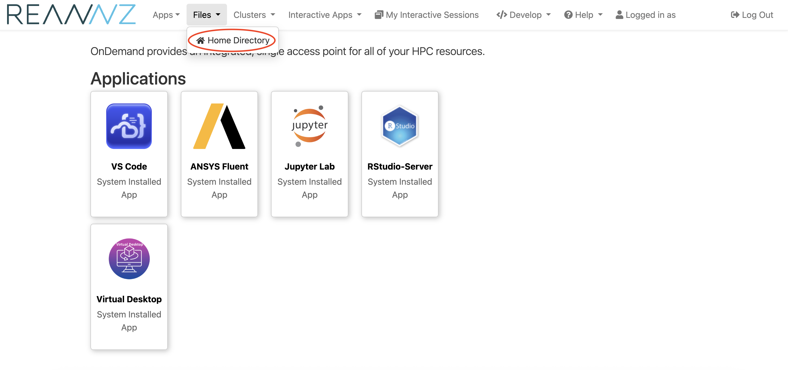
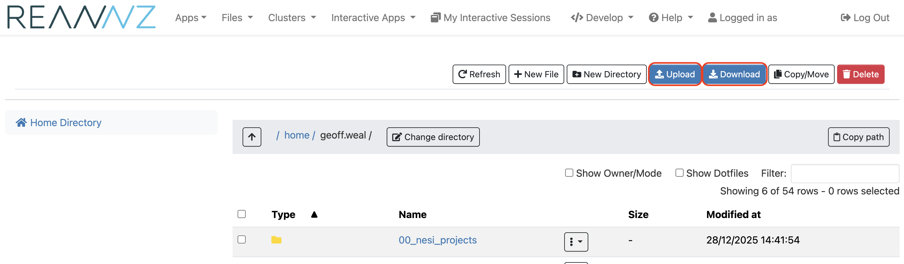

Mahuika OnDemand only a web browser to use. The instructions to use it are the same whether your are connecting from a Windows, Mac or a Linux computer.

* See [OnDemand how to guide](../Interactive_Computing/OnDemand/how_to_guide.md) for more information about how to use OnDemand.

Once you have launched NeSI OnDemand on your web browser, click on the `Files` top tab and then click on `Home Directory`.

On the `Home Directory` page, you can look through the files and folder on mahuika, you can upload files to Mahuika and download files and folders from Mahuika.

