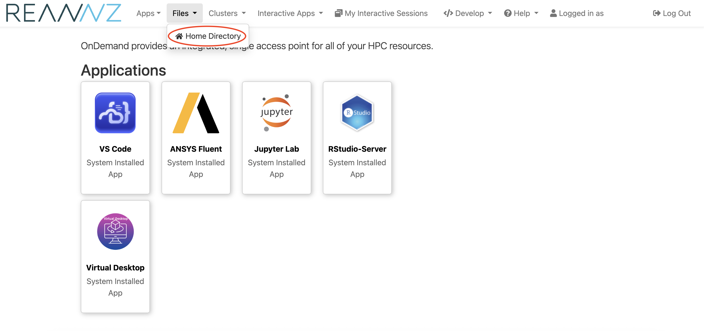
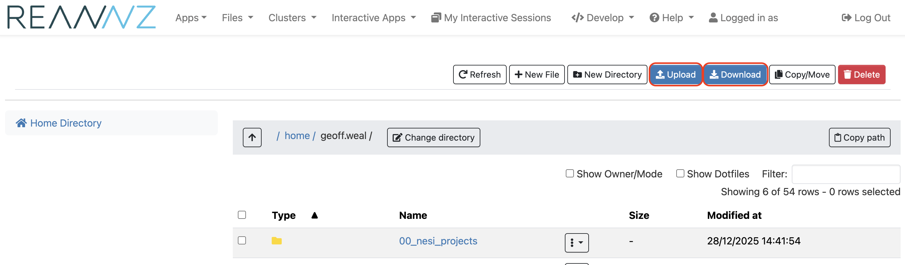

!!! info "Note"
    Using OnDemand for transferring large files is not recommended. Please see the [Data Transfer Overview](Data_Transfer_Overview.md) for alternative transfer methods.

* See [OnDemand how to guide](../Interactive_Computing/OnDemand/how_to_guide.md) for more information about how to use OnDemand.

Once you have launched REANNZ HPC OnDemand on your web browser, click on the `Files` top tab and then click on `Home Directory`.

On the `Home Directory` page, you can look through the files and folder on mahuika, you can upload files to Mahuika and download files and folders from Mahuika.

