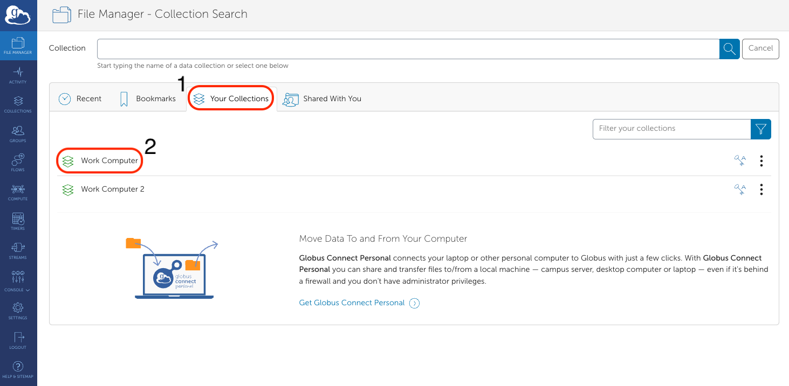
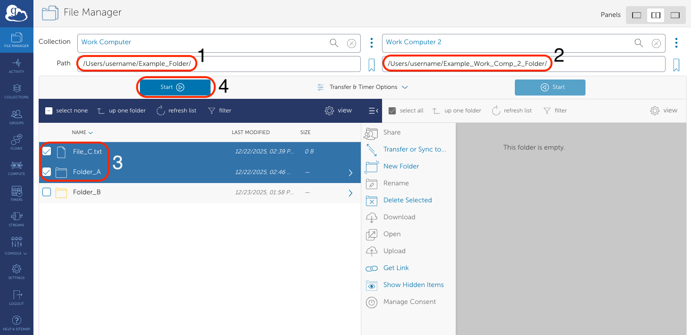
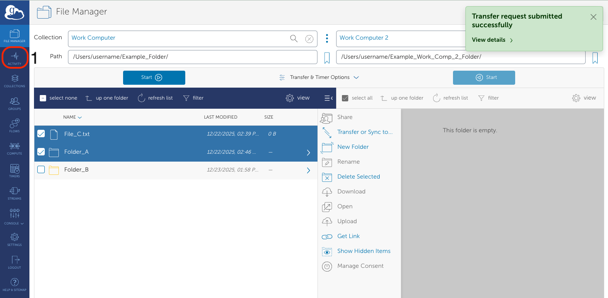
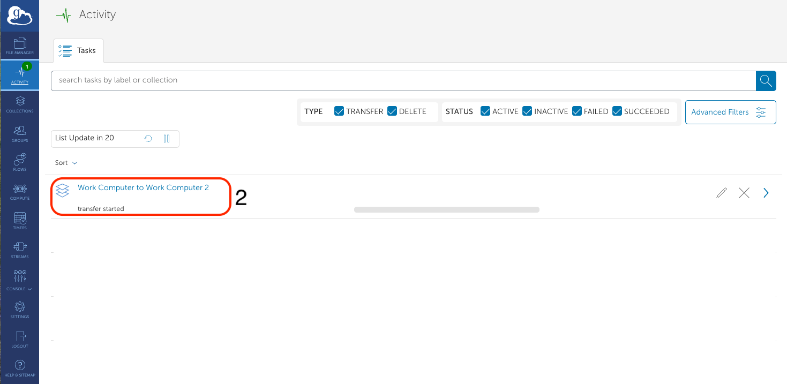
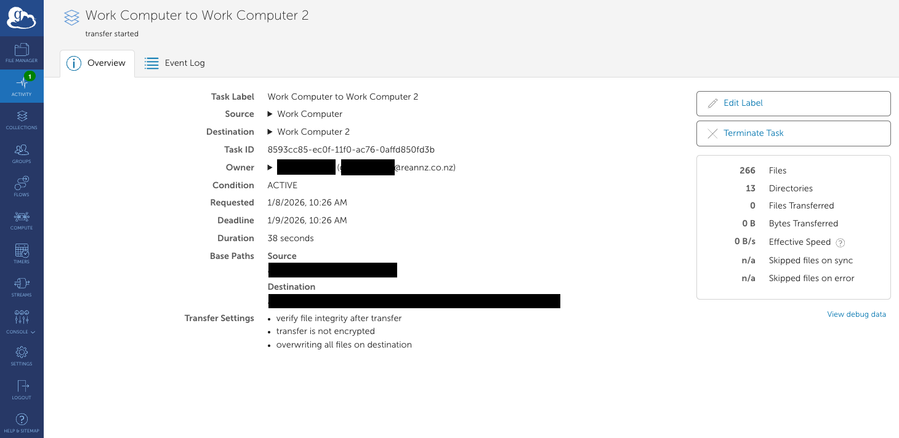

It is possible to copy files between two computers/servers (two `endpoints`) using Globus. This excludes copying any data to/from Mahuika.

## Signing into your **Free** Globus Subscription

First you need to sign up with a Globus Subscription. **This is free** for Mahuika users. [Click here to learn about how to sign up for a free Globus Subscription](./Signing_Up_To_Globus_Subscription.md).

## Transferring files between two computers

Once you have been accept to the NeSI Globus Subscription, [we will follow a similar guide for transferring data as
given here](./Data_Transfer_using_Globus.md#transferring-data-using-globus), where instead of transferring data between your `endpoint`
and mahuika, you transfer data between your two computers/servers (your two `endpoints`).

Here is a break down of what you need to do:

1. Go to the File Manager tab of [your Globus page](https://app.globus.org/file-manager?two_pane=true).
    Give yourself two panels by clicking the `Two Panel` button:
    

2. Click on the left-hand side `Collection` field, specifically on the Search icon.
    

3. Click on the `Your Collections` tab and click on the first computer/endpoint you want to transfer data to/from.
    

4. This will take you back to the `File Manager` webpage. Repeat steps 2-3 for the right-hand side `Collection` field,
   selecting the second computer/endpoint you want to transfer data from/to.

5. Move the file/folder you want to copy between your two computers/endpoints:
    * In one of your panels, go to the path containing the files/folders you want to copy.
    * Click on the file/folder you want to copy. This will highlight it.
    * If you want to copy multiple files/folders, press `shift` and click on them to highlight them all.
    * In the other device's panel, enter in the path you want to copy your file to.
    * Above the first device's panel, click on the `Start` button to begin copying your file.

    

6. You will see a green box at the top right corner of your Globus webpage that says `Transfer request submitted sucessfully`. This indicates that Globus is in the process of transferring your data between Mahuika and your computer/server.
    * You can click on the `Transfer` tab to get more details about how your transfer is doing.

    
    
    
