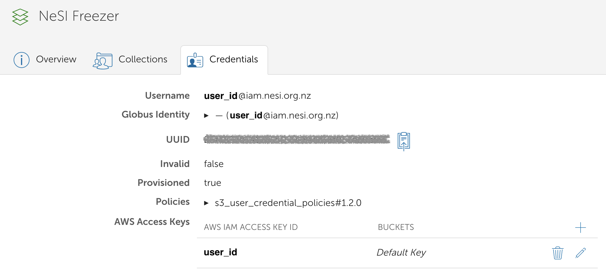

!!! note
    This service is still in the testing phase

We are currently trialing the transfer of data to and from Freezer using Globus. We currently have a new Globus Collection to Freezer called: `NeSI Freezer`. You will need to authenticate using your Freezer (S3) credentials. Please let us know if you would like some assistance or are having any difficulties with this service.

## Requirements
You will need to have a Globus account to access Globus via Freezer. Please see the page on [first time Globus set up](First_Time_Setup.md) for information on getting a Globus account.

## Setting up Freezer Credentials

1. Go to the File Manager tab of [your Globus page](https://app.globus.org/file-manager?two_pane=true) in the left hand menu bar.
    Under the `Collection` field, search for and select the `NeSI Freezer` collection, then click the blue `Continue` button.
    

2. You will need to authenticate with an identity from NeSI Keycloak. Click on `Use my user_id@iam.nesi.org.nz identity` text.
    

3. In the next window, click `Allow`.
    

    !!! info
        Steps 4 & 5 may not be required

4. To set up your credentials, please click `Continue`. You will be shown a globus page requiring you to sign in to Mahuika. 
    

5. Fill in your Mahuika Username and Secret Key. Please let us know if you have lost your Freezer Secret Key. We can  <a href="mailto:support@nesi.org.nz?subject=Reset%20Freezer%20Secret%20Key">reset your Freezer key</a>, but you will also need to reset your Freezer config on Mahuika.

    In the following sections, please enter:

    * `AWS IAM Access Key ID`: `user_id`
    * `AWS IAM Secret Key`: `Freezer Secret Key`

    

    Please click `Save` after you have entered your details. You will then be shown this page here if it is successful.

    

## Freezer Endpoint

1. Go to the File Manager on the left hand menu and search for the collection `NeSI Freezer` .
    

2. Under 'Path', type in your Freezer bucket e.g., `nesi99991-12345` and press <kbd>Enter</kbd>. you should now see the contents of your bucket.

If you initiate a transfer of offline data (only on tape - Glacier) from Freezer, the data will be automatically staged from tape before the transfer begins.

## Organizing Files Using Globus

We do NOT recommend oranising or moving files or directories on Freezer using the Globus interface. Please use the s3cmd tool in these instances. Please see our [Freezer Guide](../../Storage/Long_Term_Storage/Freezer_Guide.md) for more information.
