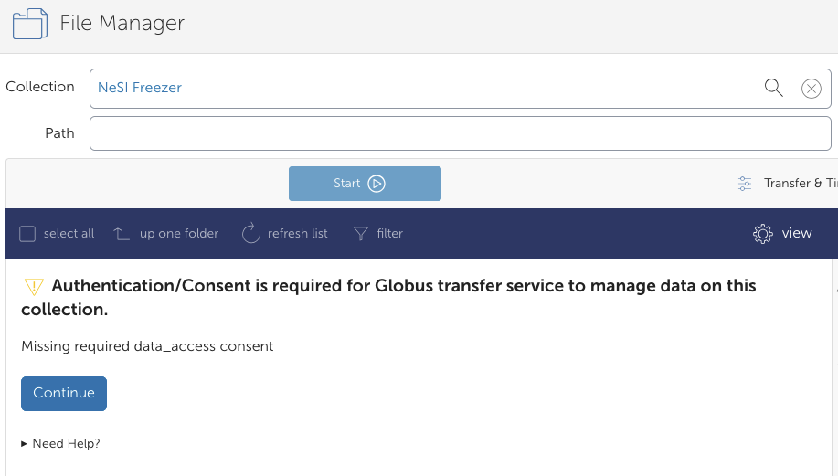
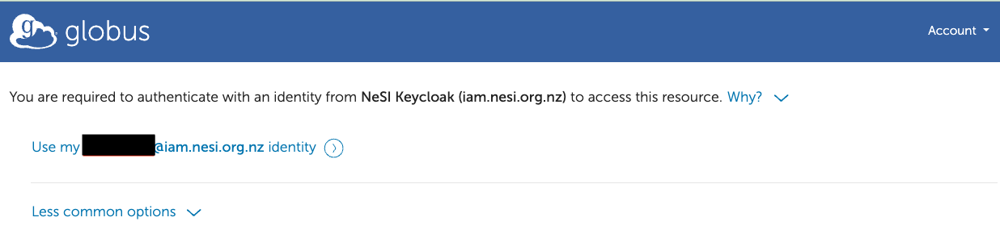
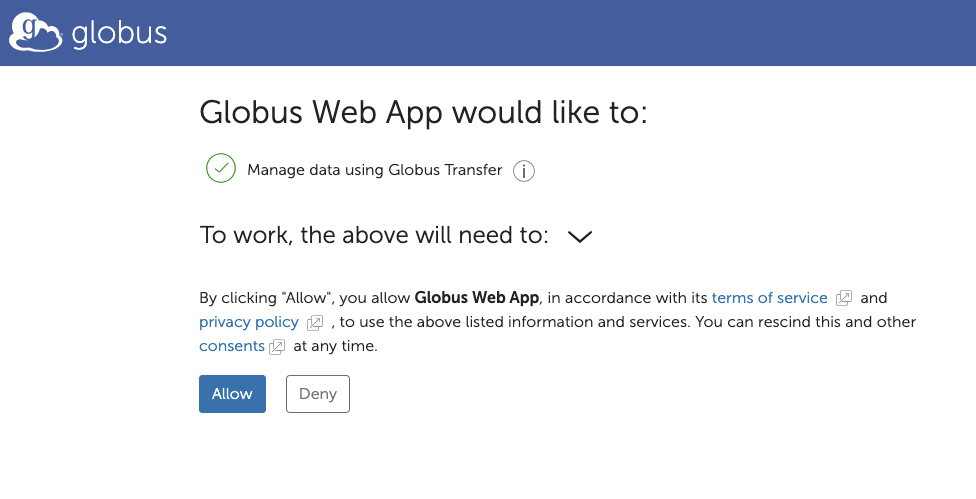
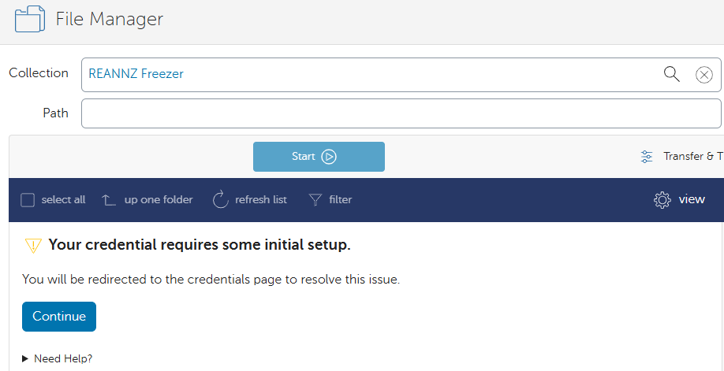
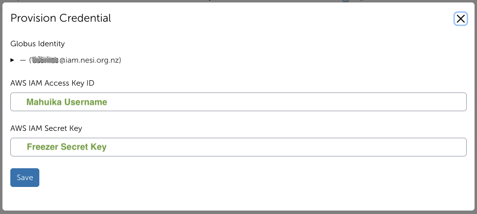
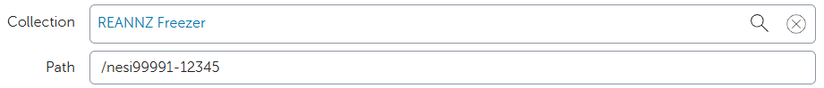
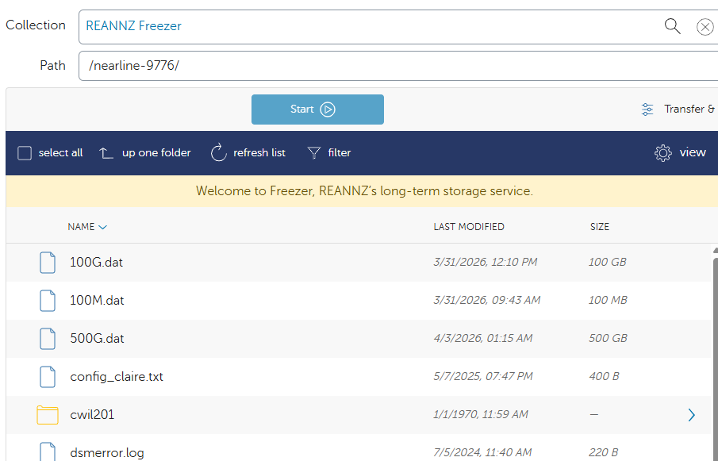

!!! note
    This service is still in the testing phase

We are currently trialing the transfer of data to and from Freezer using Globus. We currently have a new Globus Collection to Freezer called: `NeSI Freezer`. You will need to authenticate using your Freezer (S3) credentials. Please let us know if you would like some assistance or are having any difficulties with this service.

## Setting up Freezer Credentials

1. Go to the File Manager tab of [your Globus page](https://app.globus.org/file-manager?two_pane=true) in the left hand menu bar.
    Under the `Collection` field, search for and select the `NeSI Freezer` collection, then click the blue `Continue` button.
    

2. You will need to authenticate with an identity from NeSI Keycloak. Click on `Use my user_id@iam.nesi.org.nz identity` text.
    

3. In the next window, click `Allow`.
    

4. To set up your credentials, please click `Continue`
    

5. Fill in your Username and Secret Key. Please let us know if you have lost your Freezer Secret Key. We can reset this, but you will also need to reset your Freezer config on Mahuika (support@nesi.org.nz).

    In the following sections, please enter:

    * `AWS IAM Access Key ID`: `user_id`
    * `AWS IAM Secret Key`: `Freezer Secret Key`

    

    Please click `Save` after you have entered your details. You will then be shown this page here if it is successful.

## Freezer Endpoint

1. Go to the File Manager on the left hand menu and search for the collection “NeSI Freezer” .
    

2. Under 'Path', type in your Freezer bucket e.g., `nesi99991-12345` and press <kbd>Enter</kbd>. you should now see the contents of your bucket.

