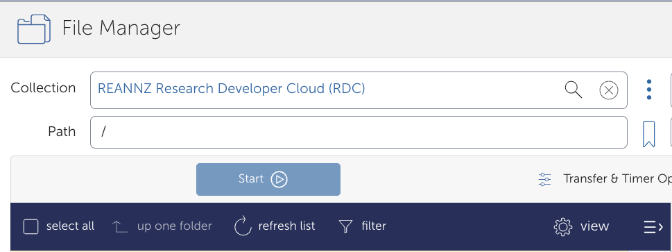
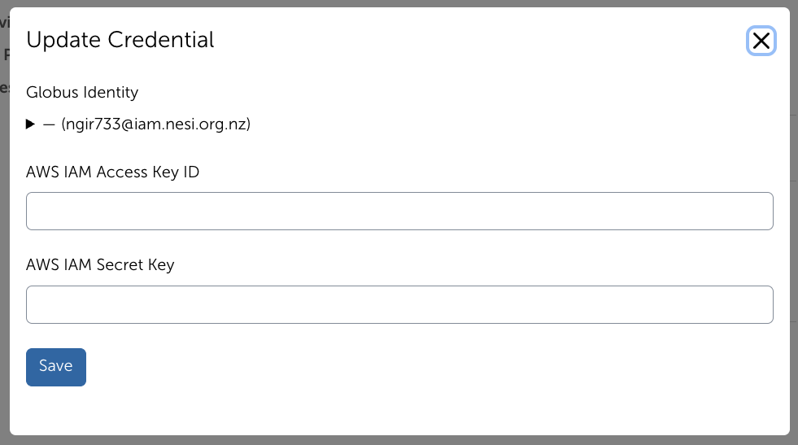
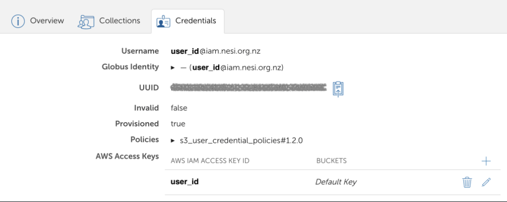

The Globus Collection to the Research Developer Cloud (RDC) is called: `{{ globus_collection_rdc}}`.
You will need to authenticate using S3 credentials created on your RDC project to access your object store bucket. 
Please let us know if you would like some assistance or are having any difficulties with this service.

## Requirements

You will need to have a Globus account to access a RDC project via Globus. Please see the page on [first time Globus set up](First_Time_Setup.md) for information on getting a Globus account.

## Creating your RDC Bucket Credentials
Prerequisite: you need to have the Openstack client installed on your device (e.g. pip3 install python-openstackclient).

1. Go to the RDC Dashboard and select your project. In https://dashboard.cloud.nesi.org.nz/project/api_access/, download the Openstack RC file on your device. 

2. Open a terminal, select the path with the Openstack RC file <RC file> is, and type `source <RD file>`. Enter your RDC account password. Note that no feedback is given if the password is correct.

3. Run `openstack token issue` and then `openstack container list`: this lists all the buckets in the project and you can confirm that the bucket your want to share on globus is listed.

4. Create ec2 credentials linked to your account by running `openstack ec2 credentials create`: take note of the access key and secret. It is recommended that your EC2 credentials are saved in a password manager. These credentials allow you to access the bucket from Globus. 

## Setting up RDC Credentials in Globus

1. Go to the File Manager tab of [your Globus page](https://app.globus.org/file-manager?two_pane=true) in the left hand menu bar.
    Under the `Collection` field, search for and select the {{ globus_collection_rdc}} collection, then click the blue `Continue` button.
    

2. You will need to authenticate with an identity from NeSI Keycloak. Click on `Use my user_id@iam.nesi.org.nz identity` text.
    

3. In the next window, click `Allow`.
    

4. To set up your credentials, please click `Continue`. You will be shown a Globus page requiring you to sign in to RDC. 

5. Fill in your EC2 access key and secret.

    

    Please click `Save` after you have entered your details. You will then be shown this page here if it is successful.

    

    If you want to see buckets in different RDC projects, click on the + and enter the other RDC EC2 access key, secret and also the bucket name (name of the object store container in Openstack).

## RDC Endpoint

Note that modification times are preserved only for files.
- Files: The displayed modification date reflects the file's original modification time.
- Folders: Folder modification times are not preserved by the Globus Freezer collection and will always appear as 1 January 1970 (Unix epoch).

This is expected behaviour and does not affect the integrity or accessibility of your data.

1. Go to the File Manager on the left hand menu and search for the collection `{{ globus_collection_rdc}}`.

2. Under 'Path', type in your bucket (Openstack container) and press <kbd>Enter</kbd>. you should now see the contents of your bucket.

