Globus is useful for transferring files between Mahuika and your computer or server and can make it easy to transfer files due to its GUI web-based interface, as well as being able to resume transfers even if disrupted.

!!! tip
    The name of the Mahuika `endpoint` is `NeSI HPC Storage`

## Transferring data using Globus

To move files and folders between `endpoints` (such as between Mahuika and another computer or server):

1. Go to the File Manager tab of [your Globus page](https://app.globus.org/file-manager?two_pane=true).
    Give yourself two panels by clicking the `Two Panel` button:
    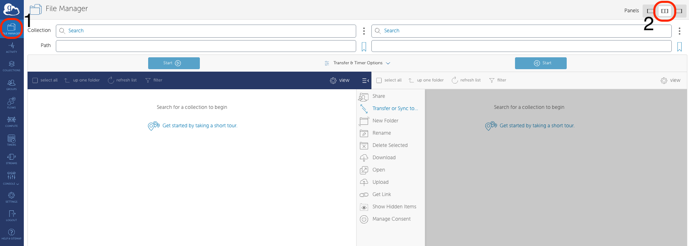

2. Click on the left-hand side `Collection` field, specifically on the Search icon.
    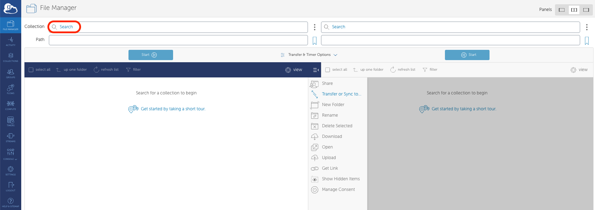

3. In the Search bar, type `NeSI HPC Storage`. Below the search bar, click on the `NeSI HPC Storage` icon.
    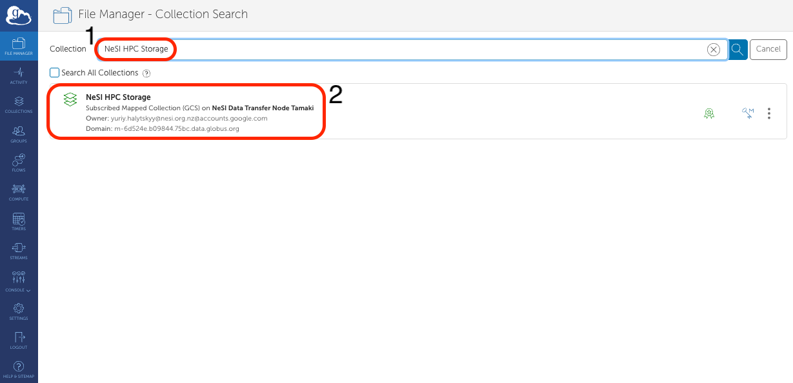

4. This will take you back to the main page, where you will need to authenticate yourself with the
    `NeSI HPC Storage` Globus endpoint.
    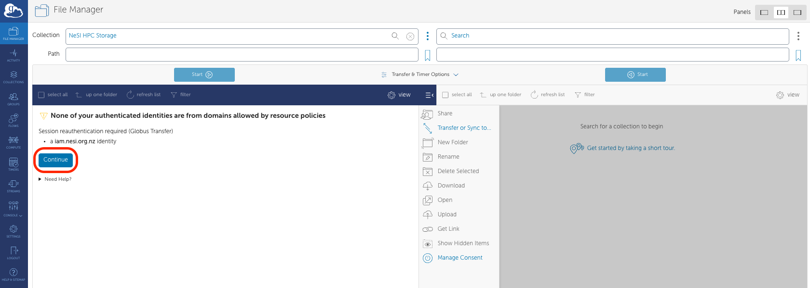

5. You will be shown a globus page requiring you to sign in to NeSI. Click on `Use my username@iam.nesi.org.nz identity` text.
    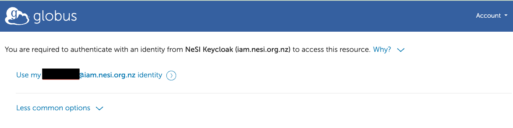

6. Once you have logged in, you will be sent back to the Globus transfer page. By default you will be placed to your
    `home` directory. Enter the directory you would like to access in `Path`:

    * `home`: `/home/<username>`
    * `project`: `/nesi/project/<project_code>`
    * `nobackup`: `/nesi/nobackup/<project_code>`

    !!! warning
        You will **not** find `project` and `nobackup` in `00_nesi_projects` (Symlinks do not work in Globus). Please enter the full file path in the `Path` section (e.g. `/nesi/nobackup/<project_code>`)

    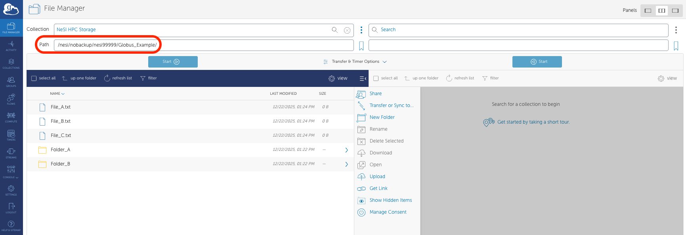

7. Repeat steps 2 - 6 for the right-hand panel, gaining access to the device you want to move data to/from.
  
    * For example, if I wanted to get access to my computer, I would click on the right-hand panel's `Search` field, select the `Your Collections` tab, and click on your computer's endpoint name.
    * You can also transfer data to a high-speed Globus Data Transfer Nodes (DTNs). See [Data Transfer Nodes throughout New Zealand](#data-transfer-nodes-throughout-new-zealand) to see if your institute contains a DTN.

    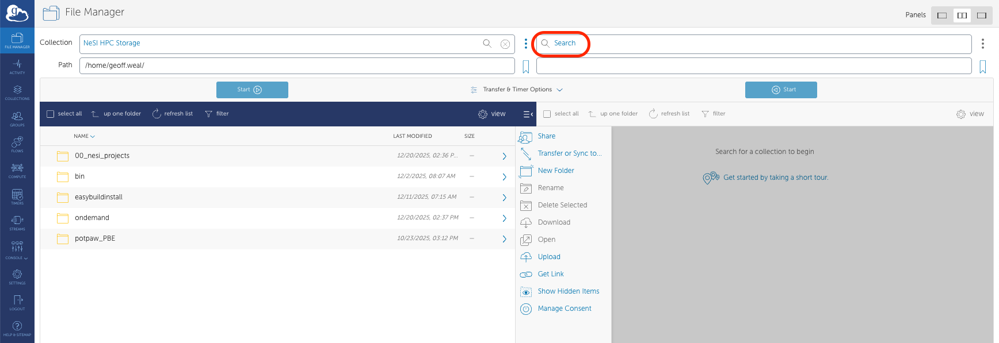
    

8. Move the file/folder you want to copy between Mahuika and your computer/server:
    * In the Mahuika (other device) panel, go to the path containing the files/folders you want to copy.
    * Click on the file/folder you want to copy. This will highlight it.
    * If you want to copy multiple files/folders, press `shift` and click on them to highlight them all.
    * In the other device (Mahuika) panel, enter in the path you want to copy your file to.
    * Above the Mahuika (other device) panel, click on the `Start` button to begin copying your file.

    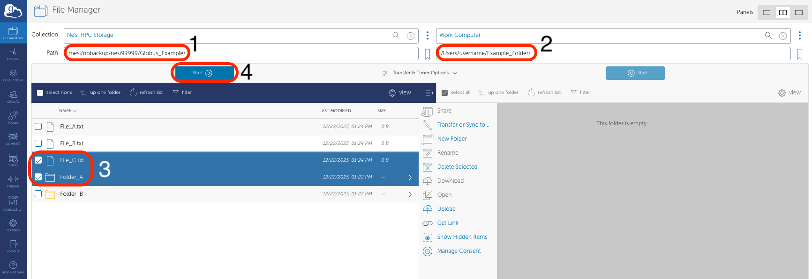

9. You will see a green box at the top right corner of your Globus webpage that says `Transfer request submitted sucessfully`. This indicates that Globus is in the process of transferring your data between Mahuika and your computer/server.
    * You can click on the `Transfer` tab to get more details about how your transfer is doing.

    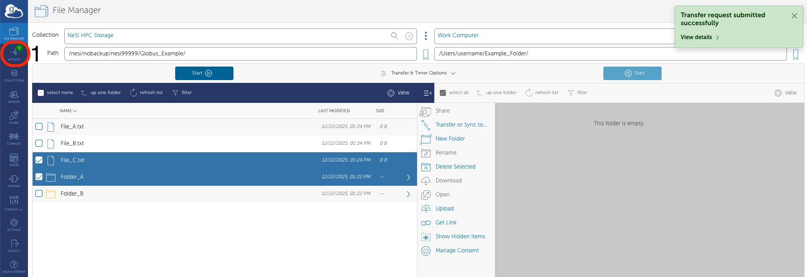
    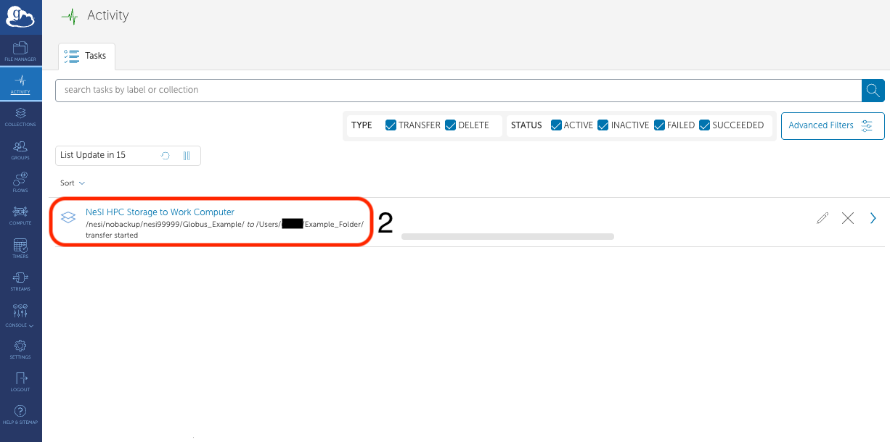
    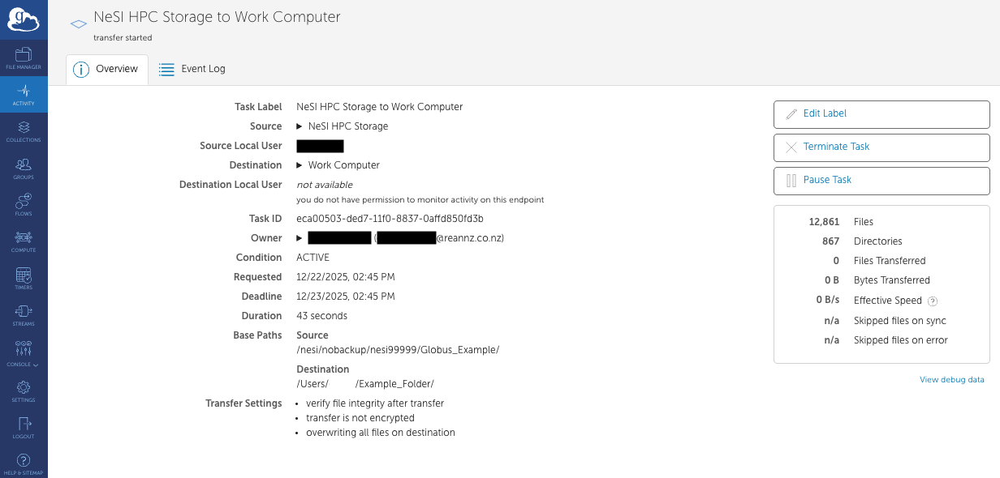

## Globus Restrictions

There are a few restrictions on the amount of data that can be transfer at any one time:

* 100 million files in a single transfer task
* 5 million files in a single directory
* 100,000 files for a directory listing / `ls` operation
* 3 active trasfer tasks per user
* 100 pending transfer tasks per use

## Data Transfer Nodes throughout New Zealand

The National Data Transfer Platform uses Globus, a third-party service
for transferring large amounts of data between Globus Data Transfer
Nodes (DTNs). New Zealand DTNs facilitate the transfer of data to and
from institutional storage. This service allows data to be accessible to
any person who has a Globus account.

| Endpoint Name | Description | Recommended Use | Apply for Use | Contact |
| ------------- | ----------- | --------------- | ------------- | ------- |
|[NeSI HPC storage]| NeSI Globus Endpoint, located at Tamaki Data Centre | File-sharing and transferring files to/from NESI HPC and storage facilities. | [First Time Setup](./First_Time_Setup.md) |  |
| [University of Otago - HCS](https://app.globus.org/file-manager?origin_id=108e72ac-c509-4cd0-940f-b7e3aa543007), [University of Otago - CHC HCS](https://app.globus.org/file-manager?origin_id=eeb5308a-2471-4696-9571-dd2092e041f9) | Endpoint for the High Capacity Research Storage Cluster, Dunedin Campus, University of Otago and Endpoint for the High Capacity Research Storage Cluster, Christchurch Campus, University of Otago | Primary endpoint for Otago Dunedin; uses local service accounts or Globus sharing. | [Access Form](https://www.otago.ac.nz/its/forms/hcs-high-speed-data-transfer-service-access-form) | [university@otago.ac.nz](mailto:university@otago.ac.nz) |
| University of Auckland Research Data Collection | Endpoint provides access to UoA research data. | Transferring files between UoA research drives and Mahuika | Apply by email | [researchdata@auckland.ac.nz](mailto:researchdata@auckland.ac.nz) |
| AgResearch DTN01 | A Globus endpoint attached to AgResearch's institutional Linux storage platform | Sharing large datasets with external collaborators and moving large datasets between NeSI's facility and AgResearch's internal storage platform | Apply by email | [servicedesk@agresearch.co.nz](mailto:servicedesk@agresearch.co.nz) |
| PFR Globus Connect Server | Endpoint provides access to Plant Food Research data | Generally for internal users, but also for sharing large datasets with collaborators | Contact the Plant and Food person you are wanting to share data with. |  |
| MWLR PN-DTN-username | Customised endpoints for users to transfer data between MWLR and NeSI, or to share data with third-party collaborators | Generally for internal users, but also for sharing large datasets with collaborators | Contact the MWLR person you are wanting to share data with. | [IToperations@landcareresearch.co.nz](mailto:IToperations@landcareresearch.co.nz) |
| Scion Data | Endpoint provides access to Scion research data | Sharing large datasets with external collaborators and moving large datasets between NeSI's facility and Scion's internal storage platform | Contact the Scion person you are wanting to share data with. |  |
| ESR Endpoint | Endpoint provides access to ESR data | Generally for internal users, but also for sharing large datasets with collaborators | Contact the ESR person you are wanting to share data with. |  |

!!! tip "How to establish a new node"
     for details on how to
    join the national data transfer platform.
