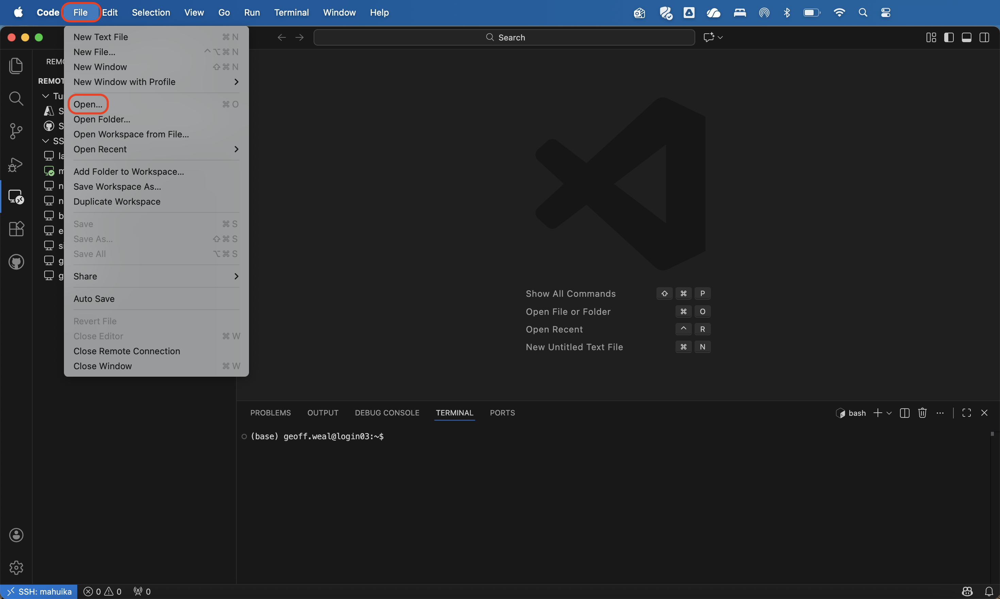
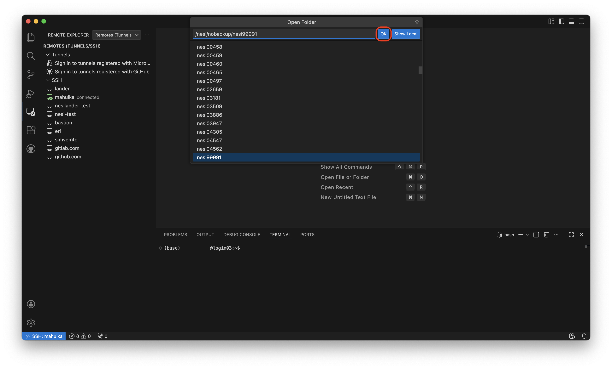
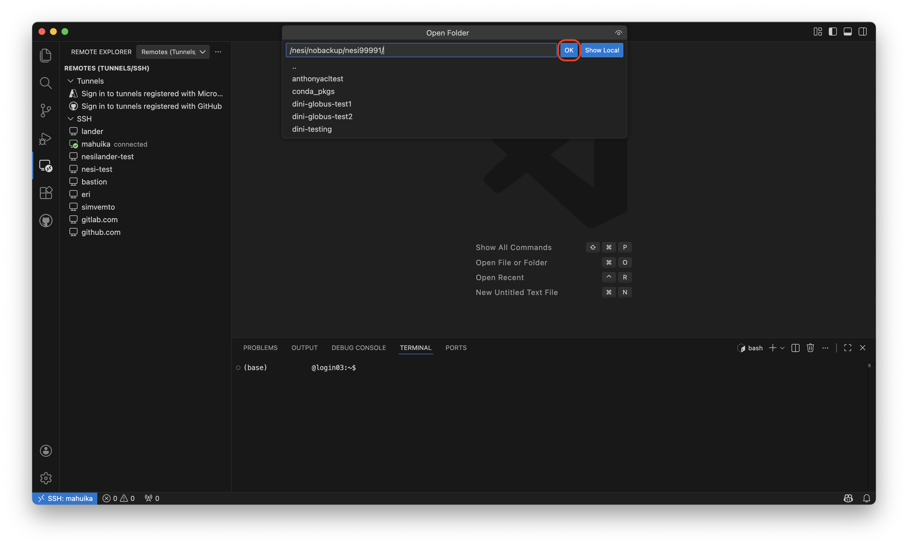
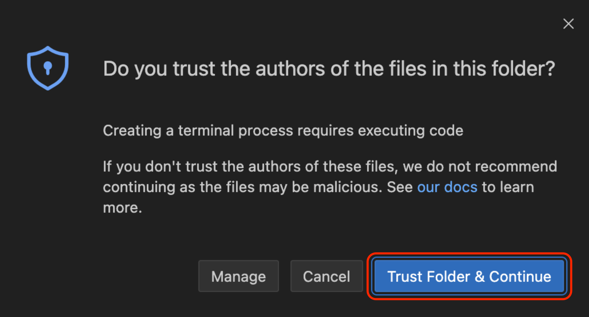
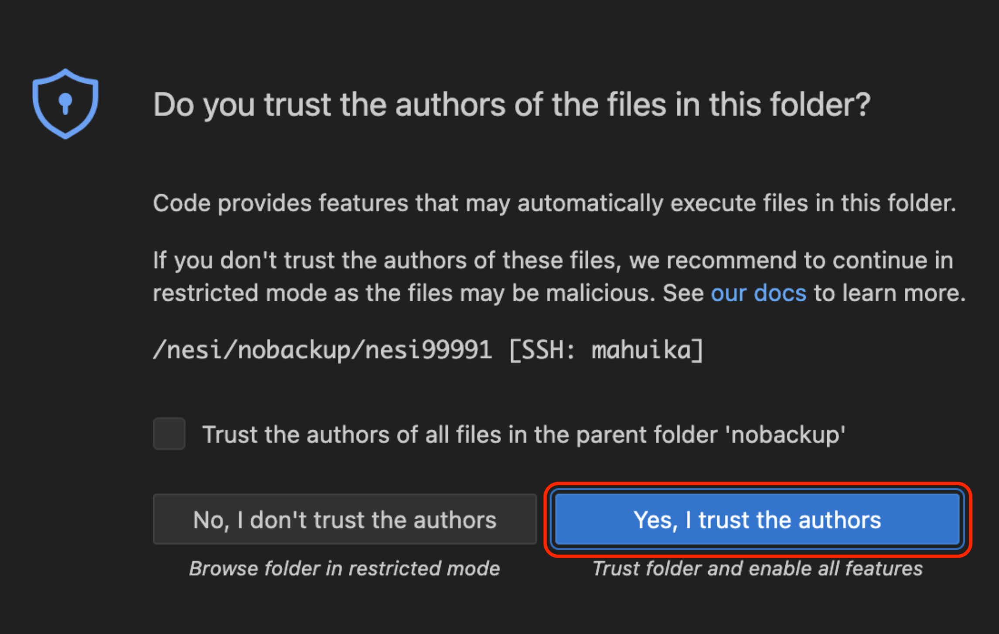
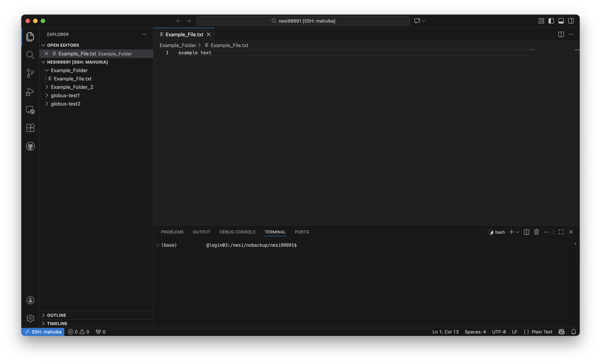
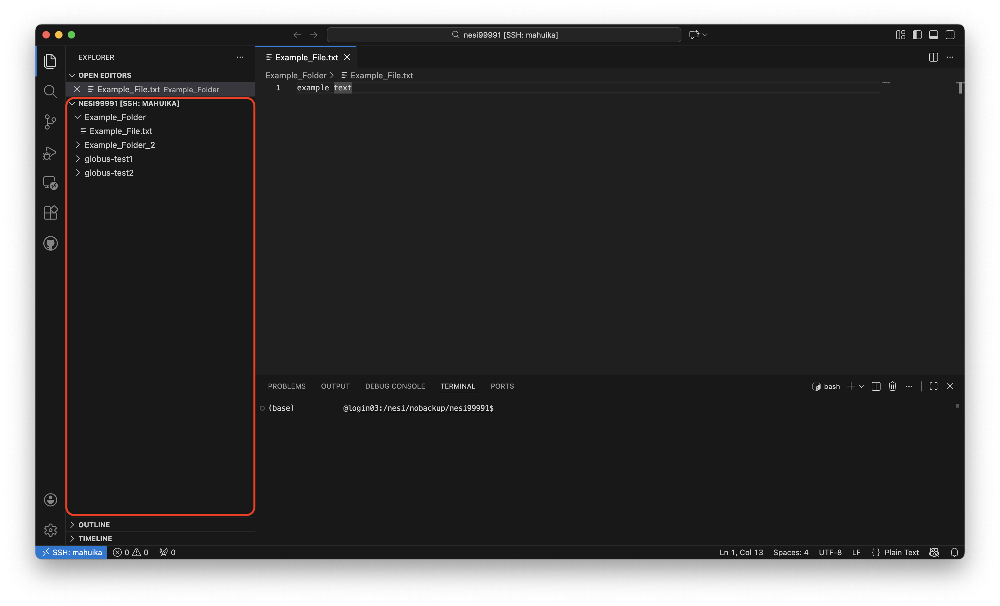
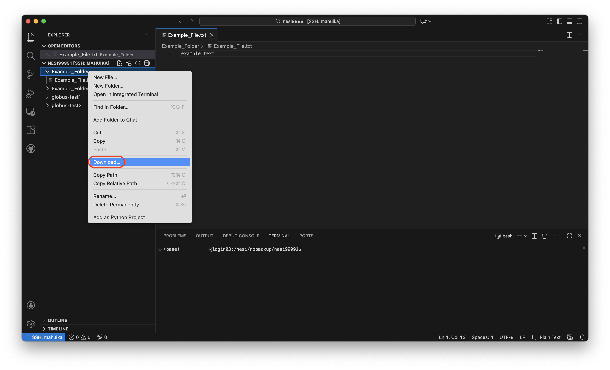

# VSCode

It is possible to use VSCode to nagivate Mahuika, as well as to upload/download file to/from Mahuika.

## Setting up Mahuika on VSCode

[Click here to see more information on how to set up VSCode to access the Mahuika Cluster](../Getting_Started/Accessing_the_HPCs/VSCode.md).

## Navigating through Mahuika on VSCode

Once you have login to Mahuika in VSCode, click `File` --> `Open`:

This will activate the top field box, where you can write the path you are wanting to access in mahuika. Write the desired path in this top field and click the `OK` button twice next to the field:

You may be asked to indicate if you trust Mahuika. If asked, click the button indicating you trust the authors:

You now have access to your files on Mahuika:

## Uploading files to Mahuika

To upload files and folders to Mahuika, drag the file/folder you want to place into Mahuika into the correct directory in the area of VSCode highlighted in the red box.

## Downloading files from Mahuika

To download a file from Mahuika, click on the file or folder you are interested in and right click on it. You will see a `Download` button, click it. This will download your file from Mahuika onto your computer:

