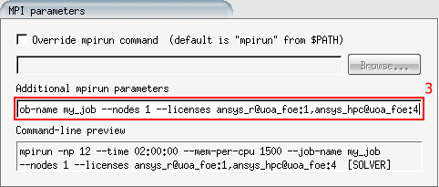

**[CLICK TO VIEW THIS PAGE RENDERED IN MKDOCS](https://nesi.github.io/support-docs/FORMAT/)**{ .hidden }

!!! prerequisite "See also"
    - To learn how you can contribute, [see CONTRIBUTING](CONTRIBUTING.md).
    - For information about page creation, [see NEWPAGE](NEWPAGE.md).

This page is an overview of the Markdown syntax supported in this documentation.

## Headers

<h2>H2</h2>

```md
## H2
```

<h3>H3</h3>

```md
### H3
```

<h4>H4</h4>

```md
#### H4
```

Headers should have a blank line before and after.

Don't use `H1` (`#`) this is reserved for the page title. Setting a title here will change it in the nav also.

h2 and h3 elements will be used to generate a table of contents (toc).

Try to keep headers short enough that they do not 'wrap' (become more than one line) in the toc,
this usually happens around 32-ish characters however this will vary depending on the letters being used.

## Line breaks

Put 2 spaces at the end of a line to force a line break.  
If you simply hit enter and don't use 2 spaces it will be considered one line.

```md
Put 2 spaces at the end of a line to force a line break.  
If you simply hit enter and don't use 2 spaces it will be considered one line.
```

## Text Emphasis

**bold**: `**bold**`

_italic_: `_italic`

## Tab Containers

=== "Tab One"
    something in the tab
=== "Tab two"
    something else

```md
=== "Tab One"
    something in the tab
=== "Tab two"
    something else
```

## Admonitions

!!! warning
    A warning.

```md
!!! warning
    A warning.
```

### Admonition Titles

!!! info "Optional title"
    Admonition with optional title.

```md
!!! info "Optional title"
    Admonition with optional title.
```

Adding titles helps users find key information, however if you can't be bothered thinking of a good title,
refrain from using something unnecessary or non descriptive (e.g. `!!! info "More Information"`), better to leave titleless.

Don't use a title if another Admonition already exists for that purpose (e.g. `!!! info "Watch out!"`).

### Collapsable Admonitions

Any Admonition can be made collapsable by replacing the `!!!` with `???` (closed), or `???+` (open)

??? info "I'm Collapseable"
    Wheeee

```md
??? info "I'm Collapseable"
    Wheeee
```

Consider making a Admonition collapsable-open (`???+`) if it is particularly long.
An Admonition **shouldn't be made collapsable-closed** (`???`) unless it has been given an **optional title explaining it's contents**.

### Admonition Flavours

There are various flavors.

!!! prerequisite
    - [link to page a user should read in order to follow](FORMAT.md)
    - some thing other requirement user must have to follow this page
    - usually you will want this to be a list format.
    - Should be right at the top of the page.

!!! tip "with title"
    For tangential actionable advice.  
    *`x` other command may be useful here.*

!!! info
    Use this to provide (optional) additional context or make an in depth explanation.
    *A little bit of info that isn't required for understanding the next paragraph.*

!!! warning
    Use this to draw readers attention to possible rare or edge case failures they may encounter.
    *If your filesystem is full you might get an error message.*

!!! danger
    Use this to draw attention to information that may lead to serious harm if ignored.
    *If your filesystem is full your job might be killed.*

!!! bug
    Mention possible bugs users may encounter (and tell them what to do if they encounter it).
    *Nearline doesn't work*

??? warning "Extra Admonitions you probably won't need"
    !!! note
        Use `info` instead of this.

    !!! question
        Havn't seen a reason to use this yet.
    
    !!! failure
        Havn't seen a reason to use this yet.
    
    !!! example
        Havn't seen a reason to use this yet.
    
    !!! quote
        Havn't seen a reason to use this yet.
    
    !!! pied-piper
        don't use this (unless Dini).
    
    !!! desktop-download-24
        don't use this (unless Dini).
    
    !!! magnifying-glass
        don't use this (unless Dini).
    
    !!! microscope
        don't use this (unless Dini).
    
    !!! vial-virus
        don't use this (unless Dini).
    
    !!! database
        don't use this (unless Dini).
    
    !!! folder-open
        don't use this (unless Dini).
    
    !!! backward
        don't use this (unless Dini).
    
    !!! jupyter
        don't use this (unless Dini).
    
    !!! terminal
        don't use this (unless Dini).
    
    !!! r-project
        don't use this (unless Dini).
    
    !!! calendar-days
        don't use this (unless Dini).
    
    !!! bell
        don't use this (unless Dini).
    
    !!! comment-dots
        don't use this (unless Dini).
    
    !!! check-to-slot
        don't use this (unless Dini).
    
    !!! square-xmark
        don't use this (unless Dini).
    
    !!! rectangle-list
        don't use this (unless Dini).
    
    !!! screwdriver-wrench
        don't use this (unless Dini).
    
    !!! linux
        don't use this (unless Dini).
    
    !!! code-compare
        don't use this (unless Dini).
    
    !!! heading
        don't use this (unless Dini).
    
    !!! space-awesome
        don't use this (unless Dini).
    
    !!! stethoscope
        don't use this (unless Dini).
    
    !!! key
        don't use this (unless Dini).
    
    !!! users-line
        don't use this (unless Dini).
    
    !!! file-code
        don't use this (unless Dini).
    
    !!! hand-holding-dollar
        don't use this (unless Dini).
    
    !!! circle-question
        don't use this (unless Dini).
    
    !!! microphone
        don't use this (unless Dini).
    
    !!! tower-observation
        don't use this (unless Dini).
    
    !!! circle-info
        don't use this (unless Dini).
    
    !!! icon--python
        don't use this (unless Dini).
    
    !!! quote-right
        don't use this (unless Dini).
    
    !!! image
        don't use this (unless Dini).
    
    !!! table
        don't use this (unless Dini).
    
    !!! glass-chart
        don't use this (unless Dini).
    
    !!! file-export
        don't use this (unless Dini).

## Code

### Block

Code blocks require a language lexer in order to do syntax highlighting, e.g. `python` ,`slurm`, `cuda`, `json`, `markdown`, `bash`
(most of these have short codes too, `py`,`sl`,`cd`,`md`,`sh`).
[A full list of lexers can be found in this list](https://pygments.org/languages/).

```py
import somepackage

formatting = True
if formatting:
    Print(formatting) # A comment
```

<pre><code><span>```py</span>
<span>import somepackage</span>
<span></span>
<span>formatting = True</span>
<span>if formatting:</span>
<span>  Print(formatting) # A comment</span>
<span>```</span>
</code></pre>

For plain text code blocks, still good to use a class as descriptor (e.g. `txt`, `stdout`, `stderr`).
May want to add formatting to this later.

<pre><code><span>```stdout</span>
<span>some code</span>
<span>```</span>
</code></pre>

```stderr
some code 
```

DON'T prefix a command with `$` (e.g. `$ ls` if this is something we want it should be added through formatting, not text.

### Inline

This is some `echo "Inline Code"`.

<pre><code><span>This is some `echo "Inline Code"`.</span></code></pre>

Inline code does not have syntax highlighting.
Code should be used for any text that you want the user to copy exactly.

### Keyboard

Keyboard keys can be added using the `<kbd>` tag.

Press `<kbd>`ctrl`</kbd>` + `<kbd>`c`</kbd>` to copy text from terminal.

```md
Press <kbd>ctrl</kbd> + <kbd>c</kbd> to copy text from terminal.
```

Note the additional spacing around the `+` else it will appear cramped.

### Slurm Scripts

The most common use of a code block is to display an example Slurm script.  

We want our examples to be easy to understand, but also users _will_ copy
paste them, so we also want them to be working scripts that wont cause easily avoidable errors.

If possible stick to the following principles.

- Make sure the code block has the `sl` language tag. This will inform syntax highlight an CI checks.
- Use `!#/bin/bash -e` as your shebang.
- One blank line between shebang and Slurm Header.
- Use <kbd>tab</kbd> for your Slurm header delimiter.
- Use the long for Slurm keywords, e.g. `--job-name` rather than `-j`.
- Make sure to include `--job-name`, `--account` (`nesi99991`) and `--time`.
- One blank line after Slurm header.
- Always `module purge` before `module load`.
- Include version in `module load`. See [Variable Injection](#variables-injection) for convenience macro.
- Don't be too fancy. We all know you are very clever,
but your script examples should do the bare minimum needed to provide a safe example.
- If possible, include an example that will work for the user, e.g. one of the tutorial files. (`wget`, `$EB_ROOT`, etc)

#### Example

<pre><code><span>```sl</span>
<span>#!/bin/bash -e</span>
<span></span>
<span>#SBATCH --job-name          test-job</span>
<span>#SBATCH --account          nesi99991</span>
<span>#SBATCH --time             01:00:00 </span>
<span></span>
<span>module purge</span>
<span>module load MATLAB/2022a</span>
<span></span>
<span>matlab -r myFile.m    # Some nice informative comment.</span>
<span>```</span></code></pre>

## Images

```md

```


!!! note "Pasting from Clipboard"
    You can 'paste' an image from the clipboard into a markdown document,
    it will add

    ```md
    
    ```

    In markdown where you pasted the image, and upload `image.png`, into the same directory.

    Make sure you rename the `image.png` to something more descriptive, move it into the 'assets/images' folder, and update then markdown accordingly.

!!! tip "Drag and Drop"
    You can easily get the path to a image file by dragging it from the left hand Explorer panel over your document, then pressing <kbd>shift</kbd> (you will be prompted) and dropping the image in the desired position. Copy pasting an image from Explorer into markdown also works.

    You can also start typing `!` and then use context suggestions (<kbd>ctrl</kbd> + <kbd>space</kbd>), select 'Insert Image' and navigate the rest of the way.

## Links

[External Link]("https://example.com")

```md
[External Link]("https://example.com")
```

[Internal Link]("General/FAQs/Password_Expiry")

```md
[Internal Link]("General/FAQs/Password_Expiry")
```

!!! warning
    Link paths are relative to current file!!!

[Anchor Link](#links)

```md
[Anchor Link](#links)
```

`snake-case` anchors are automatically generated for all headers.

The anchor will be the same as the header text with all non-alphanumeric characters removed, converted to lower case, and space characters replaced with `-`.
For example a header `## This is my (nasty-Header)` can be linked to with the anchor `[Anchor Link](#this-is-my-nastyheader)`

!!! tip "Drag and Drop"
    You can drag files from the left hand Explorer panel over your document then press <kbd>shift</kbd> (you will be prompted) and drop in the desired position. Copy pasting a file from Explorer into markdown also works.

??? tip "Ambiguous links"

    Try to avoid putting links on ambiguous words, e.g.

    === "Bad"
        View the software homepage [here](https://www.example.com).

        ```md
        View the homepage [here](https://www.example.com).
        ```

    === "Better"
        View the [software homepage](https://www.example.com).

        ```md
        View the [software homepage](https://www.example.com).
        ```

## Tooltips

[Hover over me](https://example.com "I'm a link with a custom tooltip.")

```md
[Hover over me](https://example.com "I'm a link with a custom tooltip.")
```

Acroynym should be automatically made tool-tips e.g. MPI.

```md
Acroynym should be automatically made tool-tips e.g. MPI.
```

## Lists

### Unordered List

- item1
- item2
- a
- item

```md
- item1
- item2
- a
  multi-line
- item
- nested
  - items
    - nested-er
```

### Ordered List

1. item1
2. a
   multi-line
   item
   with multiple
   lines
3. nested
   1. nested item 1
   2. nested item 2
      1. even nested-er

```md
1. item1
2. a
   multiline
   item
   with multiple
   lines
3. nested
    1. nested item 1
    2. nested item 2
        1. even nested-er
```

*Note, nested list items use numbers, but will be rendered as whatever the indent is.*

## Tables

[Markdown Table Generator](https://www.tablesgenerator.com/markdown_tables), is a handy tool for complex tables/

Tables can be constructed using `|` to separate columns, and `--` to designate headers.

Number of dashes has no effect, things don't have to be lined up when in markdown, just looks nice.
Leading and trailing `|` are optional.

| Head   | Head   |
| ------ | ------ |
| Thing1 | Thing2 |
| Thing3 | Thing3 |

```md
 Head | Head
 --- | -----------
 Thing1 | Thing2
 Thing3 | Thing 3
```

`:`'s can be used to align tables.

| Left  | Center | Right |
| :---- | :----: | ----: |
| Words | Words | Words |
| Words | Words | Words |

```md
| Syntax      | Description | Test Text     |
| :---        |    :----:   |          ---: |
| Header      | Title       | Here's this   |
| Paragraph   | Text        | And more      |
```

## Macros

Macros allow use of [Jinja filter syntax](https://jinja.palletsprojects.com/en/3.1.x/templates/) _inside the markdown files_ allowing for much more flexible templating.
More details can be found on the [mkdocs-macros-plugin page](https://mkdocs-macros-plugin.readthedocs.io/).

### Includes

The macro plugin allows the use of 'includes', here is an example.

```md



```

There are a few includes you may want to use.

| Path | content | usage |
| ---- | ------- | ----- |
| `````` | ```<a href="mailto:support@nesi.org.nz">Contact our Support Team</a>``` | Anywhere the user is told to contact support. |
| `````` | Info block | At the top of documents about particular software (TODO: elaborate) |
| `````` | List of network licences | When dynamic licence info is required (used in `appHeader.html`)  |
| `````` | List of versions and a 'module load' code-block. | When dynamic version info is required |

### Variables injection

Here is an example using dynamically using the module version information.

`module load ANSYS/{{ applications.ANSYS.default }}`

```md

`module load ANSYS/{{ applications.ANSYS.default }}`

```

### Advanced Macros

And here is another example showing all Python packages installed in Python modules.

??? "Fancy Example"
    Our Python modules come pre-built with the following packages:
    <table>
    <tr><th>Package</th></tr>
    
    <tr><td>{{ pyext }}</td></tr>
    
    </table>

    ```md
    
    Our Python modules come pre-built with the following packages:
    <table>
    <tr><th>Package</th></tr>
    
    <tr><td>{{ pyext }}</td></tr>
    
    </table>
    
    ```
