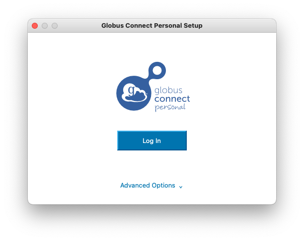
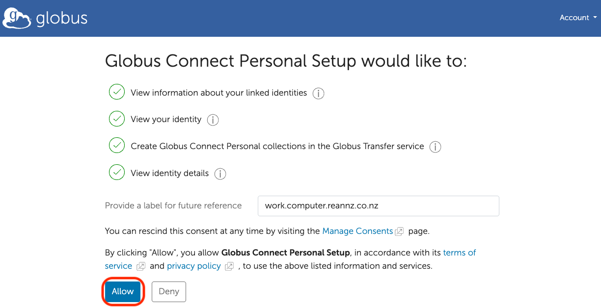
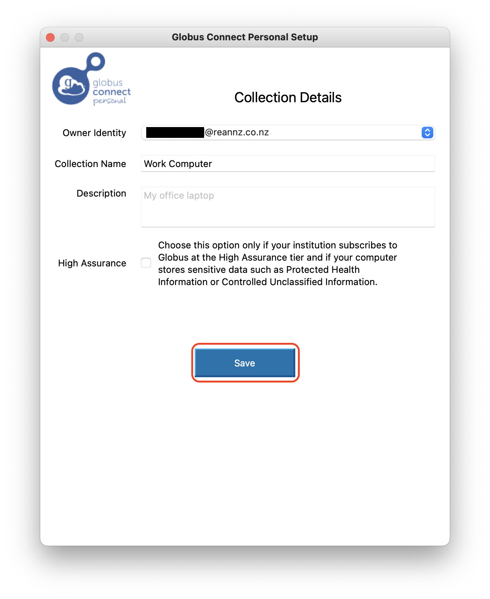
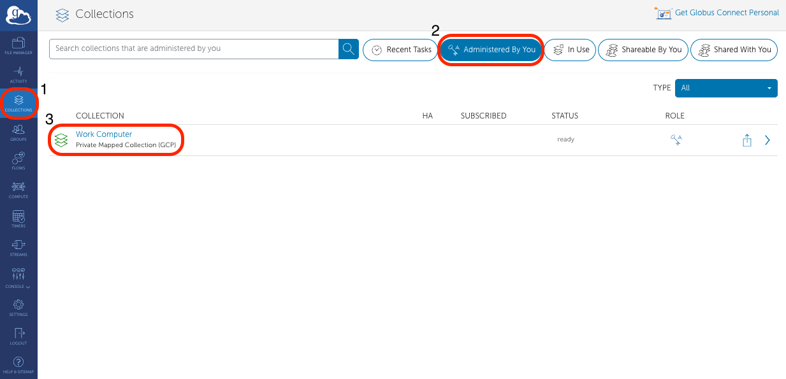

To download and upload files between the Mahuika supercomputer and your personal computer,
you will need to install [Globus Connect Personal](https://www.globus.org/globus-connect-personal)
onto your computer.

1. To install Globus on your computer, see:
    * Windows: [docs.globus.org/globus-connect-personal/install/windows](https://docs.globus.org/globus-connect-personal/install/windows)
    * Mac: [docs.globus.org/globus-connect-personal/install/mac](https://docs.globus.org/globus-connect-personal/install/mac)
    * Linux: [docs.globus.org/globus-connect-personal/install/linux](https://docs.globus.org/globus-connect-personal/install/linux)

2. During your installation you will be asked to `Log In`. Login using your Globus
   login. This may require you to login to your Tuakiri, Github, Google, or ORCID ID
   account.
   

3. You will be required to click `Allow` to connect your computer to Globus.
    

4. Back in your Globus Connect Personal Setup screen, give a name for your computer
    in the `Collection Name` field and click save. This is your computer's `Endpoint`
    

5. Your computer will now be saved in Globus as a Globus endpoint. Back in the Globus
    website, you will see that your computer's `Endpoint` has been added to your
    `Collections`. On the `Collections` tab, click the `Administrated By You` button
    to see your computer's `Endpoint` on Globus.
    

Notes: [docs.globus.org/globus-connect-personal](https://docs.globus.org/globus-connect-personal)
