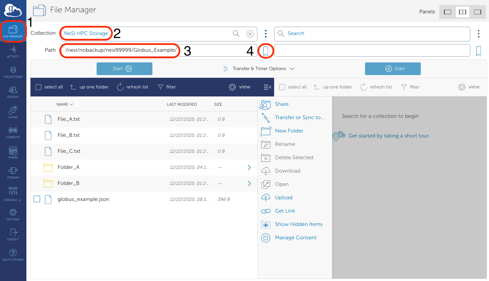
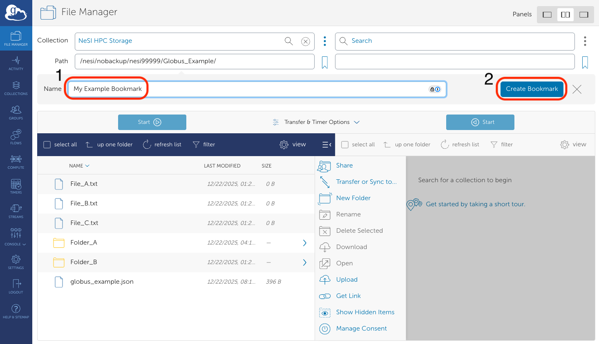
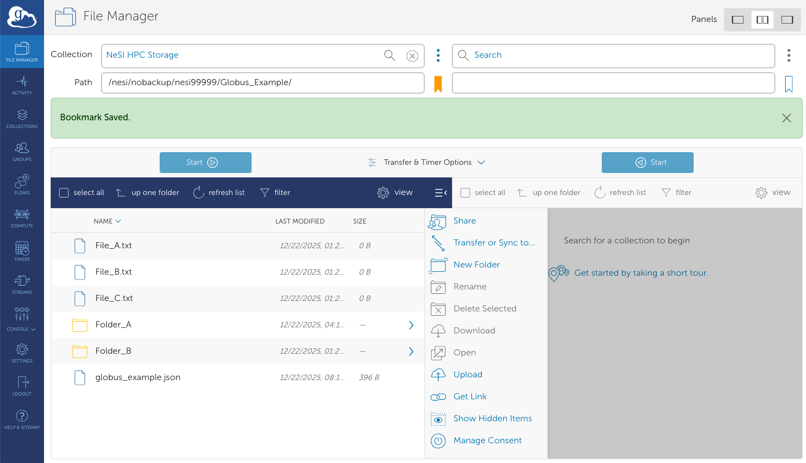
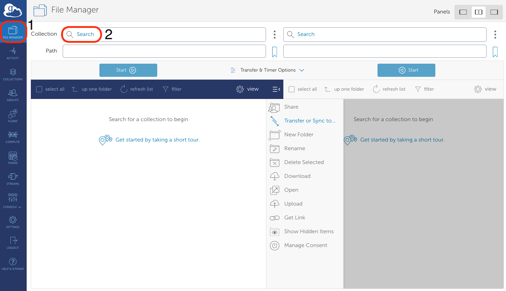
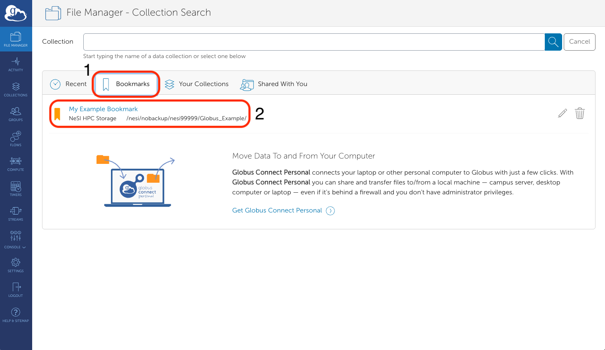

Borkmarks are a convenient way to quicky open a `Path` of an `Endpoint` very quickly.

## Create a bookmark

To create a new bookmark:

1. In the `File Manager` tab, open the collection you are interested in and find your way to the
`Path` you are interested in bookmarking. Then click the bookmark icon in (4):
    
2. Give a name to your bookmark and click `Create Bookmark`:
    
3. This will create a bookmark, and make the bookmark icon go gold:
    

## Select a bookmark

1. Click on the `File Manager` tab, then click on the `Collection` field:
    
2. Click on the `Bookmarks` tab. Here, you will see all your bookmarks.
    Click on the one that is relevant to you:
    
3. You will then return to the `File Manager` page, but now with your `Collection` open
    to the desired `Path`.
