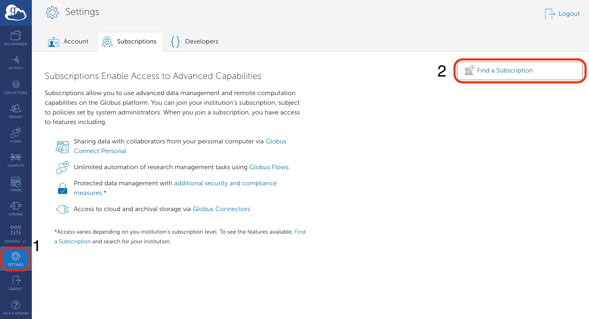
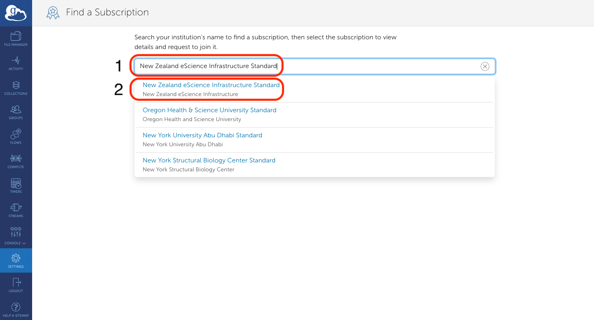
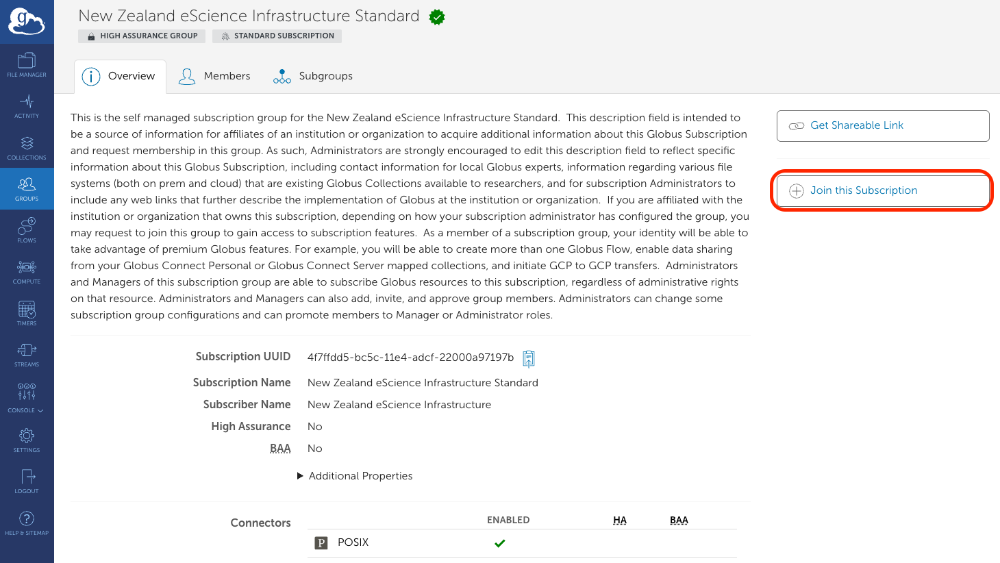
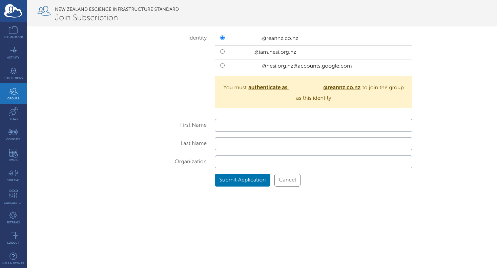
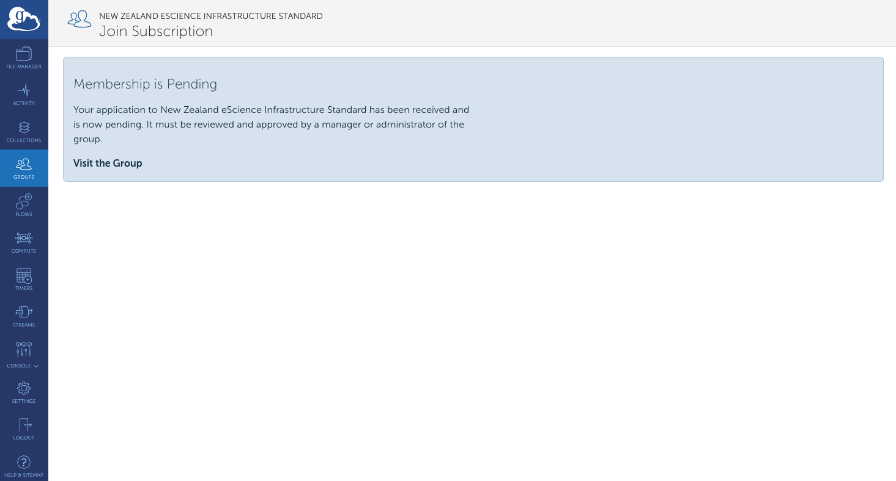

It is possible to copy files between two computers/servers (two `endpoints`) using
Globus. However, first you need to sign up with a Globus Subscription. **This is free**
for Mahuika users.

!!! tip
    The name of the Mahuika subscription is `New Zealand eScience Infrastructure Standard`

## Signing into your **Free** Globus Subscription

1. Click the Search Tab and click on `Find a Subscription`:
    
2. In the empty field line, search for `New Zealand eScience Infrastructure Standard`
    
3. On the `New Zealand eScience Infrastructure Standard` subscription page, click on `Join this Subscription`:
    
4. Select an identity and provide your first name, last name, and organisation for the subscription.
    Note: you may be required to authenticate yourself.
    
5. You will see a message saying that `Membership is Pending`. Our support team will submit your request and
   email you back once you have been accepted into the subscription.
    

## Transferring files between two computers

Once you have been accept. follow the [Transferring data using Globus](./Data_Transfer_using_Globus.md#transferring-data-using-globus) page
to learn how to transfer data between two computers, where instead of transferring data between your `endpoint`
and mahuika, you transfer data between your two computers/servers (your two `endpoints`).
