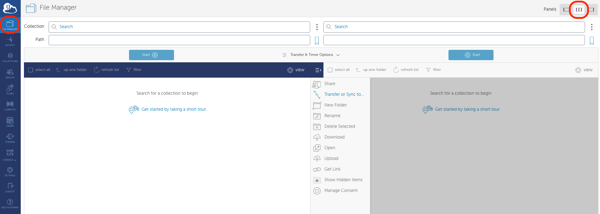
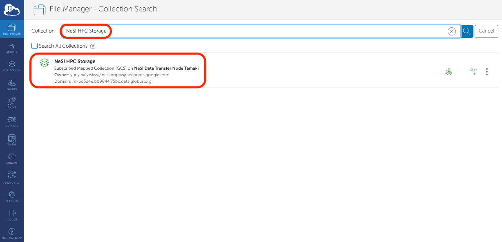
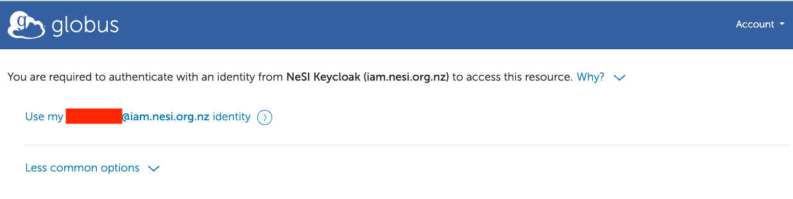
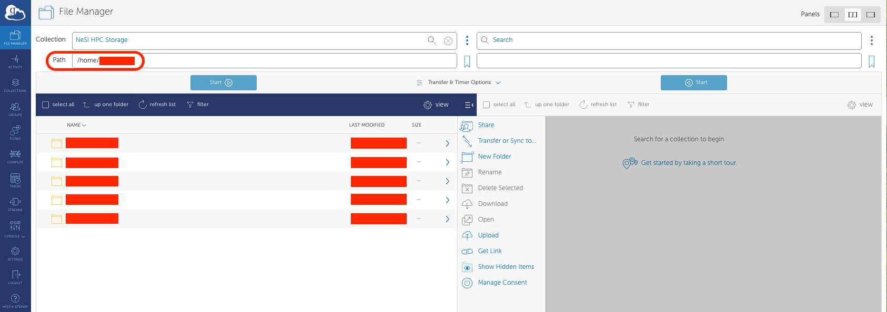

To move files and folders between `Endpoints` (such as between Mahuika and another computer or server):

1. Go to the File Manager tab of [your Globus page](https://app.globus.org/file-manager?two_pane=true).
    Give yourself two panels by clicking the `Two Panel` button:
    

2. Click on the left-hand side `Collection` field, specifically on the Search icon.
    

3. In the Search bar, type `NeSI HPC Storage`. Below the search bar, click on the `NeSI HPC Storage` icon.
    

4. This will take you back to the main page, where you will need to authenticate yourself with the 
    `NeSI HPC Storage` Globus endpoint. 
    

5. You will be shown a globus page requiring you to sign in to NeSI. Click on `Use my username@iam.nesi.org.nz identity` text.
    

6. Once you have logged in, you will be sent back to the Globus transfer page. By default you will be placed to your
    `home` directory. 

\(1\) your ***/home/&lt;username&gt;*** directory,

\(2\) project directory (read-only)
***/nesi/project/&lt;project\_code&gt;***

\(3\) project sub-directories of
***/nesi/nobackup/&lt;project\_code&gt;*** - see
[Globus Paths,Permissions, Storage Allocation](./Globus_Paths-Permissions-Storage_Allocation.md).  

    

As an example, to move files between the NeSI HPC Storage endpoint and the Otago University high-capacity central
file storage (another managed server endpoint):

!!! info
    Log in to the [NeSI File Manager](https://transfer.nesi.org.nz/file-manager) where you are able to search for DTNs in the Collection field.
    [Listing of available endpoints on the New Zealand Data Transfer Platform](National_Data_Transfer_Platform.md)

Find the NeSI endpoint by typing in "NeSI HPC Storage". Select the
endpoint "NeSI HPC Storage" from the list, and you will be asked
to authenticate your access to the endpoint.

Click Continue to the next step.

You'll be asked to select an identity to continue.
Choose **&lt;username&gt;@iam.nesi.org.nz**.

- *Note:*
OpenID Connect (OIDC) in Globus is used to enable secure authentication and authorization for accessing resources within the Globus ecosystem, particularly on Globus Connect Server endpoints. If this is your first login, you may be asked to *bind* your primary identity to the OICD login, and you will need to allow that.

The NeSI HPC Storage endpoint is protected by Tuakiri
authentication.

After the login, you will navigate to the default root (display as "/") path, then you could change the path to

\(1\) your ***/home/&lt;username&gt;*** directory,

\(2\) project directory (read-only)
***/nesi/project/&lt;project\_code&gt;***

\(3\) project sub-directories of
***/nesi/nobackup/&lt;project\_code&gt;*** - see
[Globus Paths,Permissions, Storage Allocation](./Globus_Paths-Permissions-Storage_Allocation.md).  
  
Navigate to your selected directory. e.g. the `nobackup` filesystem
`/nesi/nobackup/<project_code>` and select the two-endpoint panel
for transfer.

Select the target endpoint and authenticate.

When you have activated endpoints in both transfer windows, you can
start transferring files between them.

Select files you wish to transfer and select the corresponding "Start"
button:  
  

To find other NeSI endpoints, type in "nesi#":

## In brief

- Sign in to the NeSI Globus Web App <https://transfer.nesi.org.nz/>.
  You will be taken to the *File Manager* page
  <https://transfer.nesi.org.nz/file-manager>
- If this is your first time, you will need to create a Globus
  account.
- Open the two-endpoint panel
  {: style="height:2em;"} located
  on the top-right of the *File Manager* page.
- Select the Endpoints you wish to move files between (start typing
  "nesi#" to see the list of NeSI endpoints to select from).
  [Authenticate](./Globus_endpoint_activation.md)
  at both endpoints.
- At Globus.org the endpoint **defaults to
  `/home/<username>` path** (represented by `~`) on the NeSI platform. We do not recommend uploading data to your home directory, as
  home directories are very small. Instead, navigate to an appropriate
  project directory under /nobackup (see
  [Globus Paths, Permissions,  Storage  Allocation](./Globus_Paths-Permissions-Storage_Allocation.md)).
- Transfer the files by clicking the appropriate
  {: style="height:1em;"} button
  depending on the direction of the transfer.
- Check your email for confirmation about the job completion report.

## Transferring data using a personal endpoint

To transfer files to/from your laptop, desktop computer or any other
system you control, configure it as a [Globus Personal
Endpoint](https://www.globus.org/globus-connect-personal) (see
[Personal Globus Endpoint Configuration](./Personal_Globus_Endpoint_Configuration.md)
for transfers between personal endpoints).

## File sharing

To share files with others outside your filesystem,
see [https://docs.globus.org/how-to/share-files/](https://docs.globus.org/how-to/share-files/).

## Using Globus to transfer data to or from the cloud

Globus connectors enable a uniform interface for accessing, moving, and
sharing across a variety of cloud providers. We do not currently have a
connector subscription (note a subscription is required per cloud
provider) so we can't use globus to transfer to/from cloud storage. If
you see this as key for you, please .

Our current advice for moving data to or from the cloud is to use tools
such as Rclone ([https://rclone.org/](https://rclone.org/)) or the
cloud CLI's such as aswcli for S3 [https://aws.amazon.com/cli/](https://aws.amazon.com/cli/) or
gcloud CLI
([https://cloud.google.com/sdk/gcloud](https://cloud.google.com/sdk/gcloud)).
If you have any trouble or would like further advice, please .
