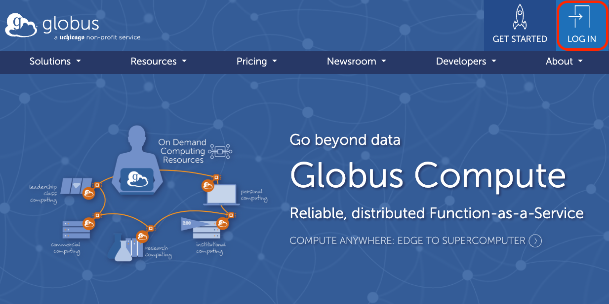
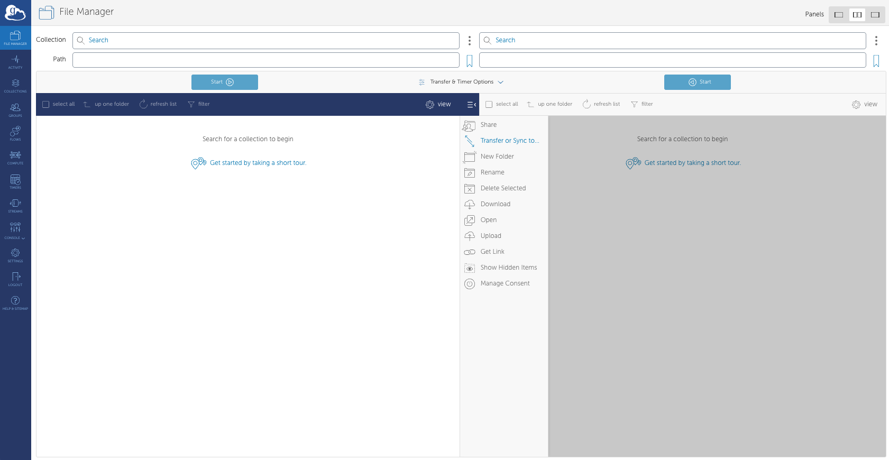
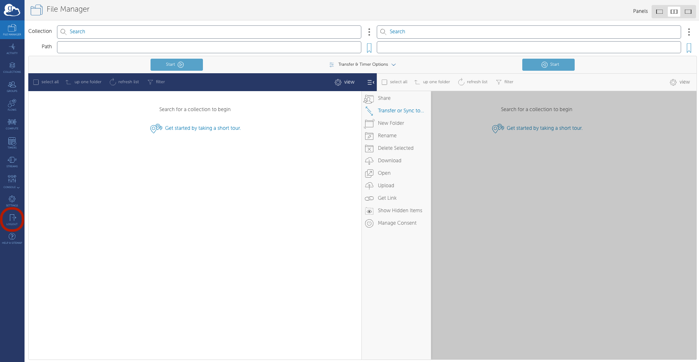
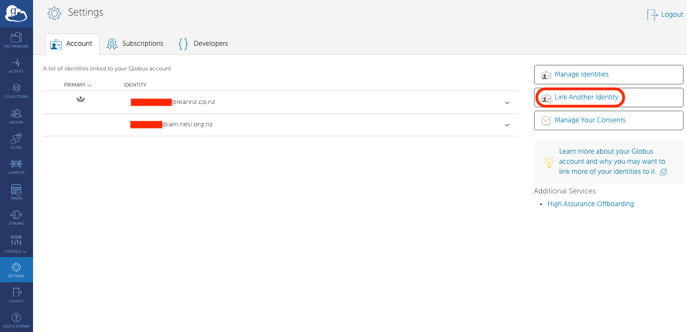
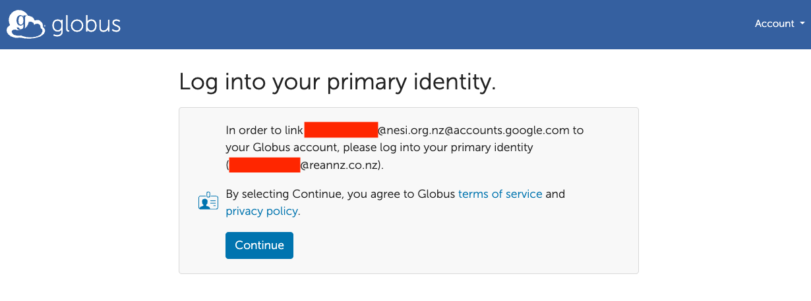

This guide will show you how to setup globus for the first time. This page includes:

* [Setting up your Globus account](#setting-up-your-globus-account)
* [Link other accounts to your Globus account](#link-other-accounts-to-your-globus-account)

You can learn about setting up your personal Globus endpoint on your computer on the [Add your Computer to Globus](./Add_Your_Computer_To_Globus.md) section.

## Setting up your Globus account

1. Either go to [globus.org](https://www.globus.org) and click the `LOG IN` button, or go to
    [transfer.nesi.org.nz](https://transfer.nesi.org.nz/).
    
2. Look up your institution in the drop-down box, or sign in using your github, google, or
    ORCID ID, then click continue. You will be directed to your Tuakiri login screen or
    Github, Google, or ORCID ID login screen.
    
3. Once you have done this, you will enter the Globus website.
    

## Link other accounts to your Globus account

You can link your globus account to your github, google, or ORCID ID account by performing the following steps:

1. Click on the Settings button.
    
2. Click on `Link Another Identity`.
    
3. In the `Look up your organization...` field, type in the intitution you would like to add to
    your globus account, or Github, Google, or ORCID ID if you want to link these accounts to your
    Globus account.
    
4. After logging into this account, you will need to login to your primary Globus account. Click continue
    
