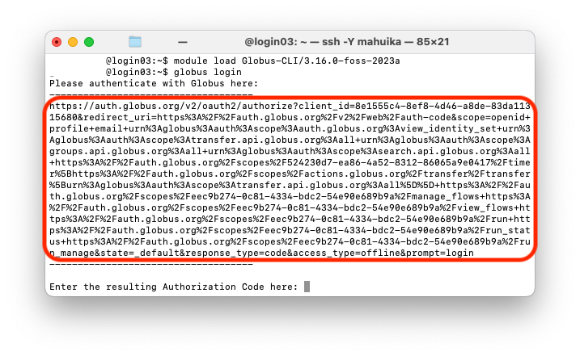
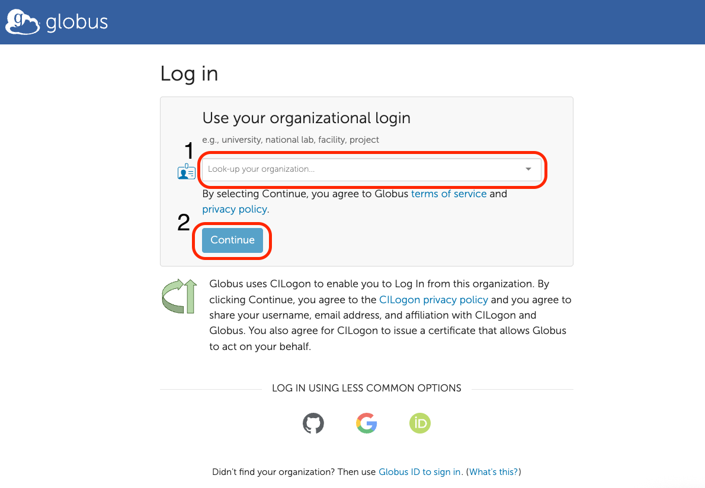
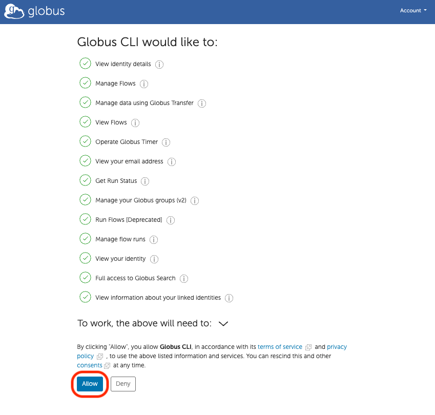
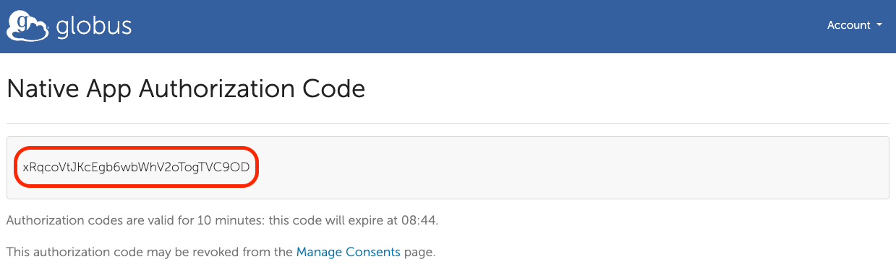
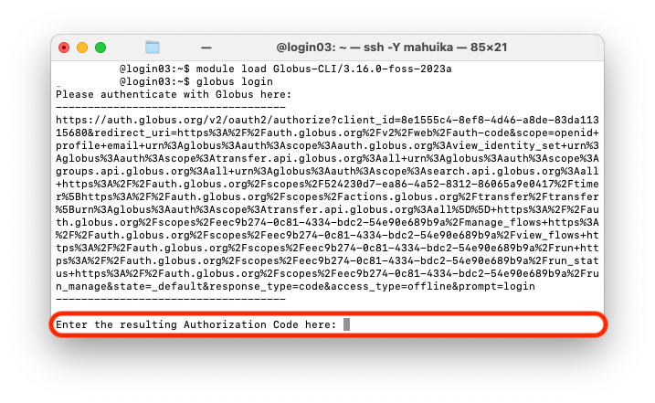
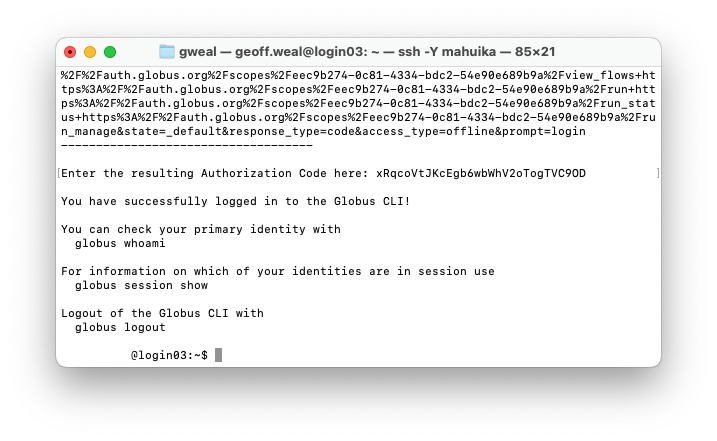
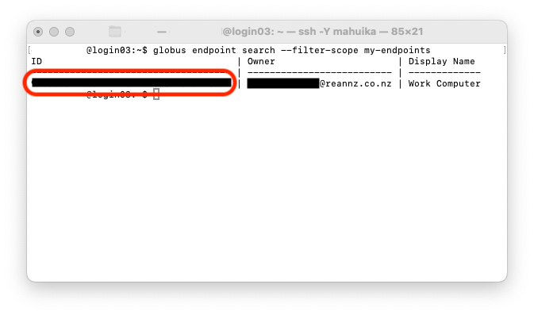

This page will describe the various step to how to use the Globus Command Line Interface (CLI).
This is a useful way to use globus directly from your terminal.

## Loading Globus CLI on Mahuika/Installing Globus CLI on your computer and logging in to Globus CLI

Whenever you need to use Globus CLI on Mahuika, you must first load the module:

```sh
module load Globus-CLI/3.16.0-foss-2023a
```

If you want to use it on your computer, you need to have installed
[Globus Personal Connect](./Add_Your_Computer_To_Globus.md) first, then install
`globus-cli` on your computer:

```sh
pip install --user --upgrade globus-cli
```

Then, you need to login to Globus by typing into the terminal

```sh
globus login
```

This will show you a website that will require you to authenticate yourself, as well as to allow
Globus CLI to have access to your Globus files. You will be given an authorization codethat you
want to enter into the terminal.








## Transfer files/folders using Globus CLI

To transfer a files/folders using Globus CLI, you need to obtain the `Endpoint` id for each of the
endpoints you want to transfer data to and from.

!!! hint
    The `Endpoint` id for mahuika is: `763d50ee-e814-4080-878b-6a8be5cf7570`
    ```sh
    globus endpoint search "NeSI HPC Storage"
    ```

To get the `Endpoint` id of your computer, type into your terminal (on your local machine or mahuika):

```sh
globus endpoint search --filter-scope my-endpoints
```

This will give you the endpoint of your computer/server.



Next, you will need to authorise Mahuika to allow your transfer. Do this by typing in the terminal:

```sh
globus session update --all
```

This will take you to a website where you can authenticate yourself across mahuika, as well as all your 
devices and institutional infrastructure (servers) you are using

Then, you can then transfer a file using `globus transfer` in the terminal. To transfer a folder off of mahuika
onto your computer (you will need to give full paths):

```sh
export Globus_Mahuika_Endpoint="763d50ee-e814-4080-878b-6a8be5cf7570"
export Globus_My_Computer_Endpoint="00000000-0000-0000-0000-000000000000"
globus transfer "$Globus_Mahuika_Endpoint:/nesi/nobackup/nesi99999/Globus_Example" "$Globus_My_Computer_Endpoint:home/username" --recursive --label "CLI single folder"
```
