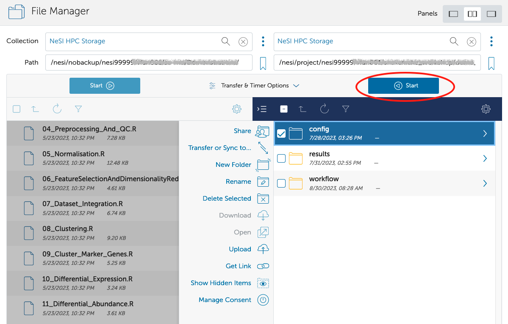

This is intended to be a quick-start guide, for more detailed
information, please see our other Globus articles here: [Globus documentation](Data_Transfer_using_Globus.md)

Globus is a third-party service for transferring large amounts of data
between two Globus Data Transfer Nodes (DTNs). To use Globus to transfer
data to or from NeSI, you need:

1. An active NeSI account (see
  [Creating a NeSI Account](../../Getting_Started/Creating_an_Account.md))
2. A Globus account (see
  [Initial Globus Sign-Up and Globus ID](./Initial_Globus_Sign_Up-and_your_Globus_Identities.md))
3. Access to Globus DTNs or endpoints  
    - Access to a DTN (e.g., at your home institution)
    - Personal endpoint if no DTN is available

## Globus Account

Please note that a Globus account is not the same as a NeSI account. You
will need both Globus and NeSI accounts in order to transfer data to or
from NeSI HPC and storage facilities.

To get a Globus account, go to <https://transfer.nesi.org.nz/> and sign
up using one of the available options on the page. Please note that the
"existing organizational login" is somewhat limited, if your
organisation is not listed, please sign in (sign up) using any of the
other methods.

For more detailed instructions please see
[Initial Globus Sign-Up, and your Globus Identities](./Initial_Globus_Sign_Up-and_your_Globus_Identities.md).

## Globus Endpoint Activation

A NeSI account is required in addition to a Globus account to transfer
data to or from NeSI HPC and storage facilities. 

To transfer data between two sites (for example, NeSI platforms and the University of Otago central file storage), you need to have access to the DTN or
endpoint at each location. You will also need the appropriate read and write permissions from where you're
copying to and from. Please note that the NeSI `project` directory is read only, and `nobackup` is read and write.

A list of some Institutional endpoints can be found here:
[National-Data-Transfer-Platform](./National_Data_Transfer_Platform.md).
You can also set up your own [personal
endpoint](./Personal_Globus_Endpoint_Configuration.md)
to transfer data to or from your personal computer, however,
administrative access to your computer is required.

To activate the NeSI endpoint click go to
[https://transfer.nesi.org.nz/](https://transfer.nesi.org.nz/)  and click "file manager" on the menu
bar on the left.

1. Next to "Collection", search for "NeSI HPC Storage", select
    it, then click "Continue".
2. Select your identity provider from the list to authenticate and continue.

## Transferring Data

To transfer data, activate your two endpoints and navigate to the
appropriate folders, then select the files or folders of interest. To
initiate the transfer, select one of the two directional arrows. In the
image below, the 'config' folder is being transferred from the location
on the right, to the location on the left.

To see the progress of the transfer, please click 'Activity' on the left
hand menu bar.

If you have any questions or issues using Globus to transfer data to or
from NeSI, 
