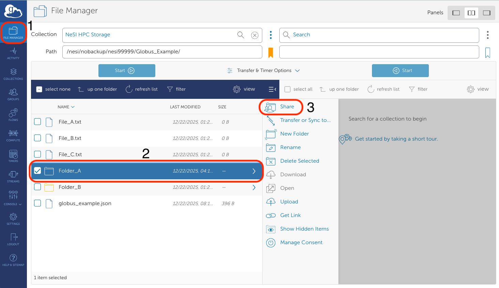
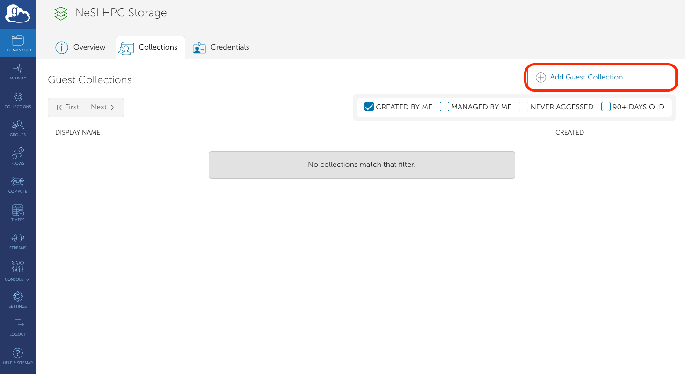
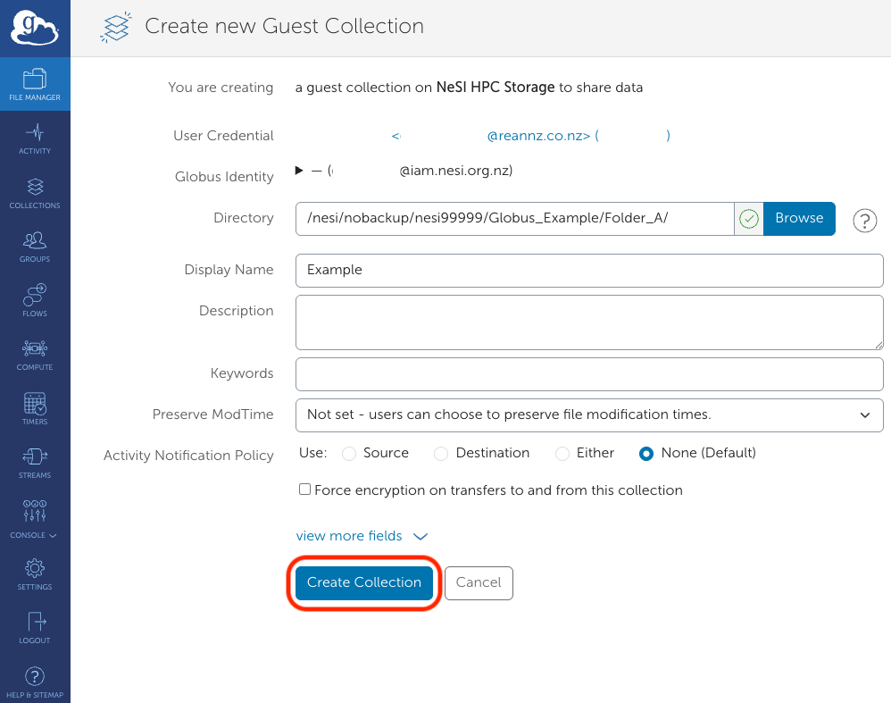
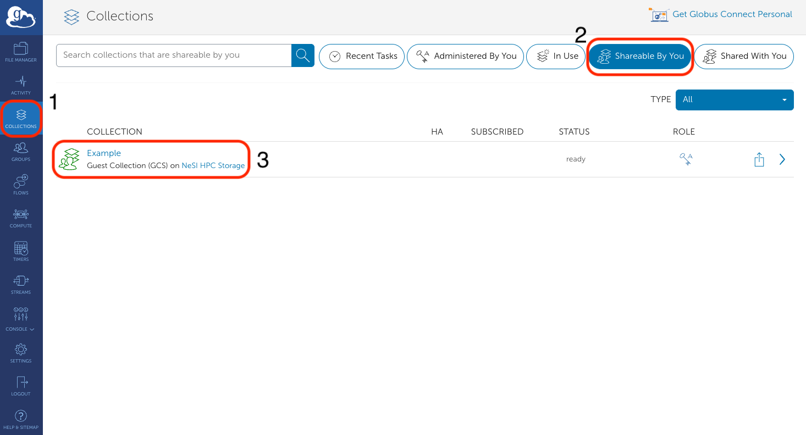
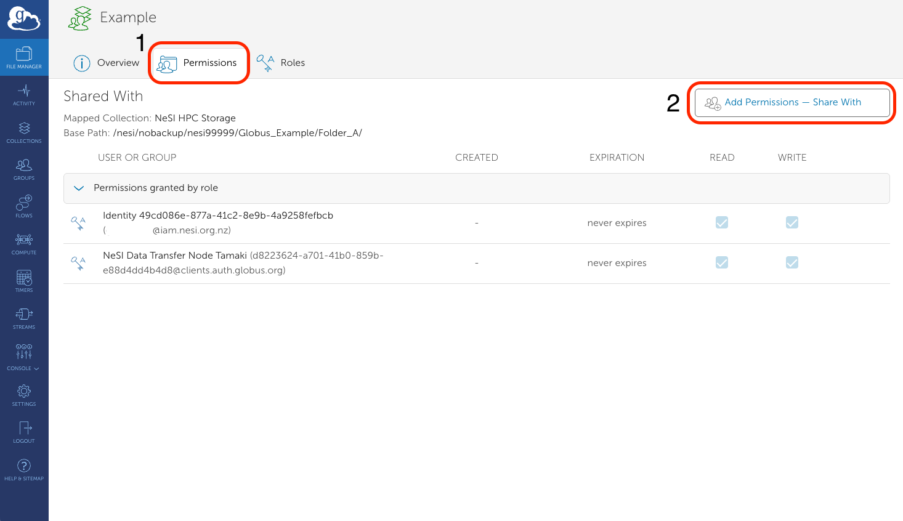
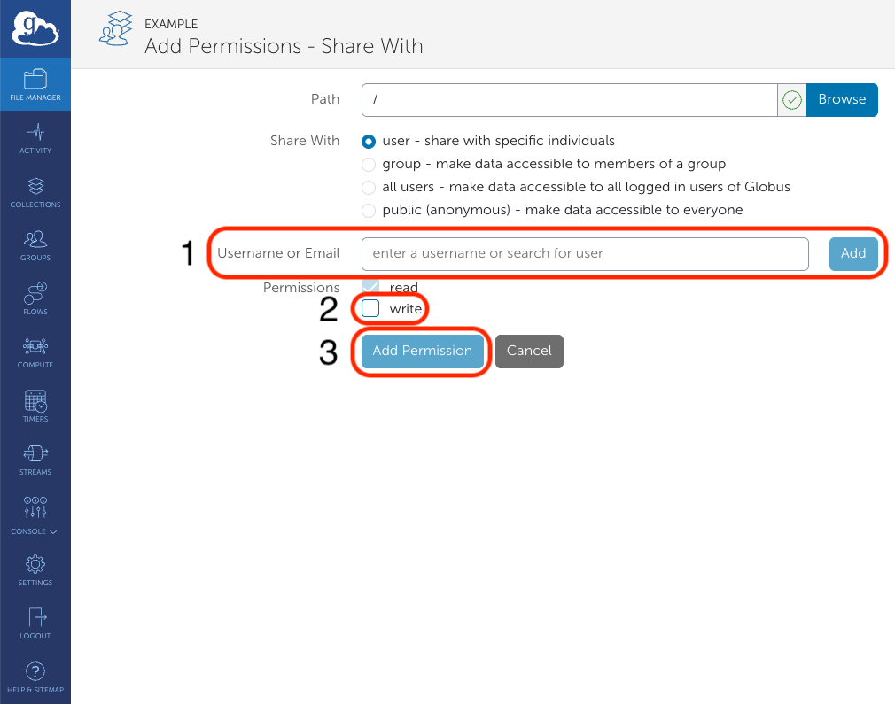
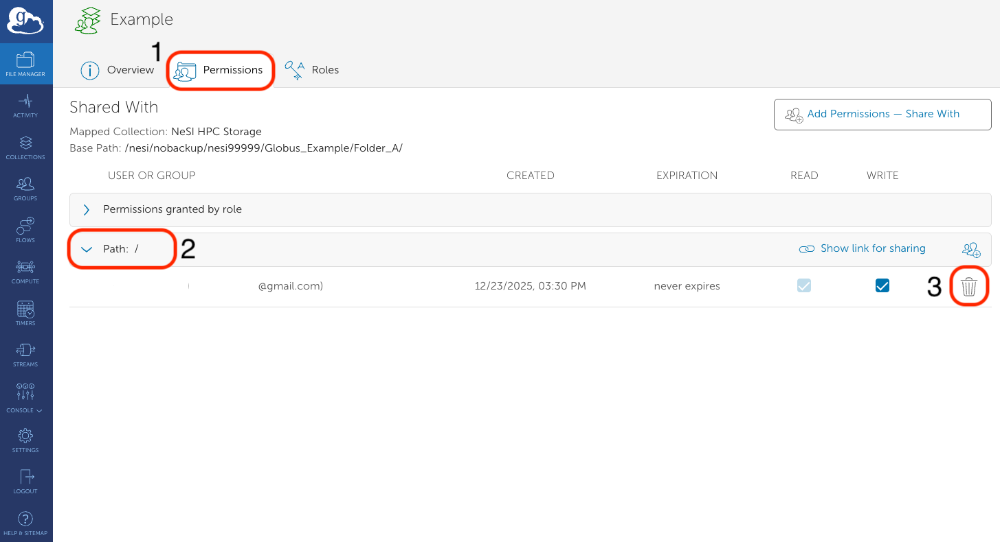
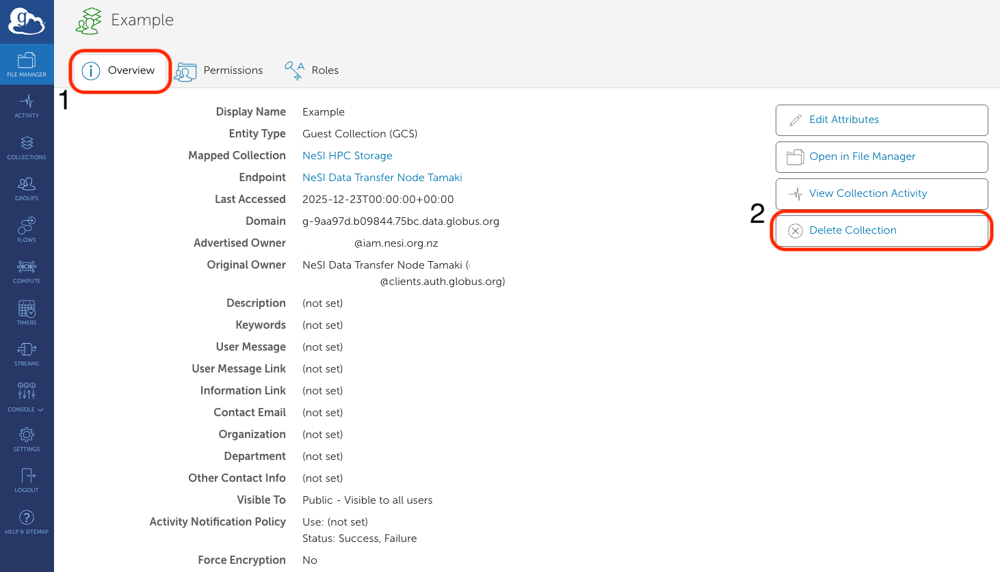
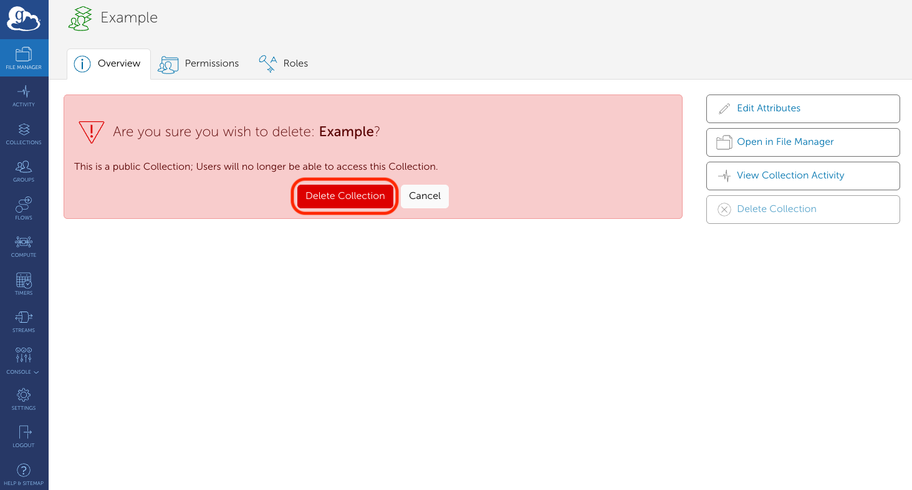

Share collections are a way to easily share data with other researchers who also has globus.

## How to create a share collection

1. In `File Manager`, click on the file or folder you which to share and click `Share`:

    

2. In the `Guest Collections` page that appears, click `Add Guest Collection`:

    

3. In the next page that appears, Fill in the details about the guest collection and then
    click `Create Collection`. This will create a new shared collection:

    

## How to share a share collection

1. In the `Collections` tab, click on the `Shareable By You` tab and click on the collection
    you wish to share:

    

2. In the `Permissions` tab, click `Add Permissions - Share With`:

    

3. Enter the email address of the person who you wish to share your data with, allow
    them write privileges if desired, then click the `Add Permission` button. This will
    send an email to the user you which to share your data with about how to access the
    data *via* Globus:

    

## How to remove someone from a share collection

1. In the `Collections` tab, click on the `Shareable By You` tab and click on the collection
    you wish to share:

    

2. In the `Permissions` tab, open up the `Path` window and click the bin button of the user(s)
    you would like to remove from the share collection:

    

## How to remove a share collection

1. In the `Collections` tab, click on the `Shareable By You` tab and click on the collection
    you wish to share:

    

2. In the `Overview` tab, click the `Delete Collection` button:

    

3. Click the `Delete Collection` button:

    
