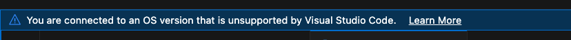

The latest version of Visual Studio Code (1.86.0) released in January
2024 requires a later version of GLIBC than is currently available on
the NeSI login nodes.

For the moment please roll back to the [previous release
(1.8.5)](https://code.visualstudio.com/updates/v1_85).

You will also have to roll back the 'Remote - SSH' plugin. This can be
done by selecting the plugin in the Extension Marketplace, clicking on
the 'Uninstall' drop down and choosing 'Install another version'.

## Update: 09/02/2024

Due to the amount of [feedback on the glibc
change](https://github.com/microsoft/vscode/issues/204658) the VSCode
team have said that **future versions will allow you to connect with a
warning instead.**

You can get the fix in a [pre-release build
(1.86.1)](https://github.com/microsoft/vscode/releases/tag/1.86.1), or
wait for the next stable release in March.
