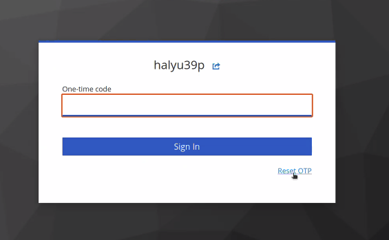
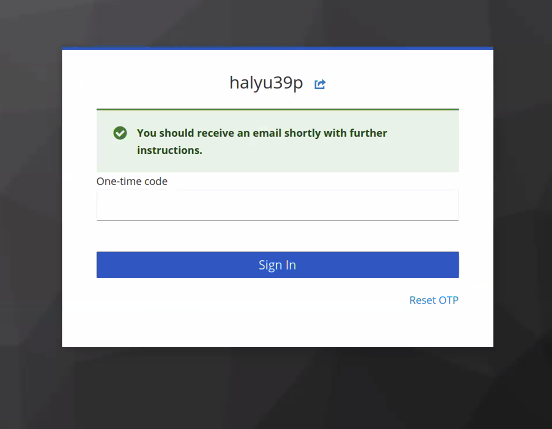

If you have misplaced your 2FA authenticator, you may need to reset your 2FA credentials.

1. On the screen where you are prompted for your 6 digit code, click 'Reset OTP'
.

   !!! warning "Not seeing this page?"
       If you perviously confirmed your device as 'Trusted', you will not be prompted for 2FA authentication.
       In order to see the option to reset, open the link in a private/incognito session.
   
3. You will be redirected to a window for conformation. Your username should be prepopulated, if this is not the case, enter your username and click send.

4. Check your emails (the one associated with your NeSI account).
   You should find an email called 'Reset OTP'.

6. Follow the instructions to setup your new 2FA.
