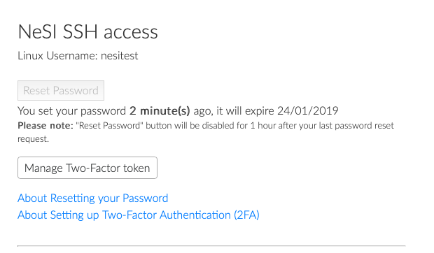
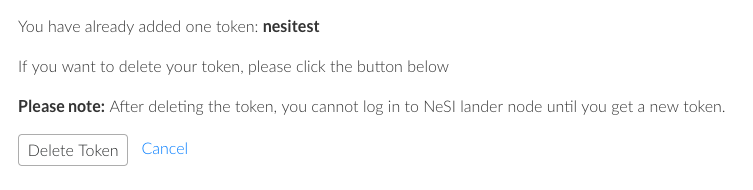
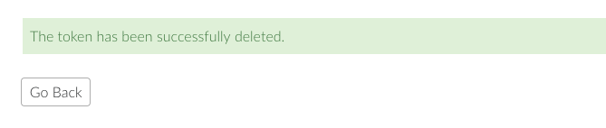
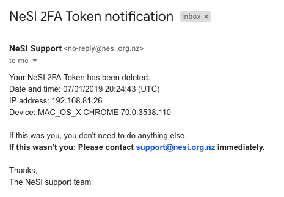

[//]: <> (REMOVE ME IF PAGE VALIDATED)
[//]: <> (vvvvvvvvvvvvvvvvvvvv)
!!! warning
    This page has been automatically migrated and may contain formatting errors.
[//]: <> (^^^^^^^^^^^^^^^^^^^^)
[//]: <> (REMOVE ME IF PAGE VALIDATED)

Log in to [my.nesi.org.nz](https://my.nesi.org.nz) and select the option
'Manage Two-Factor token' under 'Account'.

## Manage Two-Factor token

Once you've created a token, you should see the 'Manage Two-Factor
token' option.

## Delete the Two-Factor token

Select the option 'Manage Two-Factor token' under 'Account'.

You should see the confirmation of the previous token.

After 'Delete Token' has been selected:

You will also receive an email confirmation:

## Related content

[Setting Up Two-Factor
Authentication](../../Getting_Started/Accessing_the_HPCs/Setting_Up_Two_Factor_Authentication)