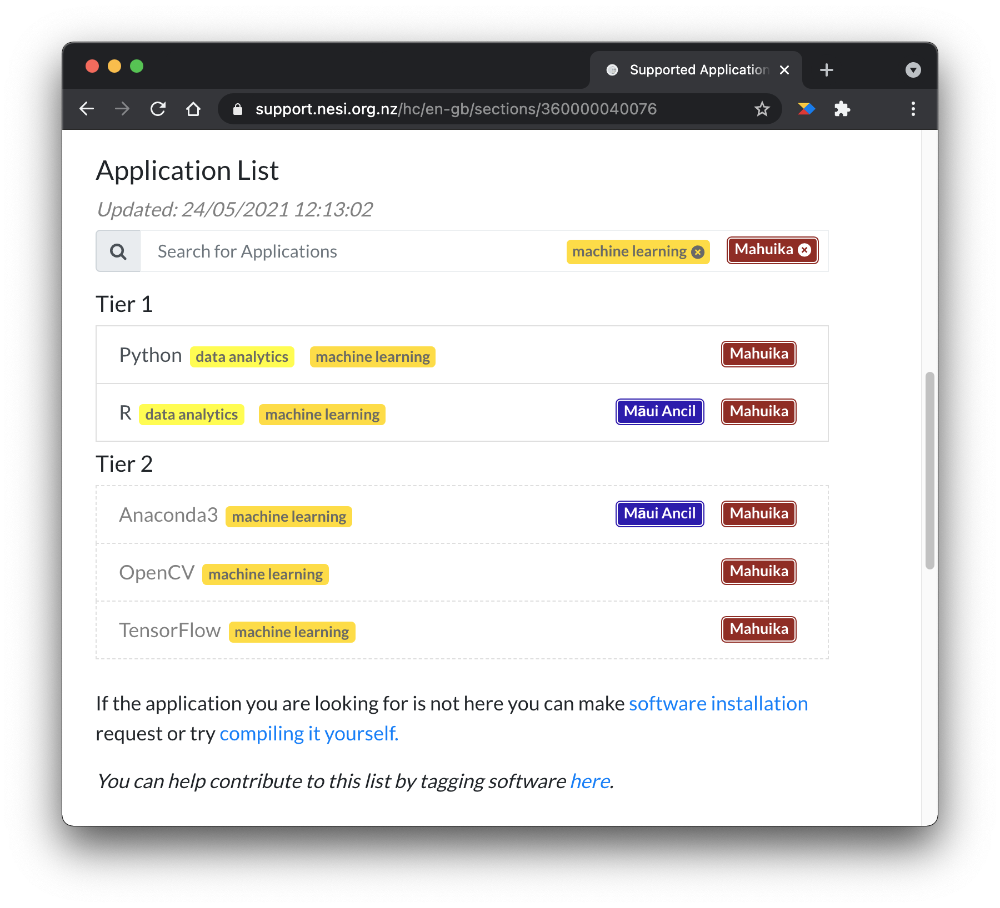

When using NeSI's [HPC
platform](https://support.nesi.org.nz/hc/en-gb/sections/360000034335),
you can bring your own code to install or you can access our extensive
software library which is already built and compiled, ready for you to
use.

Examples of software environments on NeSI optimised for data science
include:

- [R](../../Scientific_Computing/Supported_Applications/R.md) and [Python](../../Scientific_Computing/Supported_Applications/TensorFlow_on_GPUs.md) users
    can get right into using and exploring the several built-in packages
    or create custom code.

- [Jupyter on NeSI
    ](../../Scientific_Computing/Interactive_computing_using_Jupyter/Jupyter_on_NeSI.md)is
    particularly well suited to artificial intelligence and machine
    learning workloads. [R
    Studio](../../Scientific_Computing/Interactive_computing_using_Jupyter/RStudio_via_Jupyter_on_NeSI.md)
    and/or Conda can be accessed via Jupyter.

- Commonly used data science environments and libraries such as
    [Keras](../../Scientific_Computing/Supported_Applications/Keras.md),
    [LambdaStack](../../Scientific_Computing/Supported_Applications/Lambda_Stack.md),
    [Tensorflow](../../Scientific_Computing/Supported_Applications/TensorFlow_on_GPUs.md)
    and [Conda](https://docs.conda.io/en/latest/) are available to
    create comprehensive workflows.

For more information about available software and applications, you
can [browse our catalogue
here](https://support.nesi.org.nz/hc/en-gb/sections/360000040076).

As pictured in the screenshot below, you can type keywords into the
catalogue's search field to browse by a specific software name or using
more broad terms such as "machine learning".

For more information on NeSI's model and approach to application
support, refer to our [policy for the management of scientific
application
software](../../General/NeSI_Policies/NeSI_Application_Support_Model.md).

If you need help installing your software or would like to discuss your
software needs with us, .
