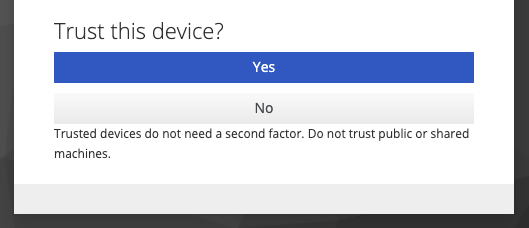
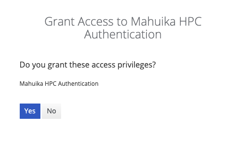

!!! prerequisite
    -  Have an [account](../Accounts-Projects_and_Allocations/Creating_a_NeSI_Account_Profile.md).  
    -  Be a member of an [active project](../Accounts-Projects_and_Allocations/Creating_a_NeSI_Account_Profile.md).  
    -  Have a device with an authentication app.

!!! note
    On 01 July 2025, New Zealand eScience Infrastructure (NeSI) was integrated into the Crown company, Research and Education Advanced Network New Zealand (REANNZ) Ltd. 
    NeSI’s services and technologies are now hosted by REANNZ as a national eResearch Infrastructure Platform. 
    Some of our tools (as pictured in the screenshot below) will retain a ‘NeSI’ brand as we transition our services and develop a longer-term strategy for this integrated platform.

1. Go to [**OnDemand**](https://ondemand.nesi.org.nz/). It will automatically take you to the Tuakiri login screen.
    

2. Select your affiliated institution, and log in using your institutional account. Example below shows the University of Auckland login screen.
    

3. If you haven't logged in to OnDemand or our HPC platforms before, you will need to set up a new Second Factor Authentication (2FA). This is in addition to your institutional 2FA.
    
  
    !!! note
        If your device is not trusted (step 6 ), you will be asked every time to enter your one-time password (OTP) for our HPC platforms.
  
4. Scan the barcode with your preferred authenticator app (e.g. Google Authenticator), and enter the OTP (6 digit number) along with a device name (e.g. my mobile) and click 'Submit'.

5. Once you have set up an OTP, you will be shown the following screen instead of the one above, where you can enter the 6 digit number from your authenticator app.
    

6. You are now asked about your current device: do you trust it or not?  
    -  Do not trust shared computers (e.g. a university computer where you have to delete cookies) or if you are using incognito or private windows: click No. This means that you will need to enter your OTP every time you log in.
    -  If the device is your personal laptop and you are using a secure network, you can trust it: click Yes. This will allow you to log in without 2FA for 7 days.
    
    . 

    If you have trusted your device, you have to enter a name for this device. This name must be unique. E.g. you cannot trust two devices the same day with the same name. 

7. You will be prompted again to confirm that you initiated this sequence as a security measure against remote phishing. Click 'Yes' if you want to proceed with access. Click 'No' if you did not initiate this authentication process.

    .

8. After successfully logging in, you will be presented with the following OnDemand screen.

    
