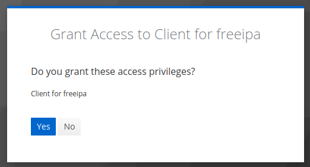

!!! prerequisite
    -  Have a [NeSI account](../Accounts-Projects_and_Allocations/Creating_a_NeSI_Account_Profile.md).  
    -  Be a member of an [active project](../Accounts-Projects_and_Allocations/Creating_a_NeSI_Account_Profile.md).  
    -  Have a device with an authentication app.

1. Go to [**NeSI OnDemand**](https://ondemand.nesi.org.nz/). It will automatically take you to the Tuakiri login screen.
    If you haven't logged into NeSI OnDemand or HPC3 before, part of the login process will include a step to setup a new 2FA.
    

2. Select your affiliated institution, and log in using your institutional account. Example below shows the University of Auckland login screen.
    

3. If it is your first time logging in, you will be asked to set up your 2FA (2-Factor Authentication) for NeSI. This is in addition to your institutional 2FA.
    
  
4. Scan the barcode with your preferred authenticator app (e.g. Google Authenticator), and enter the one-time code (6 digit number) along with a device name (e.g. my mobile) and Submit and you are good to go.

5. Once you have already set up NeSI OTP, you will be shown the following screen instead of the one above, where you can enter the 6 digit number from your authenticator app.
    

6. For the moment, you will be prompted again. Press yes.
    

7. After successfully logging in, you will be presented with the following NeSI OnDemand screen.
    
