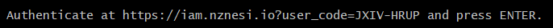
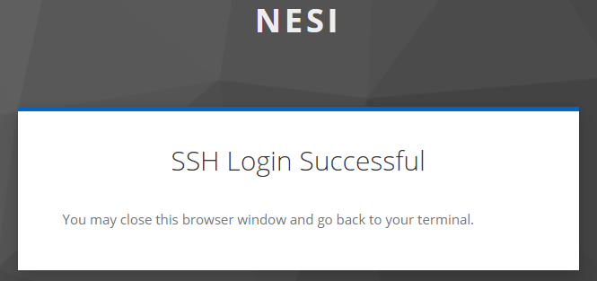

!!! prerequisite
     -   Have a [NeSI account.](../Creating_an_Account.md).
     -   Be a member of an [active project.](../Projects/Applying_to_Join_a_Project.md)

## First time setup

1. [Download Git Bash](https://git-scm.com/download/win) as part of Git.

   The login process can be simplified with a few configurations.

2. Follow instructions [Standard Terminal Setup](Standard_Terminal_Setup.md).

## Usage

Assuming you have followed the setup above you will be able to connect
to the clusters directly using;

```sh
ssh nesi
```

You will be prompted twice for Authentication 
Hit `ctrl` and click the link and then `enter` after the browser pop shows


As multiplexing is not configured *you will have to enter your login
credentials every time you open a new terminal or try to move a file.*

```sh
scp <path/filename> nesi:~/
```

For more info visit [data transfer](../../Data_Transfer/Data_Transfer_Overview.md).

!!! prerequisite "What Next?"
   - [Standard Terminal Setup](Standard_Terminal_Setup.md)
