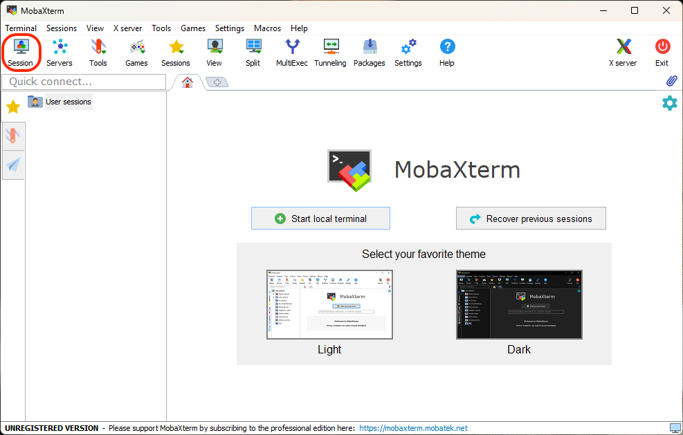
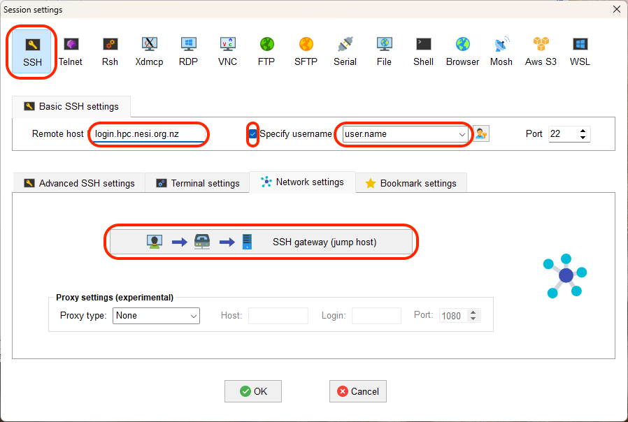
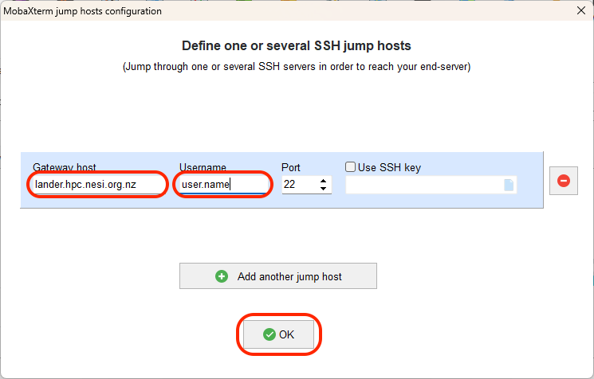
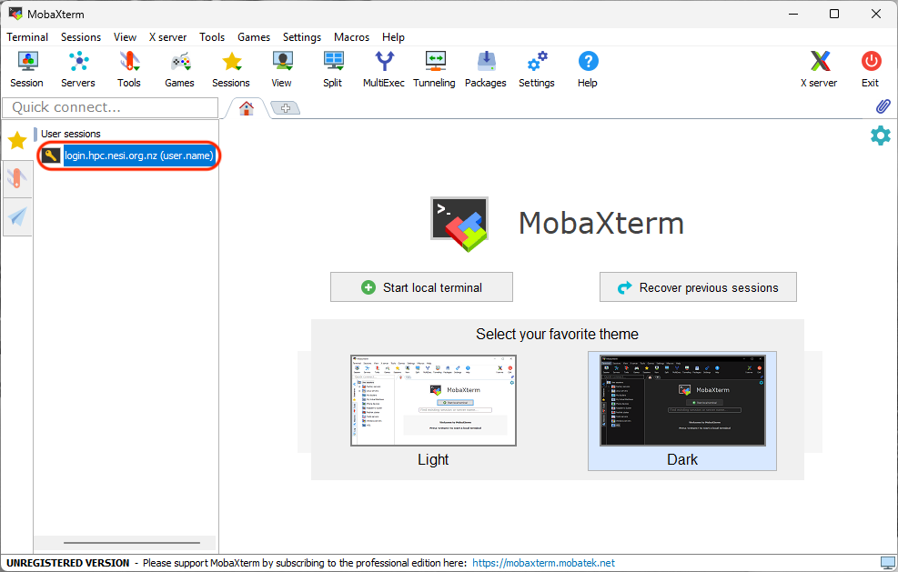
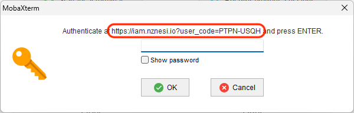
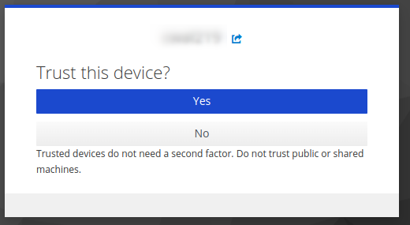
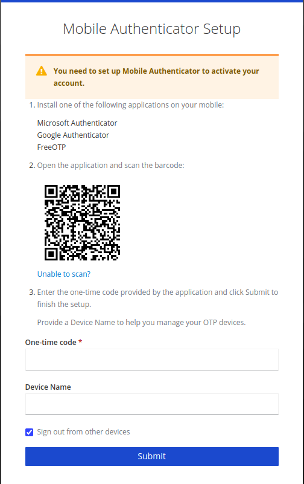

!!! tip
    For file browsing, uploading and downloading files, and terminal access, you can also use [OnDemand](https://ondemand.nesi.org.nz/) in your web browser.

!!! prerequisite
     - Have an [active account and project.](../Creating_an_Account.md)
     - [Download MobaXterm](https://mobaxterm.mobatek.net/download-home-edition.html)

!!! WARNING
    - Use the Portable Edition if you don't have administrator rights on your machine.
    - Otherwise, choose freely the Portable or Installer Edition.

!!! prerequisite "What Next?"
     -   [Moving files to/from a cluster.](../../Data_Transfer/Data_Transfer_Overview.md)

## GUI Setup

This setup saves your login details as a session in MobaXterm. You only need to create the session once.

### Creating a session

1. Open MobaXterm.

2. Click **Session**.

    

3. In the **Session settings** window:

    1. Click **SSH** at the top left of the window.
    2. In the **Remote host** box, type `login.hpc.nesi.org.nz`.
    3. Tick **Specify username** and type your username.
    4. On the **Network settings** tab, click **SSH gateway (jump host)**.

    

4. In the **MobaXterm jump hosts configuration** window:

    1. In the **Gateway host** box, type `lander.hpc.nesi.org.nz`.
    2. In the **Username** box, type your username.
    3. Click **OK**.

    

5. In the **Session settings** window, click **OK**.

6. Log in by following the steps in [Using a saved session](#using-a-saved-session).

### Using a saved session

1. In the left sidebar, click the star icon, then click your session under **User sessions**.

    

2. A window opens with a link to the authentication website.
    Open the link in your web browser and log in.
    If you have not logged in before, [First Time Login](First_Time_Login.md) shows what to expect.

    

3. Once you have logged in on the website, click **OK** in the MobaXterm window.

4. You may be asked to authenticate one or two more times. Repeat steps 2 and 3 each time.

5. You are now logged in to Mahuika.
    The terminal opens in the main window, and your files on Mahuika are shown in the left sidebar.

## Terminal Setup

This setup saves your login details in an SSH config file, so you can log in by typing `ssh mahuika` in the MobaXterm terminal.

### First time setup

1. In a new local terminal run; `mkdir -p ~/.ssh/` this will
    ensure you have an `.ssh/` directory

2. Open your ssh config file by typing the following into your MobaXterm terminal:

    ```bash
    notepad config.txt
    ```

    Notepad will ask you "Do you want to create a new file?". **Click yes**

3. Add the following (replacing **`username`** with your username):

    ```sh
    Host lander 
        User username 
        HostName lander.hpc.nesi.org.nz 
        ForwardX11 yes
        ForwardX11Trusted yes
        ServerAliveInterval 300
        ServerAliveCountMax 2

    Host mahuika
        User username 
        Hostname login.hpc.nesi.org.nz
        ProxyCommand ssh -W %h:%p lander
        ForwardX11 yes
        ForwardX11Trusted yes
        ServerAliveInterval 300
        ServerAliveCountMax 2
    ```

4. Save the file and close Notepad.

5. Run the command `mv config.txt ~/.ssh/config`

6. Ensure the permissions are correct by
    running `chmod 600 ~/.ssh/config`.

7. Run the command.

    ```sh
    ssh mahuika
    ```

8. You will be prompted to approve host authenticity

    ```sh
    The authenticity of host 'lander.hpc.nesi.org.nz (163.7.144.68)' can't be established.
    ECDSA key fingerprint is SHA256:############################################.
    ECDSA key fingerprint is MD5:##:##:##:##:##:##:##:##:##:##:##:##:##:##:##:##.
    Are you sure you want to continue connecting (yes/no)? 
    ```

    Type `yes` and <kbd>Enter</kbd>

9. You will be presented with a link.

    ```sh
    Authenticate at https://iam.nesi.org.nz/realms/public/device?user_code=XXXX-XXXX and press ENTER.
    ```

    Depending on the terminal used, you may have to hold `ctrl` when clicking to follow the link.

    !!! warning "Double Authentication"
        If you set up your `.ssh/config` as recommended you will be prompted to authenticate again.  
        We are working on fixing this.

10. Select your institution, you will be prompted to provide your login details.

11. You are now asked about your current device: do you trust it or not?

    

    - If this device is a shared computer (e.g. university computer where you have to delete cookies) or if you are using incognito or private windows, please do not trust it: click No. This means that you will need to enter your 6-digit code every time you log in.
    - If this device is your own laptop and you are using a secure network, you can trust it: click Yes. This will allow you to log in without additional authentication for 7 days.

    If you have trusted your device, you have to enter a name for this device. This name must be unique but can be anything you want.

    Note: You cannot trust two devices the same day with the same name.

12. Scan the QR code with your authenticator app. Then enter the 6-digit code provided. You may give your device a name.

    

13. Return to your terminal, and press <kbd>enter</kbd>.

### Subsequent log in

1. `ssh mahuika`
2. Follow the link.
3. You may be prompted for your 6 digit code.
4. Return to your terminal, and press <kbd>enter</kbd>.
