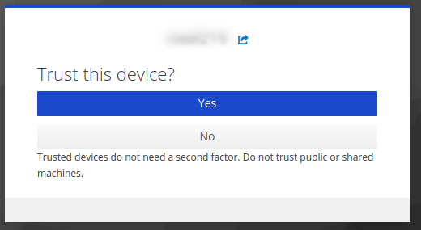

!!! WARNING  
    Logging in via the "sessions" functionality is not compatible with the new HPC's login procedure.  
    It is recommended to use [OnDemand](https://ondemand.nesi.org.nz/) for file browsing, up and downloading and terminal access if you would normally have used MobaXterm.

!!! prerequisite
     -   Have an [active account and project.](../../Getting_Started/Accounts-Projects_and_Allocations/Creating_an_Account_Profile.md)
     - [Download MobaXterm](https://mobaxterm.mobatek.net/download-home-edition.html)
     - Followed the steps in [Standard Terminal](Standard_Terminal_Setup.md).

!!! WARNING
    - Use the Portable Edition if you don't have administrator rights
        on your machine.
    - Otherwise, choose freely the Portable or Installer Edition.

!!! prerequisite "What Next?"
     -   [Moving files to/from a cluster.](../../Storage/Moving_files_to_and_from_the_cluster.md)
     
The interactive login configuration for MobaXterm is not compatable with the current web-based authentication method. If you wish to use MobaXterm as your SSH client you therefore need to use a non-interactive setup.
This can be done by following a modified version of the instructions for setting up the [the standard terminal setup described on this support page](Standard_Terminal_Setup.md).

## First time setup

The login process can be simplified significantly with a few easy
configurations.

1. In a new local terminal run; `mkdir -p ~/.ssh/` this will
    ensure you have an `.ssh/` directory

2. Open your ssh config file (e.g. `notepad config.txt` to open with the text editor `notepad`) and add the
    following (replacing **`username`** with your username):

    ```sh
    Host lander 
        User username 
        HostName lander.hpc.nesi.org.nz 
        ForwardX11 yes
        ForwardX11Trusted yes
        ServerAliveInterval 300
        ServerAliveCountMax 2


    Host mahuika
        User username 
        Hostname login.hpc.nesi.org.nz
        ProxyCommand ssh -W %h:%p lander
        ForwardX11 yes
        ForwardX11Trusted yes
        ServerAliveInterval 300
        ServerAliveCountMax 2

        
    ```

    Close and save with `ctrl x`, `ctrl y`, `Enter`
    
4. Run the command `mv config.txt ~/.ssh/config`

5. Ensure the permissions are correct by
    running `chmod 600 ~/.ssh/config`.

6. Run the command.

    ```sh
    ssh mahuika
    ```

6. You will be prompted to approve host authenticity

    ```sh
    The authenticity of host 'lander.hpc.nesi.org.nz (163.7.144.68)' can't be established.
    ECDSA key fingerprint is SHA256:############################################.
    ECDSA key fingerprint is MD5:##:##:##:##:##:##:##:##:##:##:##:##:##:##:##:##.
    Are you sure you want to continue connecting (yes/no)? 
    ```

    Type `yes` and <kbd>Enter</kbd>

7. You will be presented with a link.

    ```sh
    Authenticate at https://iam.nesi.org.nz/realms/public/device?user_code=XXXX-XXXX and press ENTER.
    ```

    Depending on the terminal used, you may have to hold `ctrl` when clicking to follow the link.

    !!! warn "Double Authentication"
        If you set up your `.ssh/config` as recommended you will be prompted to authenticate again.  
        We are working on fixing this.

8. Select your institution, you will be prompted to provide your login details.

9. You are now asked about your current device: do you trust it or not?  
-  If this device is a shared computer (e.g. university computer where you have to delete cookies) or if you are using incognito or private windows, please do not trust it: click No. This means that you will need to enter your 6-digit code every time you log.
-  If this device is your own laptop and you are using a secure network, you can trust it: click Yes. This will allow you to log in without additional authentication for 7 days.

If you have trusted your device, you have to enter a name for this device. This name must be unique but can be anything you want.

Note: You cannot trust two devices the same day with the same name.
    .

10. Scan the QR code with your authenticator app. Then enter the 6-digit code provided. You may give your device a name.

    

11. Return to your terminal, and press <kbd>enter</kbd>.

## Subsequent log in

1. `ssh mahuika`
2. Follow the link.
3. You may be prompted for your 6 digit code.
4. Return to your terminal, and press <kbd>enter</kbd>.
