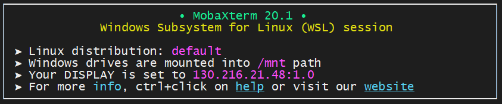
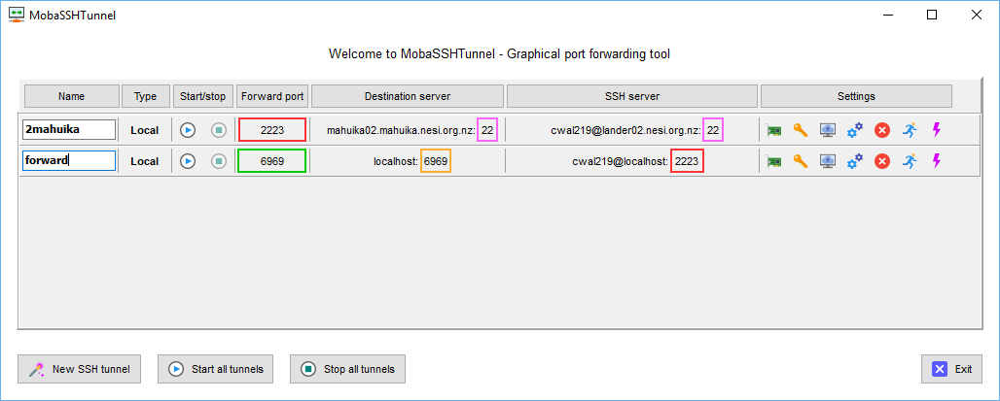

!!! prerequisite
    Have your [connection to the NeSI cluster](../../Scientific_Computing/Terminal_Setup/Standard_Terminal_Setup.md) configured

Some applications only accept connections from internal ports (i.e a
port on the same local network), if you are running one such application
on the cluster and want to connect to it you will need to set up
[port forwarding](https://en.wikipedia.org/wiki/Port_forwarding).

Three values must be known, the *local port*, the *host alias*, and the
*remote port*. Chosen port numbers should be between **1024** and
**49151** and not be in use by another process.

**Localhost:** The self address of a host (computer), equivalent
to `127.0.0.1`. The alias `localhost` can also be used in most cases.

**Local Port:** The port number you will use on your local machine.

**Host Alias:** An alias for the socket of your main connection to the
cluster, `nesi` if you have set up your ssh config file as
described in [Standard Terminal Setup](../../Scientific_Computing/Terminal_Setup/Standard_Terminal_Setup.md).

**Remote Port:** The port number you will use on the remote machine (in
this case the NeSI cluster)
!!! note
    The following examples use aliases as set up in [standard terminal setup](../../Scientific_Computing/Terminal_Setup/Standard_Terminal_Setup.md).
    This allows the forwarding from your local machine to the NeSI
    cluster, without having to re-tunnel through the lander node.

## Command line (OpenSSH)

*Works for any Linux terminal, Mac terminal, or Windows with WSL
enabled.*

The command for forwarding a port is

``` sh
ssh -L <local_port>:<destination_host>:<remote_port> <ssh_host>
```

A client program on my local machine uses the port 5555 to communicate.
I want to connect to a server running on Mahuika that is listening on
port 6666. In a new terminal on my local machine I enter the command:

``` sh
ssh -L 5555:localhost:6666 nesi
```

Your terminal will now function like a normal connection to Mahuika.
However, if you close this terminal session the port forwarding will end.

If there is no existing session on Mahuika, you will be prompted for
your first and second factor, same as during the regular log in
procedure.

!!! note
    Your local port and remote port do not have to be different numbers.
    It is generally easier to use the same number for both.

## SSH Config (OpenSSH)

If you are using port forwarding on a regular basis, and don't want the
hassle of opening a new tunnel every time, you can include a port
forwarding line in your ssh config file ~/.ssh/config on your local
machine.

Under the alias for the cluster you want to connect to add the following
lines.

``` sh
LocalForward <local_port> <host_alias>:<remote_port>
ExitOnForwardFailure yes
```

`ExitOnForwardFailure` is optional, but it is useful to kill the session
if the port fails.

For example:

``` sh
  Host nesi
      User username
      Hostname login.nesi.org.nz
      ProxyCommand ssh -W %h:%p lander
      ForwardX11 yes
      ForwardX11Trusted yes
      ServerAliveInterval 300
      ServerAliveCountMax 2
      LocalForward 6676 nesilander:6676
      ExitOnForwardFailure yes
```

In the above example, the local and remote ports are the same. This
isn't a requirement, but it makes things easier to remember.

Now so long as you have a connection to the cluster, your chosen port
will be forwarded.

!!! note
    -   If you get a error message
        ``` sh
        bind: No such file or directory
        unix_listener: cannot bind to path:
        ```
        try to create the following directory:
        ``` sh
        mkdir -P ~/.ssh/sockets
        ```
<!--
## MobaXterm

If you have Windows Subsystem for Linux installed, you can use the
method described above. This is the recommended method.

You can tell if MobaXterm is using WSL as it will appear in the banner
when starting a new terminal session.



You can also set up port forwarding using the MobaXterm tunnelling
interface.


You will need to create **two** tunnels. One from lander to mahuika. And
another from mahuika to itself. (This is what using an alias in the
first two examples allows us to avoid).

The two tunnels should look like this.



<span style='color:#32CD32'>■</span> local port  
<span style="color:orange">■</span> remote port  
<span style="color:red">■</span> must match  
<span style="color:#FF00FF">■</span> doesn't matter

-->

## sshuttle

[sshuttle](https://sshuttle.readthedocs.io/en/stable/) is a transparent
proxy implementing VPN like traffic forwarding. It is based on Linux or
MacOS platforms (unfortunately Windows is not supported). `sshuttle`
allows users to create a VPN connection from a local machine to any
remote server that they can connect to via `ssh`.There is no need to
create a separate tunnel for every port to be forwarded, the package
routes all traffic, going to the specified subnet, through the tunnel.

The command line for `sshuttle` has the following form:

``` sh
sshuttle [-l [ip:]port] -r <host_alias>[:port] <subnets...>
```

More information about specific keys and modifiers for `sshuttle` commands
is available in the online documentation.

As an example, this is how to establish a tunnel through Mahuika login
node over to a specific virtual machine with IP address `192.168.90.5`:

``` sh
sshuttle -r nesi 192.168.0.0/16
```

which uses remote SSH host Mahuika to forward all traffic coming to
`192.16.XXX.XXX` subnet through the port forwarder.

## Forwarding to Compute Nodes

Ports can also be forwarded from the login node to a compute node.

The best way to do this is by creating a reverse tunnel **from your
Slurm job** (that way the tunnel doesn't depend on a separate shell, and
the tunnel will not outlive the job).

The syntax for opening a reverse tunnel is similar the regular tunnel
command, `-N` to not execute a command after connecting, `-f` to run the
connection in the background and `-R` for a reverse tunnel ( as opposed
to `-L` ).

``` sh
ssh -Nf -R <remote_port>:localhost:<local_port> ${SLURM_SUBMIT_HOST}
```

An example Slurm script:

``` sl
#!/bin/bash -e

#SBATCH --job-name  port-forward
#SBATCH --account   nesi99999
#SBATCH --time      00:15:00
#SBATCH --mem       1G

ssh -Nf -R 6676:localhost:6676 ${SLURM_SUBMIT_HOST}

<some process using port 6676>
```

!!! tip "What Next?"
    -   Using
        [JupyterLab](../../Scientific_Computing/Supported_Applications/JupyterLab.md) on the cluster.
    -   [Paraview](../../Scientific_Computing/Supported_Applications/ParaView.md)
