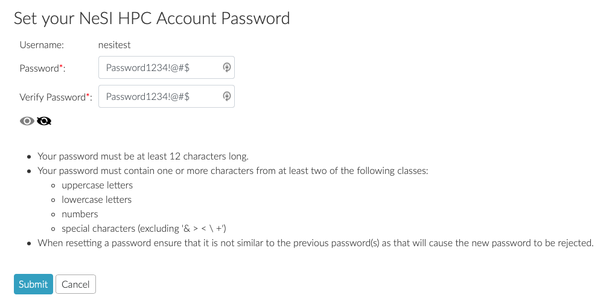
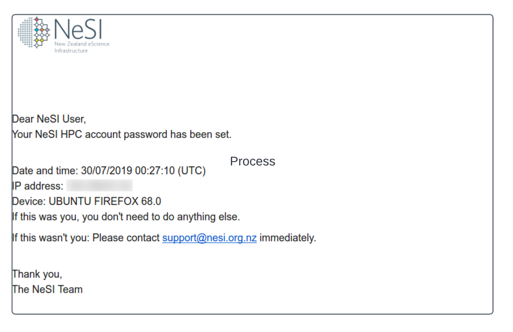
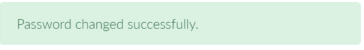

[//]: <> (REMOVE ME IF PAGE VALIDATED)
[//]: <> (vvvvvvvvvvvvvvvvvvvv)
!!! warning
    This page has been automatically migrated and may contain formatting errors.
[//]: <> (^^^^^^^^^^^^^^^^^^^^)
[//]: <> (REMOVE ME IF PAGE VALIDATED)

!!! prerequisite Requirements
     -   Have a [NeSI
         account](../../Getting_Started/Accounts-Projects_and_Allocations/Creating_a_NeSI_Account_Profile).
     -   Be a member of an [active
         project.](https://support.nesi.org.nz/hc/en-gb/sections/360000196195-Accounts-Projects)

-   -   [Setting NeSI Password via my NeSI
        portal](#h_d7de94ee-b517-41dd-b70e-6fca380b38a6)
    -   [Resetting NeSI Password via my NeSI
        portal](#h_01G15PT2EM836JXJK202V52QZP)

##  **Setting NeSI Password**

 

1.  Log into the [my NeSI portal](https://my.nesi.org.nz) via your
    browser.  
      

2.  Click **My HPC Account** on left hand panel and then **Set
    Password** (If you are resetting your password this will read
    **Reset Password**).  
    Note your** Username.  
      
    **

3.  Enter and verify your new password, making sure it follows the
    [password
    policy](../../General/NeSI_Policies/NeSI_Password_Policy).  
      

    #### 

4.  If the password set was successful, following confirmation label
    will appear on the same page within few seconds  
       
    

5.  Followed by an email confirmation similar to below

 

 

## **Resetting NeSI Password via my NeSI portal**

1.  Log into the [my NeSI portal](https://my.nesi.org.nz) via your
    browser.  
      
2.  Click **My HPC Account** on left hand panel and then **Reset
    Password**  
    Note your**** Username.  
      
    **** **  
    **
3.   You can either enter the Old Password first and then set a new one
    OR feel free to select **Forgot my password **  
    -   -   We recommend **Forgot my password **option in general   
              
4.  If the password **reset** was successful, following confirmation
    label will appear on the same page within few seconds  
    1.  -   
5.  Followed by an email confirmation similar to below  
       
      

!!! prerequisite What next?
     -   Set up [Second Factor
         Authentication.](../../Getting_Started/Accessing_the_HPCs/Setting_Up_Two_Factor_Authentication)

 