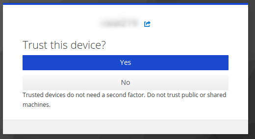
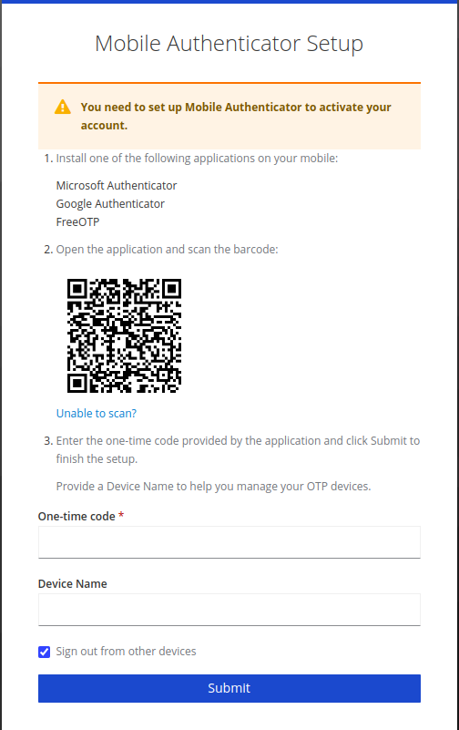

!!! prerequisite
     -   Have an [active account and project.](../Creating_an_Account.md)
     -   Have one of:
         - Built in Linux/Mac terminal
         - [Windows Subsystem for Linux](Windows_Subsystem_for_Linux_WSL.md)
         - [VSCode](VSCode.md)

!!! warning
    The following instructions may not work when using any non-standard terminal client.

## First time setup

The login process can be simplified significantly with a few easy
configurations.

1. In a new terminal **on your local machine** run; `mkdir -p ~/.ssh/sockets` this will
    create a subdirectory in your home directory to store socket
    configurations.

2. Open your ssh config file (e.g. `nano ~/.ssh/config` to open with the text editor `nano`) and add the
    following (replacing **`username`** with your username):

    ```sh
    Host *
        ControlMaster auto
        ControlPath ~/.ssh/sockets/ssh_mux_%h_%p_%r
        ControlPersist 1

    Host lander 
        User username 
        HostName lander.hpc.nesi.org.nz 
        ForwardX11 yes
        ForwardX11Trusted yes
        ServerAliveInterval 300
        ServerAliveCountMax 2

    Host mahuika
        User username 
        Hostname login.hpc.nesi.org.nz
        ProxyCommand ssh -W %h:%p lander
        ForwardX11 yes
        ForwardX11Trusted yes
        ServerAliveInterval 300
        ServerAliveCountMax 2
        # Note: The line below should only be commented out if
        #       you have set up an SSH key pair `mahuika_key`.
        # IdentityFile ~/.ssh/mahuika_key  
    ```

    Close and save with `ctrl x`, `ctrl y`, `Enter`

    !!! warning
        MobaXterm does not allow the use of sockets.
        If you are using MobaXterm please exclude the **first four lines** from your own ssh config.

3. Ensure the permissions are correct by running;

    ```sh
    chmod 600 ~/.ssh/config
    ```

4. You can now log into the cluster, run the command.

    ```sh
    ssh mahuika
    ```

5. You will be prompted to approve host authenticity

    ```sh
    The authenticity of host 'lander.hpc.nesi.org.nz (163.7.144.68)' can't be established.
    ECDSA key fingerprint is SHA256:############################################.
    ECDSA key fingerprint is MD5:##:##:##:##:##:##:##:##:##:##:##:##:##:##:##:##.
    Are you sure you want to continue connecting (yes/no)? 
    ```

    Type `yes` and <kbd>Enter</kbd>

6. You will be presented with a link.

    ```sh
    Authenticate at https://iam.nesi.org.nz/realms/public/device?user_code=XXXX-XXXX and press ENTER.
    ```

    Depending on the terminal used, you may have to hold `ctrl` when clicking to follow the link.

7. Select your institution, you will be prompted to provide your login details.

8. You are now asked about your current device: do you trust it or not?

    .

    - **Click No:** If this device is a shared computer (e.g. university computer where you have to delete cookies) or if you are using incognito or private windows.
        This means that you will need to enter your 6-digit code every time you log.
    - **Click Yes:** If this your own device and you are using a secure network.
        This will allow you to log in without additional authentication for 7 days.

    If you have trusted your device, you have to enter a name for this device.
    This name can be anything you want, but it must be unique (e.g. you cannot have two devices with the same name).

9. Scan the QR code with your authenticator app. Then enter the 6-digit code provided.

    

10. You are now asked to confirm that you initiated this authentication request. This step helps prevent remote phishing by ensuring the process was started by you.  

    .

    - **Click No:** if you did not request access to the advanced computing system.  
    - **Click Yes:** if you have been following this process from the beginning.  

     You will be asked to confirm each time to ensure you initiated the sequence and to maintain your security.  

11. Return to your terminal, and press <kbd>enter</kbd>.

!!! warning "Double Authentication"
    You will need to complete the authentication proccess twice, this can be avoided by following the steps outlined in [Adding an SSH Key](#adding-a-ssh-key-optional).

## Adding a SSH key (optional)

Generating a SSH key on the cluster removes one of the login prompts when using SSH. 

1. In a terminal **on the HPC** (either through SSH or OnDemand), run the commands;

    ```sh
    mkdir -p ~/.ssh
    ```
    ```sh
    [ -f .ssh/id_rsa ] || ssh-keygen -t rsa -q -N ""
    ```
    If you get a message after this step, hit enter.
    ```sh
    cat ~/.ssh/id_rsa.pub >> ~/.ssh/authorized_keys
    ```

2. In a terminal **on your local machine**, run the command; 

    ```sh
    scp mahuika:~/.ssh/id_rsa ~/.ssh/mahuika_key 
    ```

3. If you set up your ssh config recently, you may already have this line added.

    Open the file `~/.ssh/config` **on your local machine**, for example;

    ```sh
    nano ~/.ssh/config
    ```

    And add the line `IdentityFile ~/.ssh/mahuika_key` under the host `mahuika`.

    The `mahuika` host entry should look like this

    ```ssh
    Host mahuika
        User username 
        Hostname login.hpc.nesi.org.nz
        ProxyCommand ssh -W %h:%p lander
        ForwardX11 yes
        ForwardX11Trusted yes
        ServerAliveInterval 300
        ServerAliveCountMax 2
        IdentityFile ~/.ssh/mahuika_key
    ```

You should now be able to login with only a single authentication prompt.

!!! warning
    Do not re-use the private key `mahuika_key` on other devices.
    Your home directory on the cluster is accessible by mahuika admins.

## Subsequent log in

1. `ssh mahuika`
2. Follow the link.
3. You may be prompted for your 6 digit code.
4. Return to your terminal, and press <kbd>enter</kbd>.

## How-to Video

[Watch a demo](https://www.youtube.com/embed/IKihbN-QlIA?si=N93PPPsi85jPYV7k).

!!! prerequisite "What Next?"
     -   [Moving files to/from a cluster.](../../Data_Transfer/Moving_files_to_and_from_the_cluster.md)
     -   Setting up an [X-Server](./X11.md) (optional).
