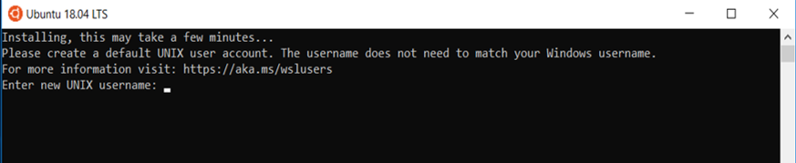

!!! prerequisite
     -   Windows 10 (version 2004) or later.

Windows Subsystem for Linux is a feature that allows you to run a Linux OS that seemlessly functions alongside and within your Windows Desktop.

WSL is enabled by default on Windows (since later releases of Windows 10).  However, your IT department may have disabled WSL.  If the instructions below do not work, please reach out to your IT helpdesk.


## Installing WSL

Microsoft provides [setup instructions](https://learn.microsoft.com/en-us/windows/wsl/install) for installing both WSL and a Linux distribution.

To check if WSL is already installed on your Windows PC, open Windows Command Prompt, Terminal, or Powershell and run `wsl --list --online`.
This should return a list of available Linux distributions that you can install.  We will be using the Ubuntu distribution in out examples below as it is the most commonly used distro in WSL.  However, if you have a preferred distro, you are welcome to use it instead. 

## Installing a Linux Distribution

In order to make use of WSL features, you will also need to install a Linux distribution (also referred to as a distro).

Distros can be obtained through the Microsoft Store, or using command line.

=== "Using The Microsoft Store"
     - Open the Microsoft store, search for 'Ubuntu' to find and install the
     latest version of the Ubuntu LTS it should look something like
     'Ubuntu 24.04 LTS' , though you may find a later version.

     
       
          
     - Close the “Add your Microsoft account.. dialogue box as you do not
     need an account for the installation.You may have to click “Install”
     for a second time (If the above dialogue box reappears, close as
     before and download/install will begin). The screenshots below show an older
     version of Ubuntu, but the process should still be valid for newer versions.
     
     
     
=== "Using Command Line"
     - Open 'Windows Power Shell' and type

     ```ps
     wsl --install -d Ubuntu-24.04
     ```
  
- When it has finished downloading, the Ubuntu Terminal will appear and prompt you to “Enter new UNIX username”
    and press <kbd>Enter</kbd>.
  
    This can be anything you want, although we reccomend using the same as your Windows username.
    
  
- Now, type in a new password for the username you picked and press
    <kbd>Enter</kbd> (this password can be anything you want, although you shouldn't need to enter it again).
    Then retype the password to confirm and press <kbd>Enter</kbd>.
    

## Installing Windows Terminal (optional)

Microsoft has also developed a solid terminal emulator, called [Windows Terminal](https://apps.microsoft.com/detail/9n0dx20hk701?hl=en-US&gl=NZ). This can be found in the Microsoft Store and best of all, it is free.  You can run your WSL, PowerShell and most other command line tools from within MS Terminal.


## WSL and VS Code integration (optional)

You can use VS Code and WSL together, creating a powerful development environment.  More details on integrating VS Code and WSL can be found here: [WSL & VS Code](https://learn.microsoft.com/en-us/windows/wsl/tutorials/wsl-vscode)

## Creating a Symlink (optional)

You may find having a symbolic link to your Windows filesystems useful.

Within Ubuntu terminal run the following command replacing c with the name of
your Windows filesystems found in /mnt/.

```sh
ln -s /mnt/c/Users/YourWindowsUsername/ Cdrive
```


!!! prerequisite What "Next?"
     -   Set up your [SSH config file](Standard_Terminal_Setup.md).
