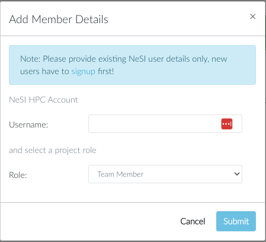

!!! prerequisite
    - Have a [NeSI Account profile](../../Getting_Started/Accounts-Projects_and_Allocations/Creating_a_NeSI_Account_Profile.md).
    - Be the owner of a [NeSI project](../../Getting_Started/Accounts-Projects_and_Allocations/Applying_for_a_new_NeSI_project.md).

## How to add members to an existing project on NeSI

1. Log in to [my.nesi.org.nz](https://my.nesi.org.nz/) via your browser.
2. Under **List Projects**, click on the project you want to add members to.
3. When the page is loaded, scroll down to the section **Project Members** and select the **+** button
4. Enter the Username of the new member, the role and click **Submit**. 
   

!!! prerequisite "What Next?"
     -   A new team member will now be able to access the system: [set your NeSI account../Accessing_the_HPCs/Setting_Up_and_Resetting_Your_Password.md
         password](../../Getting_Started/Accessing_the_HPCs/Setting_Up_and_Resetting_Your_Password.md).
