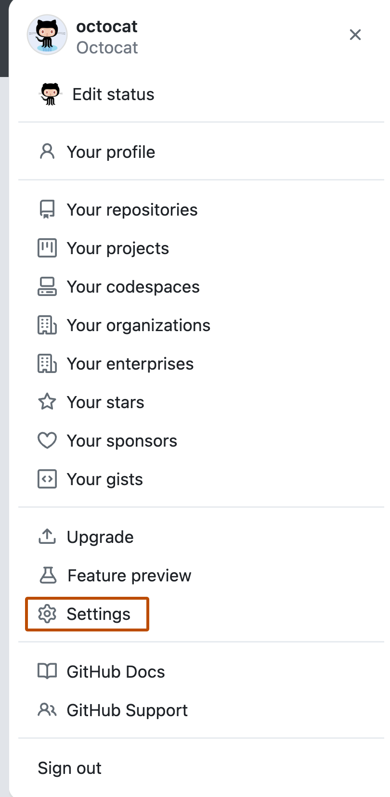

## Description

Source Code Hosting Platforms such as GitLab, GitHub, Bitbucket and Gitea are primarily used for managing and collaborating on software development projects using the Git version control system.  Some of these platforms also offer other services such as DevOps pipelines, CI/CD, etc. 

## Authentication

In order to pull from a private repo, or push changes to a remote, you
need to authenticate yourself on the cluster.

>Most Git remote cloud services such as GitLab or GitHub removed support for password authentication.  Using a SSH public key is now the easiest way to set up authentication.


We will use GitHub as the example but the basic setup should be similar in other git services. For details, here are instructions to SSH public key setup for common Git cloud providers:

[GitHub](https://docs.github.com/en/authentication/connecting-to-github-with-ssh/generating-a-new-ssh-key-and-adding-it-to-the-ssh-agent)
| [GitLab](https://docs.gitlab.com/user/ssh/)
| [Bitbucket](https://support.atlassian.com/bitbucket-cloud/docs/set-up-personal-ssh-keys-on-linux/)

- On the NeSI cluster, run the command

    ```sh
    ssh-keygen -t ed25519 -C "your_github_account@example.com"
    ```

- When prompted for a file name, press `enter`. When prompted for a password, press enter twice more.

- Open up the newly created .pub key with the command

    ```sh
    cat ~/.ssh/id_ed25519.pub
    ```

    (or whatever you named the key). It should look something like:

    ```sh
    ssh-ed25519 ABCDEFGKSAfjksjafkjsaLJfakjJF your_github_account@example.com
    ```

    Copy the whole key.

- Now log in to your GitHub account. In the upper-right corner of any
    page, click your profile photo click **Settings**.

    

- In the "Access" section of the sidebar, click **SSH and GPG keys**.

- Click **New SSH key** or **Add SSH key**.

    

- In the "Title" field, put "Mahuika" or "NeSI".

- Paste your key into the "Key" field.

    

- Click **Add SSH key**.

- Switching back to your terminal on the cluster, you can test your
    connection with the command

    ``` sh
    ssh -T git@github.com
    ```

    You may be prompted to authenticate, if so type 'yes'  
    If everything is working, you should see the message

    ```out
    Hi User! You've successfully authenticated, but GitHub does not provide shell access.
    ```

