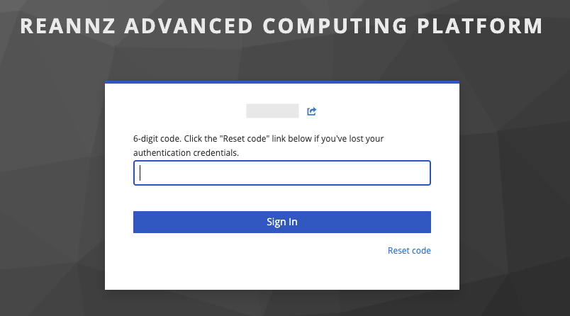
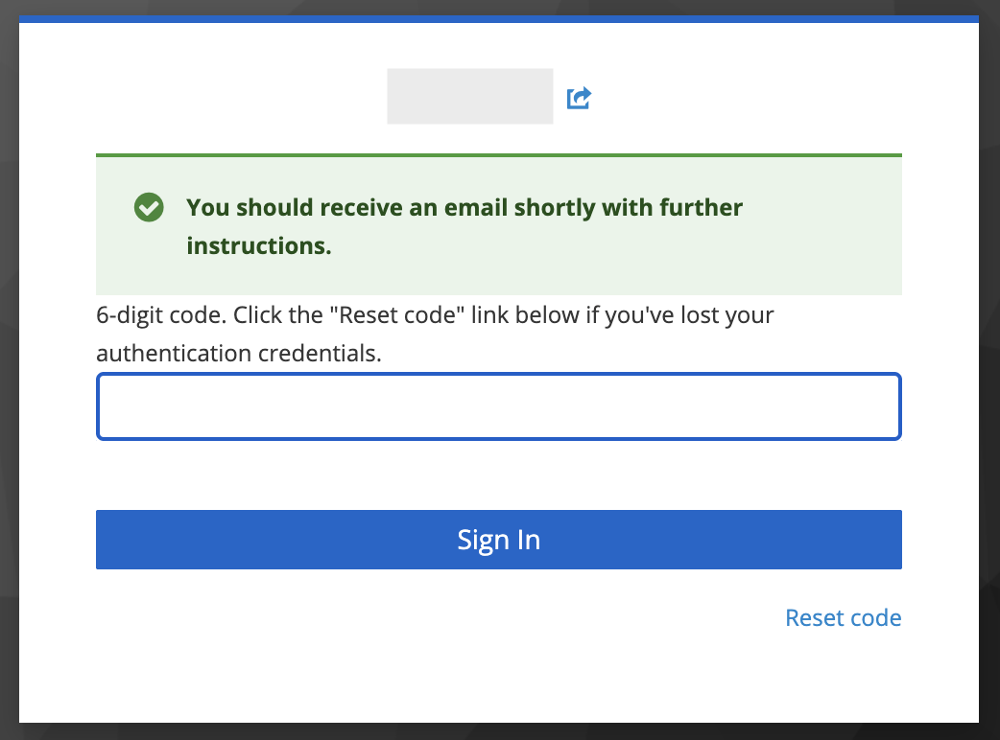



If you no longer have access to your authenticator application (e.g. change of device), you may need to re-enroll your device.

1. On the screen where you are prompted for your 6-digit code, click 'Reset code'
   .

    !!! warning "Not seeing this page?"
        If you previously confirmed your device as 'Trusted', you will not be prompted for further authentication.
        In order to see the option to reset, open the link in a private/incognito session.

2. You will be redirected to a window for confirmation. Your username should be filled in already. If it is not, enter your username and click send. You may have to re-authenticate via Tuakiri.
   A confirmation message will be displayed that instructions are emailed to you.
   .

3. Check your email (the address associated with your HPC account).
   You should find an email called 'Reset Your REANNZ HPC Authentication Credentials'.

4. Follow the instructions to configure your authentication credentials.
