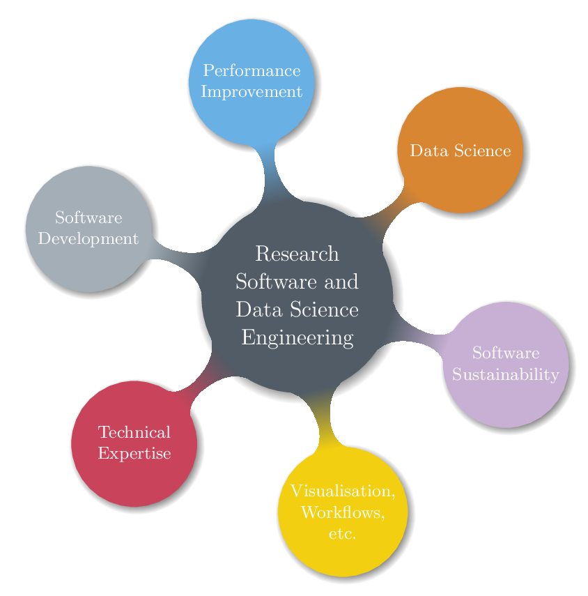

Our Consultancy service provides scientific and HPC-focused
computational and data science support to research projects across a
range of domains.

{ width=50% }

## Need support with your research project?

If you would like to learn more about our Consultancy service and how
you can work with our Research Software Engineers on
a project, please  to set up an
initial meeting. We can discuss your needs and complete a Consultancy
application form together.

Researchers with Merit (grant-funded) projects can usually access Consultancy support at no cost to
themselves.

## What do we do?

Our team of experts are available to help with any stage of your research
software development. We can get involved with designing and developing
your software from scratch, or assist with improving software you have
already written.

The service is completely bespoke and tailored to your requirements.
Some examples of outcomes we could assist with (this list is general and
non-exhaustive):

- Code development
    - Design and develop research software from scratch
    - Algorithmic improvements
    - Translate Python/R/Matlab code to C/C++/Fortran for faster
        execution
    - Accelerate code by offloading computations to a GPU
    - Develop visualisation and post-processing tools (GUIs, dashboards, etc)
- Performance improvement
    - Code optimisation – profile and improve efficiency (speed and
        memory), IO performance
    - Parallelisation – software (OpenMP, MPI, etc.) and workflow
        parallelisation
- Improve software sustainability (version control, testing,
    continuous integration, etc)
- Data Science Engineering
    - Optimise numerical performance of machine learning pipelines
    - Conduct an Exploratory Data Analysis
    - Assist with designing and fitting explanatory and predictive
        models
- Anything else you can think of ;-)

## What can you expect from us?

During a consultancy project we aim to provide:

- Expertise and advice
- An agreed timeline to develop or improve a solution (typical
    projects are of the order of 1 day per week for up to 4 months but
    this is determined on a case-by-case basis)
- Training, knowledge transfer and/or capability development
- A summary document outlining what has been achieved during the
    project
- A case study published on our website after the project has been
    completed, to showcase the work you are doing on our platforms

## What is expected of you?

Consultancy projects are intended to be a collaboration and thus some
input is required on your part. You should be willing to:

- Contribute to a case study upon successful completion of the
    consultancy project
- Complete a short survey to help us measure the impact of our service
- Attend regular meetings (usually via video conference)
- Invest time to answer questions, provide code and data as necessary
    and make changes to your workflow if needed
- [Acknowledge](https://www.nesi.org.nz/services/high-performance-computing/guidelines/acknowledgement-and-publication)
    us in article and code publications that we have contributed to,
    which could include co-authorship if our contribution is deemed
    worthy
- Accept full ownership/maintenance of the work after the project
    completes (our involvement in the project is limited to the
    agreed timeline)

## Previous projects

Listed below are some examples of previous projects we have contributed
to:

- [A quantum casino helps define atoms in the big
    chill](https://www.nesi.org.nz/case-studies/quantum-casino-helps-define-atoms-big-chill)
- [Using statistical models to help New Zealand prepare for large
    earthquakes](https://www.nesi.org.nz/case-studies/using-statistical-models-help-new-zealand-prepare-large-earthquakes)
- [Improving researchers' ability to access and analyse climate model
    data
    sets](https://www.nesi.org.nz/case-studies/improving-researchers-ability-access-and-analyse-climate-model-data-sets)
- [Speeding up the post-processing of a climate model data
    pipeline](https://www.nesi.org.nz/case-studies/speeding-post-processing-climate-model-data-pipeline)
- [Overcoming data processing overload in scientific web mapping
    software](https://www.nesi.org.nz/case-studies/overcoming-data-processing-overload-scientific-web-mapping-software)
- [Visualising ripple effects in riverbed sediment
    transport](https://www.nesi.org.nz/case-studies/visualising-ripple-effects-riverbed-sediment-transport)
- [New Zealand's first national river flow forecasting system for
    flooding
    resilience](https://www.nesi.org.nz/case-studies/new-zealand%E2%80%99s-first-national-river-flow-forecasting-system-flooding-resilience)
- [A fast model for predicting floods and storm
    damage](https://www.nesi.org.nz/case-studies/fast-model-predicting-floods-and-storm-damage)
- [How multithreading and vectorisation can speed up seismic
    simulations by
    40%](https://www.nesi.org.nz/case-studies/how-multithreading-and-vectorisation-can-speed-seismic-simulations-40)
- [Machine learning for marine
    mammals](https://www.nesi.org.nz/case-studies/machine-learning-marine-mammals)
- [Parallel processing for ocean
    life](https://www.nesi.org.nz/case-studies/parallel-processing-ocean-life)
- [NeSI support helps keep NZ rivers
    healthy](https://www.nesi.org.nz/case-studies/nesi-support-helps-keep-nz-rivers-healthy)
- [Heating up nanowires with
    HPC](https://www.nesi.org.nz/case-studies/heating-nanowires-hpc)
- [The development of next generation weather and climate models is
    heating
    up](https://www.nesi.org.nz/case-studies/development-next-generation-weather-and-climate-models-heating)
- [Understanding the behaviours of
    light](https://www.nesi.org.nz/case-studies/understanding-behaviours-light)
- [Getting closer to more accurate climate predictions for New
    Zealand](https://www.nesi.org.nz/case-studies/getting-closer-more-accurate-climate-predictions-new-zealand)
- [Fractal analysis of brain signals for autism spectrum
    disorder](https://www.nesi.org.nz/case-studies/fractal-analysis-brain-signals-autism-spectrum-disorder)
- [Optimising tools used for genetic
    analysis](https://www.nesi.org.nz/case-studies/optimising-tools-used-genetic-analysis)
- [Investigating climate
    sensitivity](https://www.nesi.org.nz/case-studies/optimising-tools-used-genetic-analysis)
- [Tracking coastal precipitation systems in the
    tropics](https://www.nesi.org.nz/case-studies/tracking-coastal-precipitation-systems-tropics)
- [Powering global climate
    simulations](https://www.nesi.org.nz/case-studies/powering-global-climate-simulations)
- [Optimising tools used for genetic
    analysis](https://www.nesi.org.nz/case-studies/optimising-tools-used-genetic-analysis)
- [Investigating climate
    sensitivity](https://www.nesi.org.nz/case-studies/investigating-climate-sensitivity)
- [Improving earthquake forecasting
    methods](https://www.nesi.org.nz/case-studies/improving-earthquake-forecasting-methods)
- [Modernising models to diagnose and treat disease and
    injury](https://www.nesi.org.nz/case-studies/modernising-models-diagnose-and-treat-disease-and-injury)
- [Cataloguing NZ's earthquake
    activities](https://www.nesi.org.nz/case-studies/cataloguing-nz%E2%80%99s-earthquake-activities)
- [Finite element modelling of biological
    cells](https://www.nesi.org.nz/case-studies/finite-element-modelling-biological-cells)
- [Preparing New Zealand to adapt to climate
    change](https://www.nesi.org.nz/case-studies/preparing-new-zealand-adapt-climate-change)
- [Using GPUs to expand our understanding of the solar
    system](https://www.nesi.org.nz/case-studies/using-gpus-expand-our-understanding-solar-system)
- [Speeding up Basilisk with
    GPGPUs](https://www.nesi.org.nz/case-studies/speeding-basilisk-gpgpus)
- [Helping communities anticipate flood
    events](https://www.nesi.org.nz/case-studies/helping-communities-anticipate-flood-events)
