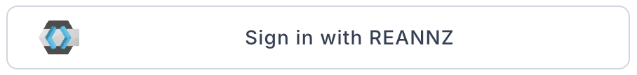

The [REANNZ HPC Portal](https://hpc-portal.reannz.co.nz) is where you see your projects,
who is in them, and the allocations (resources) they hold.
The portal is built on [Waldur](https://docs.waldur.com/latest/user-guide/).

## Log in

1. Go to [https://hpc-portal.reannz.co.nz](https://hpc-portal.reannz.co.nz).
2. Click **Sign in with REANNZ**.
    
3. Choose your home institution and log in with your institutional credentials.
   This login goes through Tuakiri, the same as for my.nesi.org.nz.

If your institution is not part of the Tuakiri federation, see
[Account Requests for non-Tuakiri Members](../../Policy/Account_Requests_for_non_Tuakiri_Members.md).
For other login problems, see
[Logging in to my.nesi.org.nz](../my-nesi-org-nz/Logging_in_to_my-nesi-org-nz.md#troubleshooting-login-issues).

## Main navigation

The sidebar on the left holds the main sections:

- **Organizations** – the institutions you belong to.
- **Projects** – every project you are a member of.
- **Resources** – your allocations, grouped by type (for example **HPC** for Mahuika and **Storage** for Freezer).
- **REANNZ Marketplace** – the services on offer.

The breadcrumb at the top of each page shows where you are, for example
*Organizations / your institution / your project*.
Your name menu on the top right holds your profile and the option to log out.

## See your roles

After you log in, the portal opens your **User dashboard**.
The **Roles and permissions** table lists every role you hold:

| Column | Meaning |
| --- | --- |
| Scope type | Whether the role is on a project or an organization. |
| Scope name | The project or organization name. Click it to open it. |
| Organization | The institution that owns the project. |
| Role name | Your role, for example *Project manager* or *Project member*. |

## What each role can do

| Role | Who holds it | What they can do |
| --- | --- | --- |
| Project member | Researchers on a project | View the project and its resources, and request an end date change. |
| Project manager | The project owner or PI | Change resource limits and request an end date change. |
| Organization owner | Nominated staff at your institution | Approve requests from projects in their organization and set end dates directly. |

## See your projects

1. Click **Projects** in the sidebar.
2. Each card shows the project name, its **Organization**, its **Resources** and its **End date**.
3. Click **Details** to open the project.

A project page has four tabs:

- **Project dashboard** – description, team summary and usage views.
- **Resources** – the allocations the project holds.
- **Team** – the project members.
- **Audit logs** – a record of changes to the project.

## See project members

1. Open the project and click the **Team** tab.
2. The **Active** list shows each **Member**, their **Email**, their **Role in project** and any **Role expiration**.
3. The **Invitations** list shows people invited who have not yet joined.

## See resources

1. Open the project and click the **Resources** tab, or pick a group under **Resources** in the sidebar.
2. Click a resource to open it.

The resource page shows:

- the offering, for example **Mahuika** or **Freezer**;
- the **Termination date**, when the allocation ends;
- current usage against each limit, for example compute, project storage and scratch storage;
- a **Usage history** chart.

The **Actions** button on the resource page lists what you can do with it.
The options depend on your role.
To extend or grow an allocation, see
[Renewing an Allocation](Renewing_an_Allocation.md).
