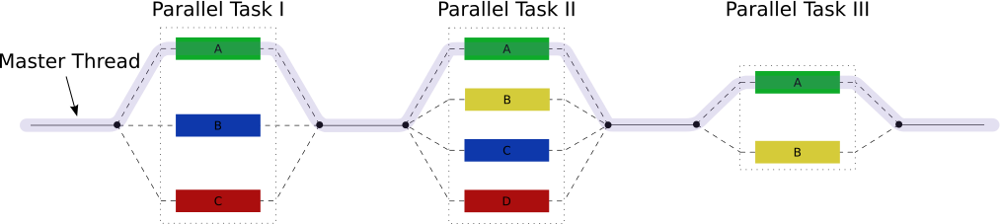

[//]: <> (REMOVE ME IF PAGE VALIDATED)
[//]: <> (vvvvvvvvvvvvvvvvvvvv)
!!! warning
    This page has been automatically migrated and may contain formatting errors.
[//]: <> (^^^^^^^^^^^^^^^^^^^^)
[//]: <> (REMOVE ME IF PAGE VALIDATED)

Many scientific software applications are written to take advantage of
multiple CPUs in some way. But often this must be specifically requested
by the user at the time they run the program, rather than happening
automatically.  

The are three types of parallel execution we will cover
are [Multi-Threading(oMP)](#t_multi),
[Distributed(MPI)](#t_mpi) and [Job Arrays](#t_array).
!!! prerequisite Note
     Whenever Slurm mentions CPUs it is referring to *logical* CPU's (**2**
     *logical* CPU's = **1** *physical* core).  
     -   `--cpus-per-task=4` will give you 4 *logical* cores.
     -   `--mem-per-cpu=512MB` will give 512 MB of RAM per *logical* core.
     -   If `--hint=nomultithread` is used then `--cpus-per-task` will now
         refer to physical cores, but `--mem-per-cpu=512MB` still refers to
         logical cores.

See [our article on
hyperthreading](../../Scientific_Computing/Running_Jobs_on_Maui_and_Mahuika/Hyperthreading.md)
for more information.

## Multi-threading

Multi-threading is a method of parallelisation whereby the initial
single thread of a process forks into a number of parallel threads,
generally *via* a library such as OpenMP (Open MultiProcessing), TBB
(Threading Building Blocks), or pthread (POSIX threads).


*  
Fig. 2: Multi-threading involves dividing the process into multiple
'threads' which can be run across multiple cores.*

Multi-threading is limited in that it requires shared memory, so all
CPU cores used must be on the same node. However, because all the CPUs
share the same memory environment things only need to be loaded into
memory once, meaning that memory requirements will usually not increase
proportionally to the number of CPUs.

Example script;

``` sl
#!/bin/bash -e
#SBATCH --job-name=MultithreadingTest    # job name (shows up in the queue)
#SBATCH --time=00:01:00                  # Walltime (HH:MM:SS)
#SBATCH --mem=2048MB                     # memory in MB 
#SBATCH --cpus-per-task=4                # 2 physical cores per task.

taskset -c -p $$                         #Prints which CPUs it can use
```

The expected output being

``` sl
pid 13538's current affinity list: 7,9,43,45
```

## MPI

MPI stands for *Message Passing Interface*, and is a communication
protocol used to achieve distributed parallel computation.

Similar in some ways to multi-threading, MPI does not have the
limitation of requiring shared memory and thus can be used across
multiple nodes, but has higher communication and memory overheads.

For MPI jobs you need to set `--ntasks` to a value larger than 1, or if
you want all nodes to run the same number of tasks, set
`--ntasks-per-node` and `--nodes` instead.

MPI programs require a launcher to start the *ntasks* processes on
multiple CPUs, which may belong to different nodes. On Slurm systems
like ours, the preferred launcher is `srun` rather than `mpi-run`.

Since the distribution of tasks across different nodes may be
unpredictable, `--mem-per-cpu` should be used instead of `--mem`.

``` sl
#!/bin/bash -e
#SBATCH --job-name=MPIJob       # job name (shows up in the queue)
#SBATCH --time=00:01:00         # Walltime (HH:MM:SS)
#SBATCH --mem-per-cpu=512MB     # memory/cpu in MB (half the actual required memory)
#SBATCH --cpus-per-task=4       # 2 Physical cores per task.
#SBATCH --ntasks=2              # number of tasks (e.g. MPI)

srun pwd                        # Prints  working directory
```

The expected output being

``` sl
/home/user001/demo
/home/user001/demo
```
!!! prerequisite Warning
     For non-MPI programs, either set `--ntasks=1` or do not use `srun` at
     all. Using `srun` in conjunction with `--cpus-per-task=1` will
     cause `--ntasks` to default to 2.

## Job Arrays

Job arrays are best used for tasks that are completely independent, such
as parameter sweeps, permutation analysis or simulation, that could be
executed in any order and don't have to run at the same time. This kind
of work is often described as *embarrassingly parallel*.  
An embarrassingly parallel problem is one that requires no communication
or dependency between the tasks (unlike distributed computing problems
that need communication between tasks).

A job array will submit the same script repeatedly over a designated
index using the SBATCH command `#SBATCH --array`

For example, the following code:

``` sl
#!/bin/bash -e
#SBATCH --job-name=ArrayJob             # job name (shows up in the queue)
#SBATCH --time=00:01:00                 # Walltime (HH:MM:SS)
#SBATCH --mem=512MB                     # Memory
#SBATCH --array=1-2                     # Array jobs


pwd
echo "This is result ${SLURM_ARRAY_TASK_ID}"
```

will submit,  `ArrayJob_1` and `ArrayJob_2`, which will return the
results `This is result 1` and `This is result 2` respectively.

### Using SLURM\_ARRAY\_TASK\_ID

Use of the environment variable `${SLURM_ARRAY_TASK_ID}` is the
recommended method of variation between the jobs. For example:

-   -   -   As a direct input to a function.  

            ``` sl
            matlab -nodisplay -r "myFunction(${SLURM_ARRAY_TASK_ID})"
            ```

        -   As an index to an array.  

            ``` sl
            inArray=(1 2 4 8 16 32 64 128)
            input=${inArray[$SLURM_ARRAY_TASK_ID]}
            ```

        -   For selecting input files.  

            ``` sl
            input=inputs/mesh_${SLURM_ARRAY_TASK_ID}.stl
            ```

        -   As a seed for a pseudo-random number.  
            -   In R

                ``` sl
                task_id = as.numeric(Sys.getenv("SLURM_ARRAY_TASK_ID"))
                set.seed(task_id)
                ```

            -   In MATLAB

                ``` sl
                task_id = str2num(getenv('SLURM_ARRAY_TASK_ID'))
                rng(task_id)
                ```

            *  
            Using a seed is important, otherwise multiple jobs may
            receive the same pseudo-random numbers.*

        -   As an index to an array of filenames. 

            ``` sl
            files=( inputs/*.dat )
            input=${files[SLURM_ARRAY_TASK_ID]}
            # If there are 5 '.dat' files in 'inputs/' you will want to use '#SBATCH --array=0-4' 
            ```

            This example will submit a job array with each job using a
            .dat file in 'inputs' as the variable input (in alphabetcial
            order).

Environment variables *will not work* in the Slurm header. In place
of `${SLURM_ARRAY_TASK_ID}`, you can use the token `%a`. This can be
useful for sorting your output files e.g.

``` sl
#SBATCH --output=outputs/run_%a/slurm_output.out
#SBATCH --output=outputs/run_%a/slurm_error.err
```

#### Multidimensional array example

``` sl
#!/bin/bash -e

#SBATCH --open-mode append
#SBATCH --output week_times.out
#SBATCH --array 0-167 #This needs to be equal to combinations (in this case 7*24), and zero based.

# Define your dimensions in bash arrays.
arr_time=({00..23})
arr_day=("Mon" "Tue" "Wed" "Thur" "Fri" "Sat" "Sun") 

# Index the bash arrays based on the SLURM_ARRAY_TASK)
n_time=${arr_time[$(($SLURM_ARRAY_TASK_ID%${#arr_time[@]}))]} # '%' for finding remainder.
n_day=${arr_day[$(($SLURM_ARRAY_TASK_ID/${#arr_time[@]}))]}

echo "$n_day $n_time:00"
```

### Avoiding Conflicts

As all the array jobs could theoretically run at the same time, it is
important that all file references are unique and independent.

If your program makes use of a working directory make sure you set it
e.g.

``` sl
mkdir .tmp/run_${SLURM_ARRAY_TASK_ID}          #Create new directory
export TMPDIR=.tmp/run_${SLURM_ARRAY_TASK_ID}  #Set TMPDIR to point there
```

If you have no control over the name/path of an output used by a
program, this can be resolved in a similar manner.

``` sl
mkdir run_${SLURM_ARRAY_TASK_ID}                             #Create new directory
cd run_${SLURM_ARRAY_TASK_ID}                                #CD to new directory
#
bash job.sh
#
mv output.log ../outputs/output_${SLURM_ARRAY_TASK_ID}.log   #Move and rename output
rm -r ../run_${SLURM_ARRAY_TASK_ID}                          #Clear directory
```

The Slurm documentation on job arrays can be
found [here](https://slurm.schedmd.com/job_array.html).

 