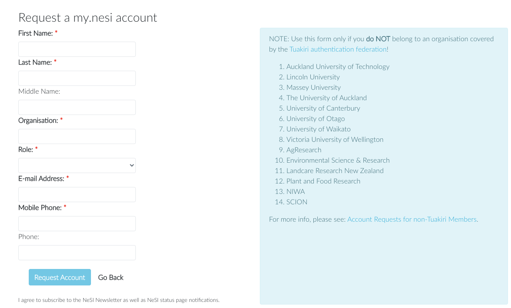

Most New Zealand universities and Crown Research Institutes are members
of the [Tuakiri authentication
federation](https://www.reannz.co.nz/products-and-services/tuakiri/join/),
but many other institutions, including private sector organisations and
most central and local government agencies, are not. If you are not
affiliated with an organisation supported by the
[Tuakiri](https://www.reannz.co.nz/products-and-services/tuakiri/)
federation, you can request access via
[my.nesi.org.nz/register](https://my.nesi.org.nz/register).

!!! prerequisite
     The email address you use on your application must be your
     institutional email address. We do not accept applications using
     personal email addresses.

We will review your request and, if we approve it, we will create a
Tuakiri Virtual Home account for you, which you can use to login to
my.nesi.org.nz. Once we have done so, the Tuakiri system will send you
an automatically generated email inviting you to activate your account.
You will need to activate your account before you can log in to
my.nesi.org.nz.

!!! warning "What if I don't get the account activation email?"
     Some organisations' email servers are known to block Tuakiri's account
     activation emails. If you haven't received your Tuakiri account
     activation email by the end of the next business day after you applied
     for an account, please check your junk mail and/or quarantine folders.
     If you still can't find the email, .

!!! note "What next?"
     -   [Project Eligibility](Allocation_classes.md)
     -   [Applying for a new project.](../../Getting_Started/Accounts-Projects_and_Allocations/Applying_for_a_new_project.md)
     -   [Applying to join an existing project](../../Getting_Started/Accounts-Projects_and_Allocations/Applying_to_join_a_project.md).
