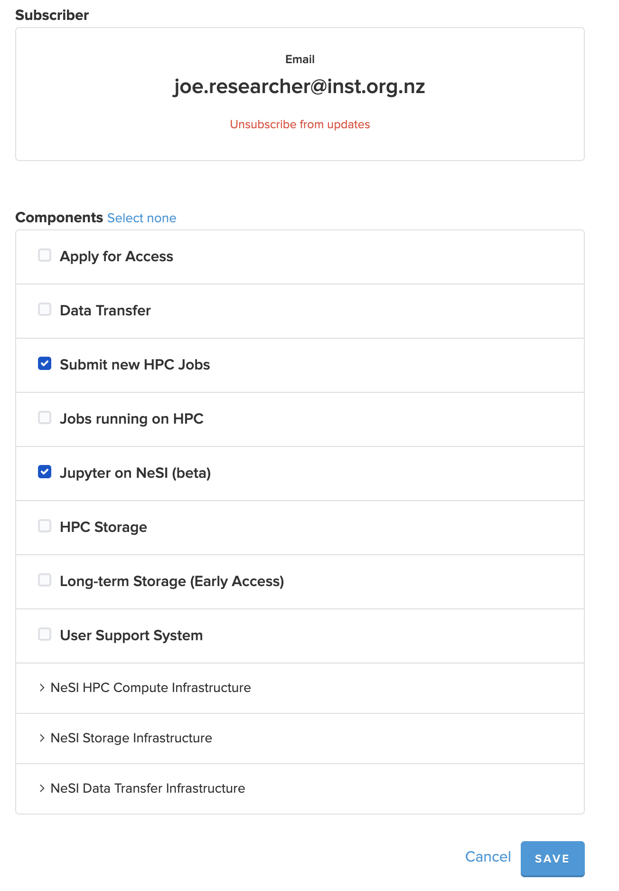
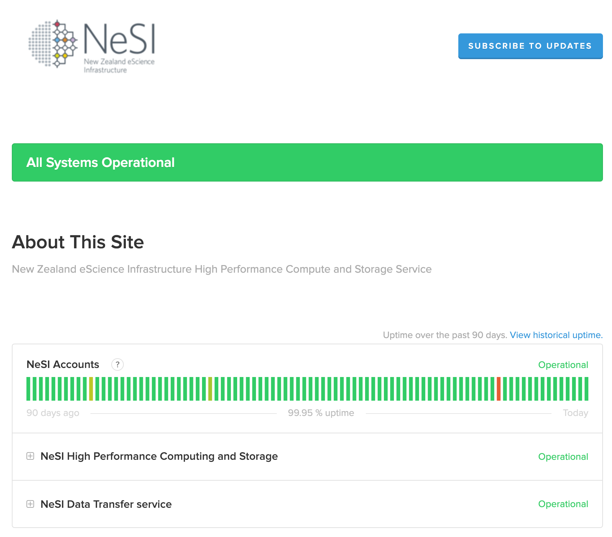

## NeSI system status related notifications

All new NeSI users will be automatically subscribed to receive system notifications for all components listed on [status.nesi.org.nz](https://status.nesi.org.nz) (with the option to
opt-out).
The [support.nesi.org.nz](https://support.nesi.org.nz) homepage shows current incidents and upcoming scheduled events (based on status.nesi.org.nz).

## How to manage your subscription to notifications

In order to manage your subscription to notifications, either log into [my.nesi](https://my.nesi.org.nz/account/preference) or use the link included at the bottom of the notification email message "Manage your subscription" or "Unsubscribe" to manage your preferences.

See also our support article [Managing NeSI notification preferences](./my-nesi-org-nz/Managing_notification_preferences.md)

{ width="80%" }

## status.nesi.org.nz

NeSI does publish service incidents and scheduled maintenance via [status.nesi.org.nz](https://status.nesi.org.nz).
Interested parties are invited to subscribe to updates (via SMS or email).

{ width="80%" }

## Wide area network

Our HPC facilities are connected to the [REANNZ](https://www.reannz.co.nz/) network, Aotearoa's high-performance national digital network (or NREN).
This national network supports collaboration and contributions to data-intensive and complex science and research initiatives in New Zealand and across the globe.

See [Weather Map](https://weathermap.reannz.co.nz), for realtime metrics on national data transfer.
