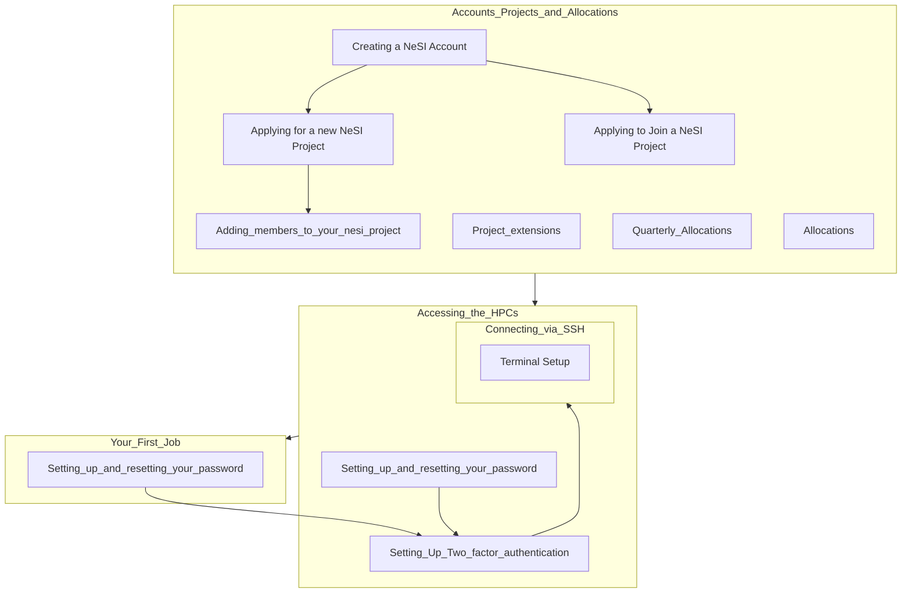

```mermaid
graph TB
subgraph A[Accounts_Projects_and_Allocations]
    direction TB
    AA[Creating a NeSI Account] 
    AA-->AB[Applying for a new NeSI Project]
    AA-->AC[Applying to Join a NeSI Project]
    AB --> AD[Adding_members_to_your_nesi_project] 
    AF[Project_extensions]
    AG[Quarterly_Allocations]
    AE[Allocations]
end
subgraph B[Accessing_the_HPCs]
    direction TB
    BA[Setting_up_and_resetting_your_password]
    BA-->BB[Setting_Up_Two_factor_authentication]
    BB --> BC
    subgraph BC[Connecting_via_SSH]
        BCA[Terminal Setup] 
    end
end
subgraph C[Your_First_Job]
    direction TB
    CA[Setting_up_and_resetting_your_password]
    CA-->BB[Setting_Up_Two_factor_authentication]
end
A --> B
B --> C

```
