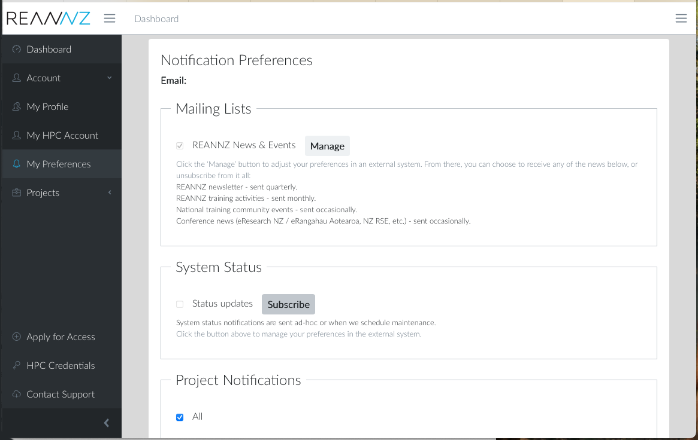

We use email as a communications channel for many types of notifications. These notifications can range from system-related updates to broader scope newsletters about our organisational activities and events.

Within [my.nesi.org.nz](https://my.nesi.org.nz/account/preference) you can view and edit your current Notification subscriptions. Start by clicking Account in the left-side navigation menu, and then click My Preferences from the sub-section options. This brings you to a page where you can change and set what emails you will receive from us.

Use the 'Manage' and 'Subscribe' buttons to open externally hosted preferences for notifications about newsletters, system status and other project-related notifications.

!! note "See also"
    Our support article on [System status.](../System_status.md)
