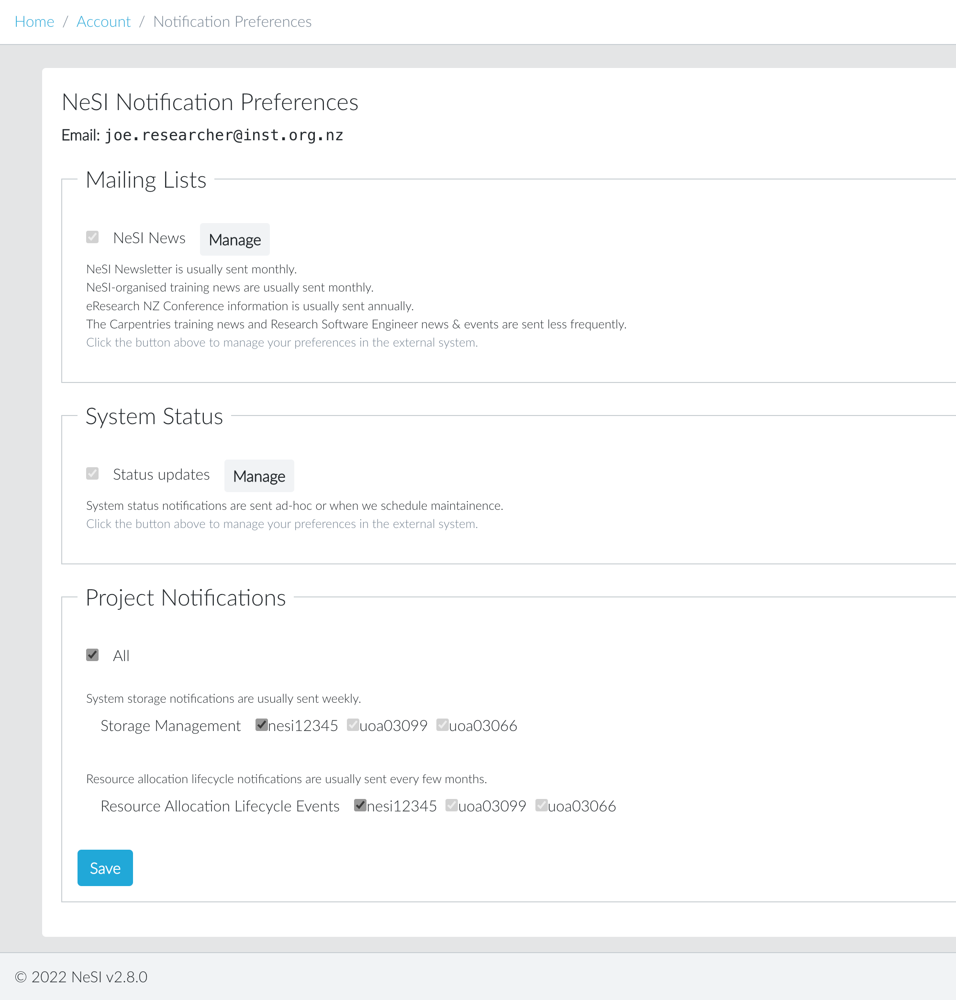

## Overview

NeSI aims to keep users informed via various communication channels. 

## Checking and setting your preferences

Within [my.nesi.org.nz](https://my.nesi.org.nz/account/preference) you
can find a summary of the current subscriptions under NeSI Notification
Preferences. 

In order to manage your subscription to notifications, either log into
[my.nesi](https://my.nesi.org.nz/account/preference) or use the link
included at the bottom of the notification email message "Manage your
subscription" or "Unsubscribe" to manage your preferences.

Use the 'Manage' button provided to open the externally hosted
preferences or the checkboxes for the NeSI Project-related
notifications.

### See also

Our support article on the NeSI [System status.](../../Getting_Started/Getting_Help/System_status.md)
