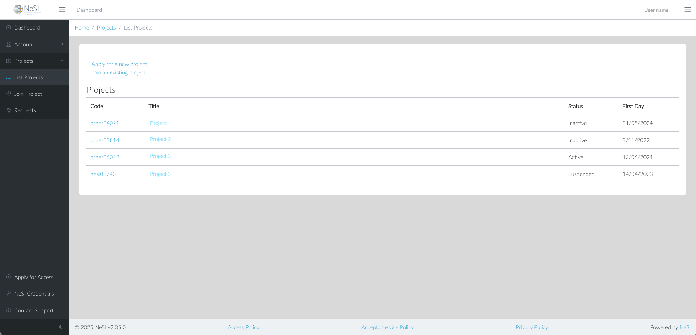



The main navigation is in the sidebar, and links to important functions
can be found at the bottom of the sidebar. A breadcrumb trail is displayed
at the top of the page when viewing sections of the site, for example
**Home / Projects / List Project**.

The triple bar (or hamburger) icons allow elements to be collapsed or
revealed. The left icon collapses the sidebar, hiding the navigation
elements it contains. The triple bar on the right is reserved for future
functions.

The **&lt;** arrow icon at the bottom of the sidebar minimises the
sidebar, reducing its visible content to icons only.

To log out and close your session, use the user name menu at the top right
of the page.
