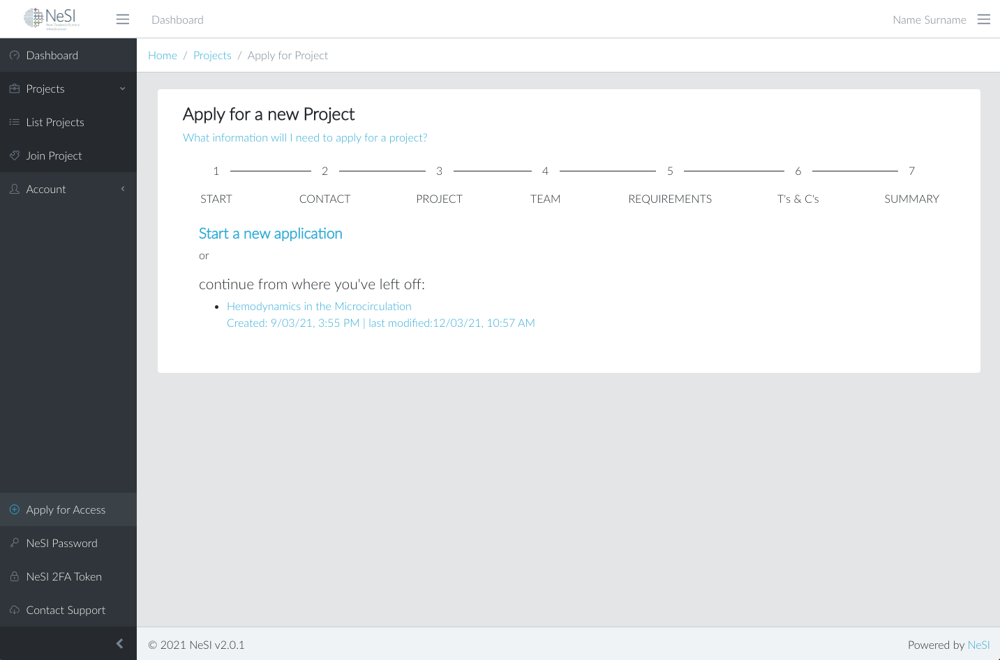



See [Applying for a project](../Projects/Applying_for_a_New_Project.md)
for how to access the form.

To start a request for a new project, or to continue editing a draft
request you started previously:

1. Point your web browser to
    [https://my.nesi.org.nz](https://my.nesi.org.nz/projects/apply) and
    login. Select "Apply for Access" from the sidebar navigation on the
    left.
    
2. Choose from the following items:
    - If you are returning to continue work on a draft request you
        started earlier, choose the link based on the date/time or title
        you've set.
    - For a new project request, select "Start a new
        application". This is the default if there is no draft request
        for your account.

    Once you've started filling in details, the system will automatically
    save a draft, so you can come back and finish your request later.
3. When your request is ready to submit, progress through the form
    sections using the 'Next' button at the bottom of the page until you
    reach the 'Summary' section. After clicking the 'Submit' button and
    passing the validation the request is submitted for review. You will
    also receive a confirmation via email.

    Questions marked with an asterisk (\*) are mandatory. The request can
    only be submitted once all mandatory data has been entered. The
    'Summary' section will highlight any missing data and allow you to
    navigate back to the relevant section.
