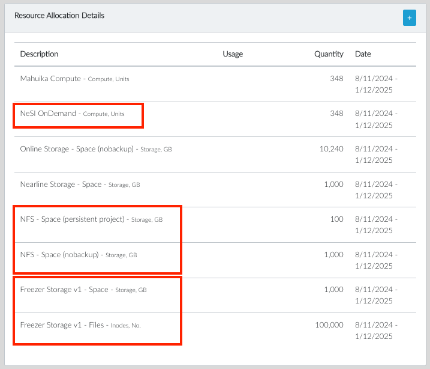

## New and Improved

- In the project details view, the NeSI OnDemand resources (NeSI OnDemand compute, NFS storage options) and the Freezer (long-term storage) resources are now visible.  

- Multiple changes have been made to the new allocation request page:
  * Long-term storage units are now listed in Terabytes (TB) instead of Gigabytes (GB).
  * You can now customise the name of your long-term storage in Freezer, if desired. This field is optional. If you choose not to use a custom name, we will automatically assign a default name related to your project id (eg. default_nesi9999). This naming field was added to enable easier searching and identification in the Freezer environment after the storage request has been created.
  * We are preparing to launch a new allocation request type: Storage only (eg. Tape). Currently, all storage allocations are granted as part of a compute allocation. This option is currently greyed out in our list of allocation request types but we wanted to raise awareness that it is a feature coming soon.  

If you have any questions about any of the updates, please
.
