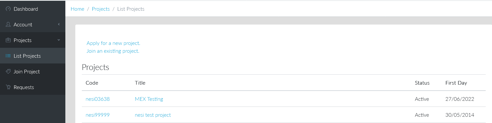
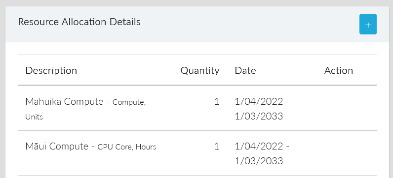
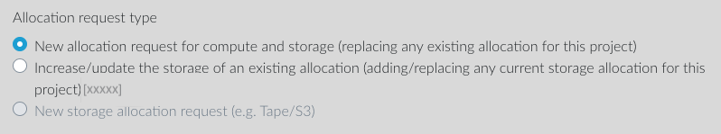
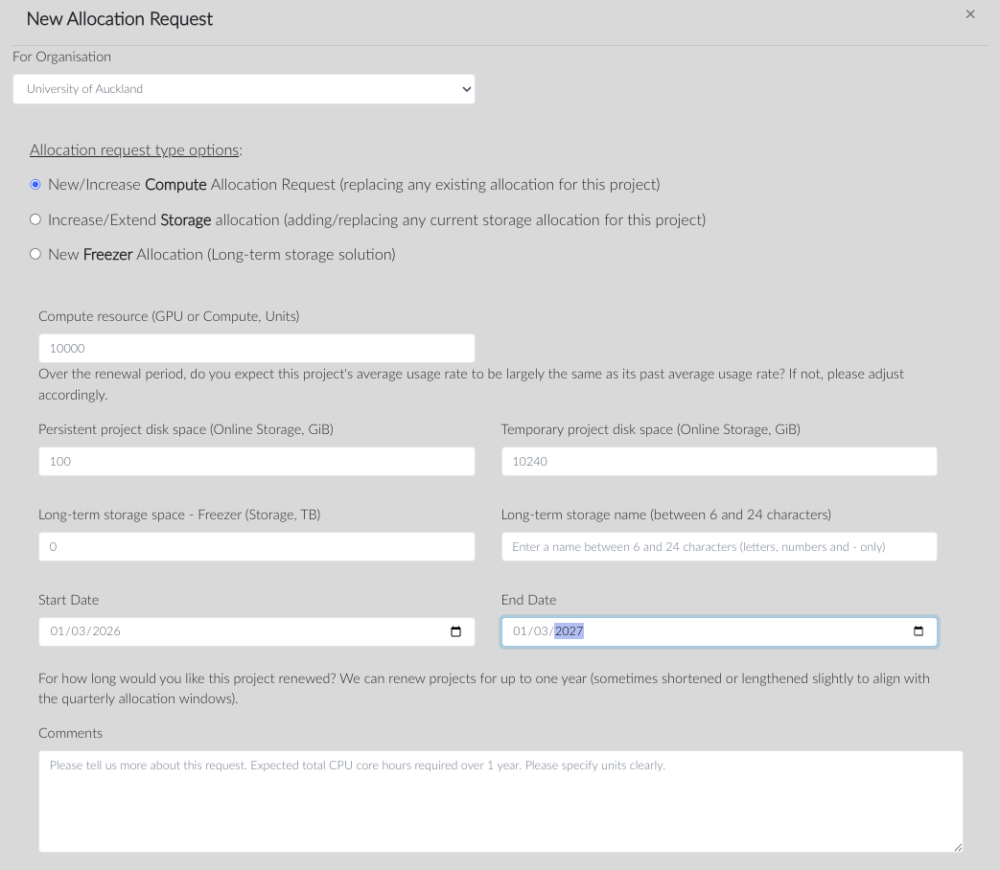

## Types of Resource Requests

1. Compute Resources:

    - Annually, you need to create or renew your compute resources and associated resources if you had them previously.  
    - If you made a mistake or want to modify the compute resources already allocated, you need to raise a new request.  

    Choose the option "New allocation request for compute and storage (replacing any existing allocation for this project)".  
    Indicate the number of compute units or CPU core hours,the platform, the persistent and temporary storage limits, and the start and end dates of the possible allocation. Add any comments to describe the intended usage (e.g. "Will use mostly JupyterLab") to help tune the allocation.  

2. Storage Increase Requests:

    - In the meantime, you can also request an increase in the storage of an existing allocation with compute.  

    Choose the option "Increase/update the storage of an existing allocation (adding/replacing any current storage allocation for this project)".  
    Indicate the persistent and temporary storage new limits.  

3. Long-Term Storage Requests:

    - You can create requests for long-term storage (e.g., Nearline, Freezer based on Tape or S3 technology).  

    Choose the option "New storage allocation request".  
    Indicate the long-term storage space, how you would like to call it, and the start and end dates.

4. Storage Update Requests:

    - Biennially, long-term storage allocations need to be extended. You must raise a request to update the storage of an existing allocation for this purpose.  

    Choose the option "Increase/update the storage of an existing allocation (adding/replacing any current storage allocation for this project)".  
    Indicate the long-term storage space, its current name and the new end date.

## How to raise a request using my.nesi.org.nz?

1. Login to [https://my.nesi.org.nz/projects/list](https://my.nesi.org.nz/projects/list) and select a project
    from the list.  
    
2. Click the Plus button icon 'action' next to the compute allocation
    line item
    
3. Select the type of resource requests needed.  
    
4. Verify the preset values and add a comment in case you update
    some.  
    Finally, click 'Submit'
    

### Can I request any allocation size?

If you are requesting a new allocation of computing resources, we will
look at your usage history and come up with an estimated allocation size
and duration based on that history. If you think your rate of usage will
be substantially higher or lower than we estimate, you should let us
know what you think your rate of usage will be and why you expect it to
differ from our forecast.

Please be aware that:

- First and subsequent allocations are subject to the NeSI allocation
    size and duration limits in force at the time they are considered by
    our reviewers.
- An allocation from an institution's entitlement is subject to
    approval by that institution.

See [Project Extensions and New Allocations on Existing Projects](../../Getting_Started/Accounts-Projects_and_Allocations/Project_Extensions_and_New_Allocations_on_Existing_Projects.md)
for more details.
