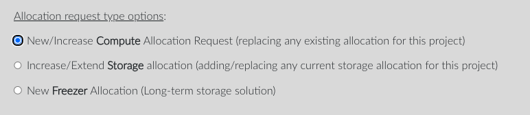

## Types of Resource Requests

1. Compute Resources:

    - At least annually, you will need to renew your compute resources and associated resources for your projects. You should receive emails ahead of time warning you of any expiring allocation.  
    - Additionally, you can request a new allocation early in order to have your compute allocation increased before the current allocation expires, if you find that the current compute allocation is no longer meeting your needs.  
    - If you made a mistake in your allocation request, please respond to the confirmation email will receive after submitting your request with the details of the changes you wish to make to your renewal request.  

    Choose the default option **"New/Increase Compute Allocation Request (replacing any existing allocation for this project)"**.  
    Indicate the number of compute units or CPU core hours, the persistent and temporary storage limits, and the start and end dates of the proposed allocation. Add any comments to describe the platform, the intended usage (e.g. "Will use mostly JupyterLab") to help tune the allocation.  

2. Storage Increase Requests:

    - You can also request a standalone increase in the storage of an existing allocation for compute and storage.  

    Choose the option **"Increase/Extend Storage allocation (adding/replacing any current storage allocation for this project)"**.  
    Indicate the new persistent and temporary storage limits.  

3. Long-Term Storage Requests:

    - You can create requests for Freezer (long-term storage based on Tape or S3 technology).  

    Choose the option **"New Freezer Allocation (Long-term storage solution)"**.  
    Indicate the long-term storage space, what you would like to call it, and the start and end dates.

4. Storage Update Requests:

    - Biennially, Freezer allocations need to be extended. You must raise a request to update the storage of an existing allocation for this purpose. You should receive emails ahead of time warning you of any expiring allocation.  

    Choose the option **"Increase/Extend Storage allocation (adding/replacing any current storage allocation for this project)"**.  
    Indicate the long-term storage space, its current name, and the new end date.

## How to raise a request using my.nesi.org.nz?

1. Login to [https://my.nesi.org.nz/projects/list](https://my.nesi.org.nz/projects/list) and select a project
    from the list.  
    
2. Click the Plus button icon 'action' next to the compute allocation
    line item
    
3. Select the type of resource requests needed.  
    
4. Verify the preset values and add a comment in case you update
    some.  
    Finally, click 'Submit'
    

### Can I request any allocation size?

If you are requesting a new allocation of computing resources, we will
look at your usage history and come up with an estimated allocation size
and duration based on that history. If you think your rate of usage will
be substantially higher or lower than we estimate, you should let us
know what you think your rate of usage will be and why you expect it to
differ from our forecast.

Please be aware that:

- First and subsequent allocations are subject to the NeSI allocation
    size and duration limits in force at the time they are considered by
    our reviewers.
- An allocation from an institution's entitlement is subject to
    approval by that institution.

See [Project Extensions and New Allocations on Existing Projects](../../Getting_Started/Accounts-Projects_and_Allocations/Project_Extensions_and_New_Allocations_on_Existing_Projects.md)
for more details.
